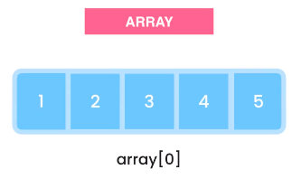
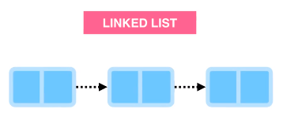
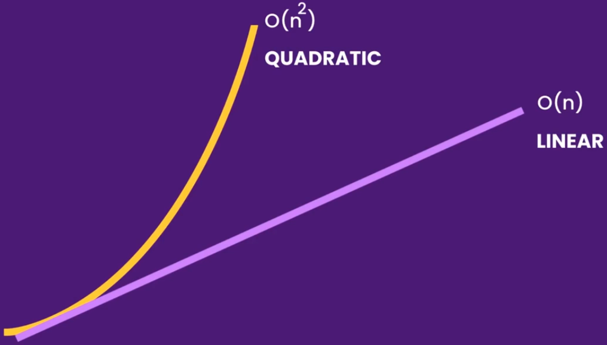
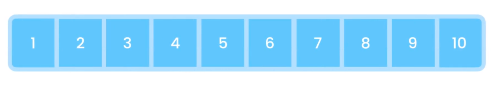
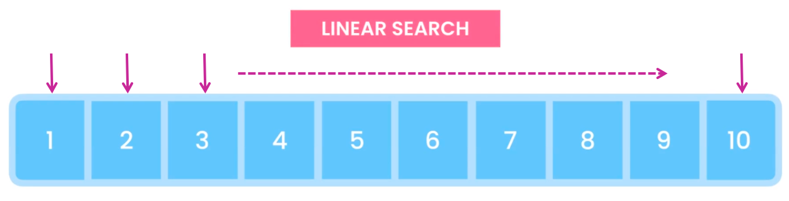
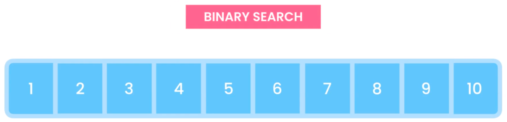
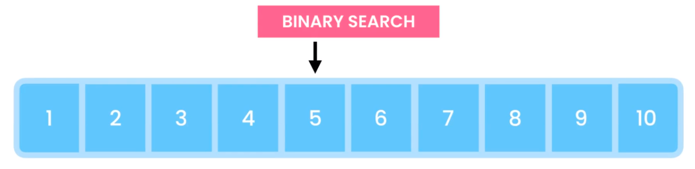
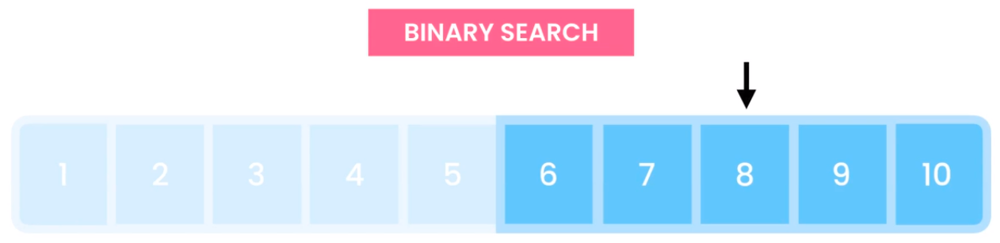
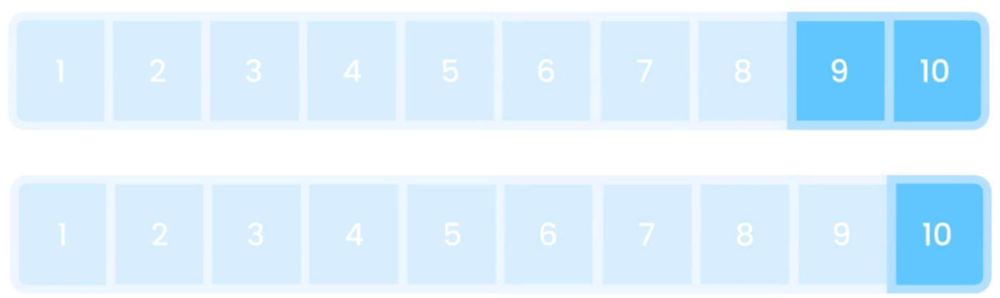

# Data Structures

## Big O Notation

### What is Big O?

**Big O from Wikipedia:**
Big O notation is a mathematical notation that describes the limiting behavior of a function when the argument tends towards a particular value or infinite.

We use Big O to describe the performance of an algorithem, and this helps us determine if a given algorithm is scalable or not. Which basically means is an algorithm going to scale well as the input grows really large.

So just because your code executes quickly on your computer doesn't mean it's going to perform well when you give it a large data set.

So that's why we use the **Big O Notation** to describe the performance of an algorithm. Now what does have to do with data structures? Certain operations can be more or less costly depending on what data structures we use.



For example, access an array element by it's index is super fast. But arrays have a fixed length and if you want constantly add or remove items, they have to get resized, and this will get costly as the size of our input grows very large.



So, if that's what we need to do. Then we have to use another data structure called a **linked-list**. These data structures can grow or shrink very quickly, but accessing a **linked-list** element by its index is slow.

So that's why you need to learn about the Big O Notation first before we can talk about various data structures.

### O(1)

Here is our example. This method takes an array of integers and paints the first item on the console.

```c
#include <stdio.h>

void log(int *numbers)
{
    printf("%d\n", numbers[0]);
}

int main()
{
    int numbers[4] = {};

    log(numbers); // (O)1

    return 0;
}
```

It doesn't matter how big the array is. We can have an array with one or one million items. All you're doing here is printing the first item. So this method has a single operation, and takes a constant amount of time to run.

You don't worry about the exact execution time in milliseconds, because that can be different from one machine to another or even on the same machine.

All we care about is that this method runs in ocnstant time, and we represent it using the **O(1)**. This is the runtime complexity of this method.

So in this example, the size of input doesn't matter, this method will always run in constant time or **O(1)**.

```c
#include <stdio.h>

void log(int *numbers)
{
    printf("%d\n", numbers[0]);
}

int main()
{
    int numbers[4] = {};

    //  O(2) -> O(1)
    log(numbers);
    log(numbers);

    return 0;
}
```

Well, what about we duplicate the _`printf()`_, and both operations run in constant time, so the runtime complexity of this method is **O(2)**.

Now when talking about the runtime complexity. We don't really care about the number of operations, we just want to know how much algorithm slows down as the input grouws larger.

So in this example, whether we have one or one million items, our method runs in constant time. So we can simplify by writing down **O(1)**, meaning **<span style="color:#2874A6">constant time</span>**.

### O(n)

Here we have a slightly more complex example. Have a loop. So we are iterating over the items this array, and printing each item.

```c
#include <stdio.h>

void logArray(int *parray, int size)
{
    // O(n)
    for (int i = 0; i < size; i++)
    {
        printf("%d\n", *(parray + i));
    }
}

int main()
{
    int numbers[4] = {0, 1, 2, 3};

    logArray(numbers, 4);

    return 0;
}
```

If you have million items (_`size`_ equals a million), obviously you're going to have a million _`printf()`_ operations.

So the cost of this algorithm grows linearly, and in direct correlation to the _`size`_ of the input. So we represent the runtime complexity of this method using **O(n)**.

The **O(n)**, where **n** represents the _`size`_ of the input. So as **n** grows, the cost of this algrithm also grows linearly, now it doesn't matter what kind of loop we use to iterate over this array.

Now what if we have a _`printf()`_ statement before and after our loop.

```c
void logArray(int *parray, int size)
{

    printf("Before the loop");       // O(1)
    for (int i = 0; i < size; i++)   // O(n)
    {
        printf("%d\n", *(parray + i));
    }
    printf("After the loop");        // O(1)
}
```

You saw that these single operations run in constant time, so here we have the **O(1)**, so the runting operation complexity of this method is **O(1 + n +n)**. However, when using the Big O notation, we drop these constant **O(1)**s because they don't really matter.

Here is the reason, if our array has one million inputs (_`size`_ equalis a million), adding 2 extra operations doesn't rally have a significant increase on the cost of our algorithm.

The cost of our algorithm still increases linearly, so we can simplify this by dropping the constant **O(1 + n +n)**, what matters is that the cost of algorithm increases linearly and in direct proportion to the _`size`_ of our input.

Then what if you had two loops here.

```c
void logArray(int *parray, int size, int length)
{
    // O(n) + O(m)

    for (int i = 0; i < size; i++)   // O(n)
    {
        printf("%d\n", *(parray + i));
    }

    for (int i = 0; i < length; i++)   // O(m)
    {
        printf("%d\n", *(parray + i));
    }
}
```

### O($n^2$)

Here we have the nested loops. This is the algorithm that we use for printing all combinations of items in an array. So we need to use runtime complexity here?

```c
void logArray(int *parray, int size)
{
    for (int i = 0; i < size; i++)      // O(n)
    {
        for (int j = 0; j < size; j++)  // O(n)
        {
            printf("first: %d, second: %d.\n", *(parray + i), *(parray + j));
        }
    }
}
```

In our outer loop, we're iterating over out input array, so here we have to **O(n)**. In each iteration, once again you're iterating over all the items in this array, in another example of **O(n)**. So the runtime complexity of this method is **O($n^2$)**.



We say this algorithm runs in quadratic time. As you can see in this diagram. Algorithms that run in the **O($n^2$)**, is slower than algorithms that run in **O(n)**. Of course this depends on the size of the input.

If you are dealing with an array of let's say 50 items, you're not going to see any differences. But as our input grows larger and larger, algorithms that run in **O($n^2$)** get slower and slower.

Now, what if you had another loop before or after this loop?

```c
void logArray(int *parray, int size)
{
    for (int i = 0; i < size; i++)   // O(n)
    {
        printf("%d\n", *(parray + i));
    }

    for (int i = 0; i < size; i++)      // O(n)
    {
        for (int j = 0; j < size; j++)  // O(n)
        {
            printf("first: %d, second: %d.\n", *(parray + i), *(parray + j));
        }
    }

    for (int i = 0; i < size; i++)   // O(n)
    {
        printf("%d\n", *(parray + i));
    }
}
```

It's still **O($n^2$)**.

What happen if we had another nested loop inside.

```c
void logArray(int *parray, int size)
{
    for (int i = 0; i < size; i++)      // O(n)
    {
        for (int j = 0; j < size; j++)  // O(n)
            for (int k = 0; k < size; k++)
            {
                printf("first: %d, second: %d, third: %d.\n", *(parray + i), *(parray + j), *(parray + k));
            }
    }
}
```

The the runtime complexity is now **O($n^3$)**. As you can imagine, this algorithm gets far slower than an algorithm with **O($n^2$)**.

### O(log n)


Here is the logarithmic curve, compare this with a linear curve, the linear grows at the same rate, but the logarithmic curve slows down at some point.

So the algorithm that runs in logarithmic time is more efficient and more scalable that an algorithm that runs in linear or poor value time.

Let's see an example here. We have an array of sorted numbers from one to ten and you want to find the number 10.



one way to find the 10 is iterate over this array using a _`for`_ loop, going forward until we find a 10. This is called the **_linear search_** because it runs in a linear time.



In the worst case scneario, if the number we're looking for is at the end of an array. we have inspect every cell in this array to find a target number.

The moe items we have, the longer this operation is going to take. So the run time of this algorithm increases lineary and in direct proportion with the size of our array.

Now, we have another searching out for them called binary search, and this algorithm runs logarithmic time. It's much faster than the linear search.



**_Assuming that our array is sorted_**, we start off by booking at the middle item. If is this item smaller or greater than the value we're looking for? It's smaller, so our target number, in this case 10, must be in the right partition of this array. So we don't need to inspect any of the items in the left partition of this array.

Assuming that out array is sorted, we start off by looking at the middle item. If this item smaller or rither nugreater than the value we're looking for? It's smaller.

So our target number, int this case, must be in the light.



So partition of this array? So we don't need to inspect any of the items in the left part of the partition, in partition and with this, we can narrow down our search by half. With this we can narrow down our search by half.



Now, in the right partition, again, we look at the middle item, is it smaller or greater than the target value? It's smaller, so again ignore the items on the left, and focus on the items on the right.

So every step, we're essentially narrowing down our search by half.



With this algorithm if we have one million items in this array, we can find a target item with a maximum of 19 comparaisons.

We don't have to inspect every item in our array, this is logarithmic time in action, we have logarithimic growth in algorithms where you reduce our work by half in every step.
