# C FOR BEGINNERS

## 1 Intro

**Topics**

- Overview of C - efficient, portable, power and flexibility, programmer oriented
- Language Feauters - impreative language, top-down planning, structured programming and modular design
- Advantages of using C - small, fast programss, reliable, easy to learn and understand
- How to use a modern, cross-platform IDE (MS vscode) to write, edit and debug
- Basic C concepts - structure of a prgram, comments, output using printf, "Hello World"
- Makefiles - how to build
- Variables - declaring and using
- Data Types - int, float, double, char etc
- Basic Operators - logical, arithmetic and assignment
- COnditional Statements - making decisions (if, switch)
- Repeating code - looping (for, while, and do-while)
- Arrays - defining and initializing, multi-dimensional
- Functions - declaration and use, arguments and parameters, called by value vs. call by reference
- Debugging - call statk, common mistakes, understanding complier messages
- Structs - initializing, nested structures, variants
- Character Strings - basic, arrays of chars, character operation
- Pointers - defintion and use, using with functions and arrays, malloc, pointer arithmetic
- The Preprocessor - #define, #include
- Input and Output - getchar, scanf
- File Input/Output - reading and writing to a file, file operations
- Standard C Library - string functions, math functions, utility functions, standard header files

**Course Outcomes**

- Able to write beginner C programs
- Able to write efficient, high quality C code
  - modular
  - low coupling
- Able to find and fix errors
  - Understand complier messages
- Understand fundamental aspects of the C Programming language

## 2 Class Organization

**Class Organization**

- Lectures are designed around explaining the why and providing the how
  - A complete learning experience
  - Understand the programming language as a whole
  - Lacking in most Udemy courses

**Demoonstrations of code in IDE**

**Challenges (coding assignments/projects)**

## 3 Fundamentals of a Program

### 3.1 Basics - Computer Instructions

- Computers are very dumb machines
  - They only do what they are told to do
- The basic operations of computer will form what is known as the computer's intruction set
- To solve a program using a computer, you must provide a solution to the program by sending instructions to the instruction set
  - A compluter program sends the instructions necessary to solve a specific problem

### 3.2 Basics - Algorithm

- The approach or method that is used to solve the problem is known as an algorithm

  - So, if we were to create a program that tests if a number is odd or even
    - The statements that solve the problem becomes the program
    - The method that is used to test if the number is even or odd is the algorithm

- To write a program, you need to write the instructions necessary to implement the algorithm
  - These instructions would be expressed in the statemetns of a particular computer language, such as Java, C++, Objective-C, or C

### 3.3 Terminology

- CPU (Central Processing Unit)

  - Does most of the computing work
  - Instructions are executed here

- RAM (Random Access Memory)
  - Stores the data of a program while it is running
- Hard Drive (Permanent Storage)

  - Stores files that contain program source code, even while the computer is turned off

- Operating System

  - Developed to help make it more convenient to use computers
  - A program that controls the entire operatio of a computer
    - All input and output
    - Manages the computer's resources and handles the execution of programs
    - Windows, Unix, Android, etc.

- Fetch/Execute Cylce (life of a CPU)
  - Fetches an instruction from memory (using registers) and executes it (loop)
  - A gigahertz CPU can do this about a billion times per second

**Fetch/Execute Cycle**
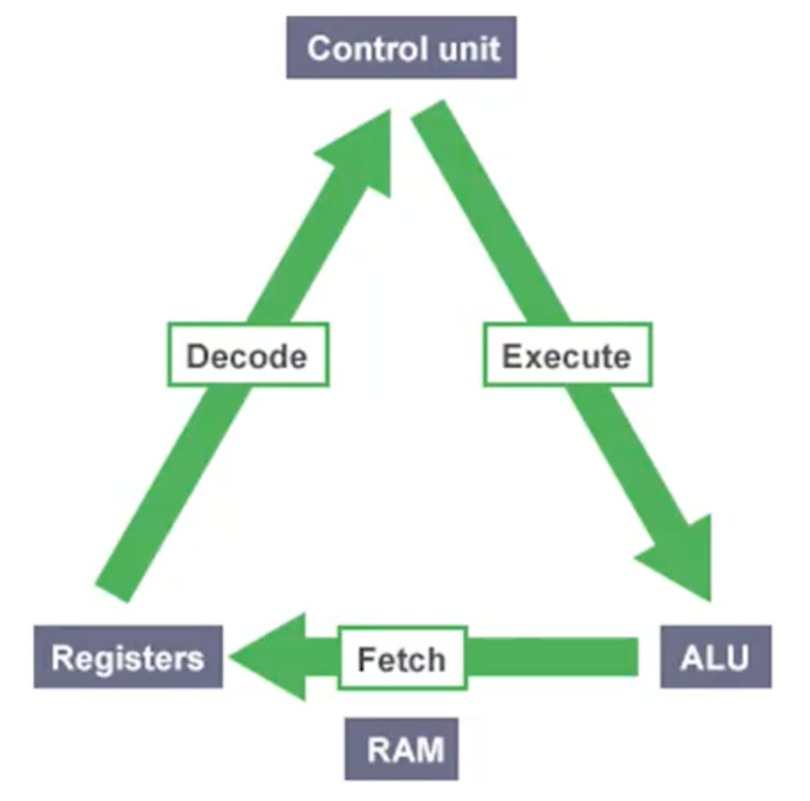

### 3.4 Higher Level Programming Languages

- High-level programming languages make it easier to write programs

  - Opposite of assembly language
  - C is a higher programming language that describe actions in a more abstract form
  - The instructions (statements) of a program look more like problem solving steps
  - Do not have to worry about the precise steps a particular CPU would have to take to accomplish a particular task
    - `total = x + ` `mv ax, 5, mv cx4`, etc....

- Compliers

  - A program that translate the high-level language source code into the detailed set of machine language instructions the computer requires
  - The program does the high-level thinking and teh compiler generates the tedious instrutions to the CPU

- Compliers will also check that your program has valid syntax for the programming language that you are compiling

  - Finds errors that it reports them to you and doesn't produce an executable until you fix them

- High-level languages are easier to learn and much easier to program in than are machine languages

### 3.5 Writing a Program

- The act of writing a C program can be broken down into multiple steps

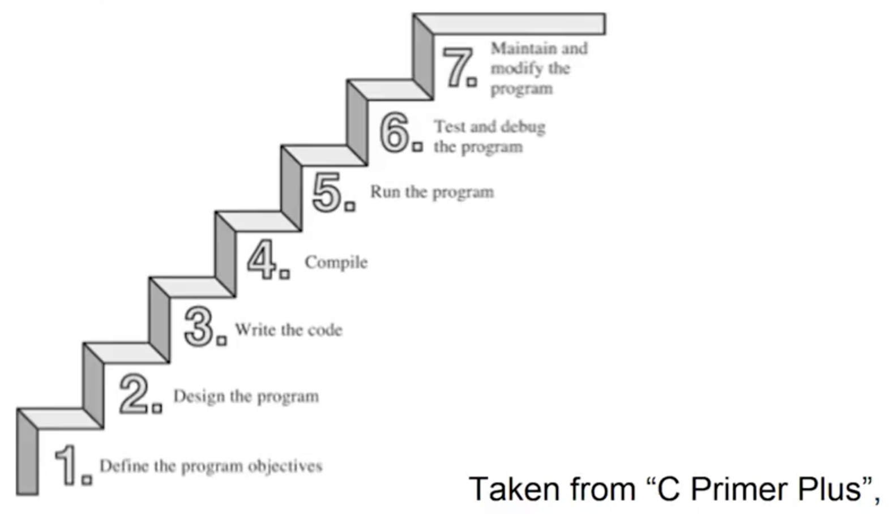

1. Define the program objectives
2. Design the program
3. Write the code
4. Compile
5. Run the program
6. Test and debug the program
7. Maintain and modify the program

**Step in Writing a Program**

1. <ins>Define the program objectives</ins>

   - Understand the requirements of the program
   - Get a clear idea of what you want the program to accomplish

2. <ins>Deisgn</ins>

   - Decide how the program will meet the above requirements
   - What should the user interface be like?
   - How should the program be organized?

3. <ins>Write the code</ins>

   - Start implementation, translate the design in the syntax of C
   - You need to use a text editor to create what is called a _source code_ file

4. <ins>Compile</ins>

   - Translate the source code into machine code (executable code)
   - Consists of detailed instructions to the CPU expressed in numeric code

5. <ins>Run the Program</ins>

   - The executable file is a program you can run

6. <ins>Test and debug</ins>

   - Just becuase a program is running, does not mean it works as intended
   - Need to test, to see that your program does what it is supposed to do (may find bugs)
     - Debugging is the process of finding and fixing program errors
     - Making mistakes is a natural part pf learning

7. <ins>Maintain and modify</ins>
   - Programs are released and used by many people
   - Have to continue to fix new bugs or add new features

- For the above steps, you may have to jump around steps and repeat steps
  - E.g. when you are writing code, you might find that your plan was impractical
- Many new programmers ignore steps 1 and 2 and go directly to writing code
  - A big mistake for large programs, may be ok for very simple programs
  - The larger and more complex program is, the more planning it requires
  - Should develop the habit of planning before coding

## 4 Overview

### 4.1 Overview

- C is a general-purpose, imperative computer programming language that supports structured programming

  - Uses statements that change a program's state, focuses on how

- Currently, it is one of the most widely used programming languages of all time

- C is a modern language

  - Has most basic control structures and features of modern languages
  - Designed for top-down planning
  - Organized around the use of functions (modular design) structured programming
  - A very reliable and readable program

- C is used on everything from minicomputers, Unix/Linux systems to PC's and mainframes
- C is the preferred lanaguage for producing word processing programs, spreadsheets and compliers

- C has become popular for programming embedded systems

  - Used to program microprocessors found in automobiles, cameras, DVD players, etc

- C has and continues to play a strong role in the development of Linux

- C programs are easy to modify and easy to adapt to new models or lanaguages

- In the 1990s, many software houses began turning to the C++ language for large programming projects

- C is a subset of C++ with object-oriented programming tools added

  - Any C program is a valid C++ program
  - By learning C, you also learn much of C++

- C remains a core skill needed by corporations and ranks in the top 10 of desired skills

- C provides constructs that map efficiently to typical machine instructions and thus is used by programs that were previously implement in assembly language

  - Provides low-level access to memory (has many low-level capabilities)
  - Requires minimal run-time support

- Was invented in 1972 by Dennis Ritchie of Bell Laboratories

  - Ritchie was working on the design of the UNIX operating system

- Was created by as a tool for working programers

  - Main goal is to be a useful language
  - Easy readability and writability

### 4.2 History

- C initially became widely known as the development language of the UNIX operating system

  - Virtually all new major operating systems are written in C and/or C++

- C evolved from a previous programming language named B

  - Uses many of the important concepts of B while adding data typing and other powerful features
  - B was a "typeless" language - every data item occupied one "word" in memory, and the burden of typing variables fell on the shoulders of the programmer

- C is available for mosst computers

- C is also hardware independent

- By the late 1970s, C had evolved into what is now reffered to as "traditional C"

- The rapid expansion of C working on many different hardware platforms led to many variations that were similar but often incompatible

  - A standard version of C was created (C89/C90, C99, C11)

- A program written only in Standard C and without any hardware-dependent assumptions will run correctly on any platform with a standard C compiler

  - Non-standard C programs may run only on a certain platform with a particular compiler

- C89 is supported by current C compilers

  - Most C code being written today is based on it

- C99 is revised standard C for the C programming language that refines and expands the capabilities of C

  - Has not been widely adopted and not all popular C compilers support it

- The current standard is commonly referred to as C11

  - Some elements of the language as defined by C11 are optiontal
  - Also possible that a C11 compiler may not implement all of the languages features mandated by the C11 standard

- C is one of the most important popular programming languages

- It has grown because people try it and like it

- In the past decade or two, many have moved from C to languages such as C++, Objective C, and Java
  - C is still an important language in its own right, as well as a migration path to these others

## 5 Language Features

### 5.1 Overview

- C produces compact and efficient programs

- C is one of the most important languages and will continue to be so

- The main features of C are the following
  - Efficient
  - Portable
  - Powerful and Flexible
  - Programmer Oriented

### 5.2 Efficiency and Portability

- C is an efficient language

  - Takes advantage of the capabilities of current computers
  - C programs are compact and fast (similar to assembly language programs)
  - Programmers can fine-tune their programs for maximum speed or most efficient use of memory

- C is a portable language

  - C programs written on one system can be run on other systems with little or no modifications
  - A leader in portability
  - Compilers are available for many computer architectures

- Linux/Unix systems typically come with a C compiler as part of the package

  - Computers are available for personal computers

- A good chance that you can get a C compiler for whatever device you are using

### 5.3 Power ad Flexibility

- The Unix/Linux kernel is written in C

- Many compilers and interpreters for other languages (FORTRAN, Perl, Python, Pascal, LISP, Logo and BASIC)

- C programs have been used for solving physics and engineering problems and even for animating special effect for movies

- C is flexible

  - Used for developing just about everything you can imagine by way of a computer program
  - Accounting applications to word processing and from games to operating sytems
  - It is the basis for more advanced languages, such as C++

- It is also used for developing mobile phone apps in the form of Objective-C

- C is easy to learn because of its compactness
  - It is an ideal first language to learn if you want to be a programer
  - You will acquire sufficent knowledge for practical application development quickly and easily

### 5.4 Programmer Oriented

- C fulfills the needs of programmers

  - Gives you access to hardware
  - Enables you to manipulate individual bits in memory

- C contians a large selection of operators which allws you to express yourself succinctly

- C is less strict than most languages in limiting what you can do

  - Can be both an advantage and a danger
  - Advantage is that many tasks (such as converting forms of data) are easier in C
  - Danger is that you can make mistakes (pointers) that are impossible in some languages
  - C gives you more freedom, but it also puts more responsibility on you

- C implementations have a large libary of useful C functions
  - Deal with common needs of most programmers

### 5.5 Other Features

- Provides low level features that are generally provided by the lower level languages

- Programs can be manipulated using bits

  - Ability to manage memory representation on bit level
  - Provides wide variety of bit manipulation operators

- Pointers play a big role in C
  - Direct access to memory
  - Supports efficient use of pointers

### 5.6 Disadvantages

- Flexibility and freedom also requires added responsibility

  - Use of pointers is problematic and abused
  - You can make programming errors that are difficult to trace

- Sometimes because of its wealth of operators and its conciseness, it makes the language difficult to read and follow
  - There is an opportunity to write obscure code

### 5.7 Summary

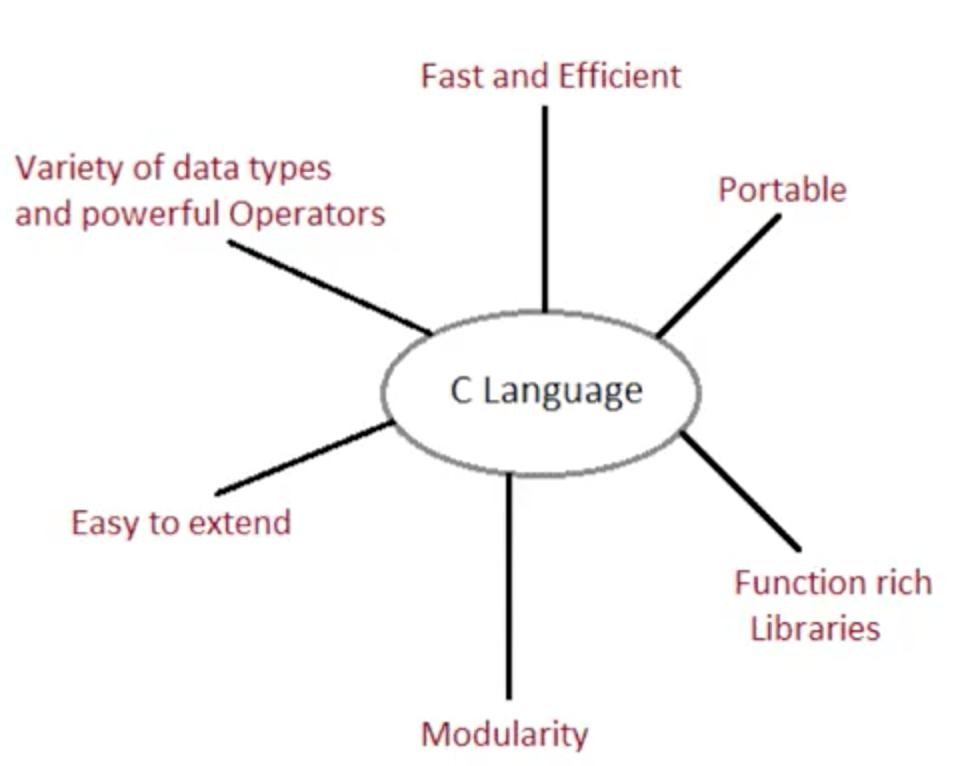

## 6 Creating a C Program

### 6.1 Overview

- There are four fundamental tasks in the creation of any C program

  - Editing
  - Compiling
  - Linking
  - Executing

- These tasks will become second nature to you because you will be doing it so often

- The processes of editing, compiling, linking, and executing are essentially the same for developing programs in any environment and with any compiled language

- Editing is the process of creating and modifying your C source code
  - Source code is inside a file and contains the program instructions your write
  - Choose a wise name for your base file name (all source files end in the .c extension)

### 6.2 Compiling

- A compiler converts your source code into machine language and detects and reports errors in your code

  - The input to the compiler is the file your produce during your editing (source file)

- Compilation is a two-statge process

  - The first stage is called the preprocessing phase, during which your code may be modified or added to
  - The second stage is the actual compilation that generates the object code

- The compiler examines eash program statement and checks it to ensure that it conforms to the syntax and semantics of the language

  - Can also recoginze structural errors (dead code)
  - Does not find logic errors
  - Typical errors reported might be due to an expression that has unbalanced parentheses (syntactic error), or due to the use of a variable that is not "defined" (semantic error)

- After all errors are fixed, the compiler will the take each statement of the program and translate it into assembly language

- The compiler will then translate the assembly language statements into acutal machine instructions

  - The output from the compiler is known as object code and it is stored in files called object files (same name as source file with a .obj or .o extension)

- The standard command to compile the C programs will be `cc` (or the GNU compiler which is `gcc`)
  - `cc -c myprog.c` or `gcc -c myprog.c`
  - If you omit the `-c` flag, your program will automatically be linked as well

### 6.3 Linking

- After the program has been translated into object code, it is ready to be linked

  - The purpose of the linking phase is to get the program into a final form for execution on the computer
  - Linking usually occurs automatically when compiling depending on what system you are on, but, can sometimes be a separate command

- The linker combines the object modules generated by the compiler with additional libraries needed by the program to create the whole executable

  - Also deetects and reports errors
    - If part of the program is missing or a nonexistent library component is referenced

- Program libraries support and extend the C language by providing routines to carry out operations, that are not part of the language

  - Input and output libraies, mathematical libraies, string manipulation libraries

- A failure during the linking phase means that once again you have to go back and edit your source code

- Success will produce an executable file

  - Windows - .exe extension
  - UNIX/Linux - no such extension (a.out by default)
  - Many IDEs have a build option, which will compile and link your program in a single operation to produce the executable

- A program of any signficant size will consist of several source code files

  - Each source code file needs the compiler to generate the object file that need to be linked

- The program is much easier to manage by breaking it up into a number of smaller source files
  - It is cohesive and makes the development and maintenance of the program a lot easier
  - The set of source files that make up the program will usually be integrated under a project name, which is used to refer to the whole program

### 6.4 Executing

- In most IDEs, you'll find an appropriate menu command that allows you to run or execute your compiled program

  - Otherwise double click the exe file or type a.out on the console in linux manually

- THe execution stage is where you run your program

  - Each of the statements of the program is sequentially executed in turn
  - If the program requests any data from the user the program temporarily suspend its execution so that the input can be entered
  - Results that are displayed by the program (output) appear in a window called the console

- This stage can also generate a wide variety of error conditions

  - Producing the wrong output
  - Just sitting there and doing nothing
  - Crashing your computer

- In the program does not perform the intended functionality then it will be necessary to go back and renalayze the program's logic
  - Known as the debugging phase, correct all the known problems or bugs from the program
  - Will need to make changes to the original source program
  - The entire process of compiling, linking, and executing the program must be repeated until the desired results are obtained

### 6.5 C Compilation Stages

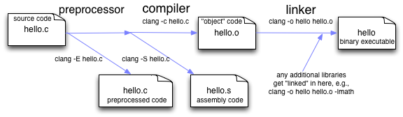

## 7 Installing Code::Blocks

## 8 Exploring the Code::Blocks Environment

## 9 Creating a New Project in Code::Blocks

## 10 Running the First Code in Code::Blocks

Using vscode should be better!

## 11 Challenge : Writing a C Program

### 11.1 Requirements

- Write a C program that displays your first name as output
  - Create a project in code::blocks
  - Delete the "main.c" file that was auto-generated when creating the Project
  - Create a new source file in the above project (name the file test.c)
  - Copy the source code as bellow

```c
#include <stdio.h>

int main()
{
    printf("Hi, my name is .....");
    return 0;
}
```

### 11.2 Next Steps

- Modify the source code to display your name

- Compile and link the source code

- Run the program!!!

- Analyze the output to confirm it is correct and displays your name!!!

## 12 Demonsttration : Writing a C Program

## 13 Structure of a C Program

```c
#include <stdio.h>

// Speicial function as the entry function of the whole C program
int main()
{
    printf("Hi, my name is Jun");

    // Exit from the C program
    return 0;
}
```

## 14 Comments

### 14.1 Comments

- Comments are used in a program to document a program and to enhance its readability

- There to remind you, or someone else reading your code, what the program does or what a particular line of code is doing

- Comments are ignored by the compiler

- Comments are very useful
  - A programmer may return to a program that he coded six months ago and may not remember the purpose of a particular funciton or line of code
  - A simple comment can save a significant amount of time otherwise wasted on having to re-understand the code

### 14.2 Syntax

- There are two ways to add comments into a C program

```c
// single line comments

/*
multi-line comments
multi-line comments
multi-line comments
*/
```

### 14.3 Style & Example

```c
/* This program adds two integer values
and displays the results*/

#include <stdio.h>

int main(void)
{
    // Declare variables
    int value1, value2, sum;

    // Assign values and calculate their sum
    value1 = 50;
    value2 = 25;
    sum = value1 + value2;

    // Display the result
    printf("The sume of %i and %i is %i\n", value1, value2, sum);

    return 0;
}
```

### 14.4 Use of Coments

- It is possible to insert so many comments into a program that the readability of the program is actually degraded of improved!

- You need to intelligently use comments

- It is a good idea to get into the habit of inserting comment statements into the program as the program is being written or typed in

  - Easier to document the program while the particular program logic is still fresh in your mind
  - Reap the benifits of the comments during the debug phase, when program logic errors are being isolated and debugged

- A comment can helps you read through the program, but it can also help point the way to the source of the logic mistake

- Self documenting comments by using meaningful names

## 15 The Preprocessor

### 15.1 Overview

- Another unique feature of the C language that is not found in many other higher-level programming languages

- Allows for programers to be easier to develop, easier to read, easier to modify, and easier to port to different computer systems

- Part of the C compilation process that recognizes special statements

  - Analyzes these statements before analysis of the C program itself takes place
  - An instruction to the compiler to do something before compiling the source code
  - Could be anywhere in the code

- Preprocessor statements are identified by the presence of a pound sign - `#`, which must be the first non-space character on the line

- We will utilize the preprocessor to:
  - Create are own constants and macros with the `#define` statement
  - Build your own library files with the `#include` statement
  - Make more powerful programs with the conditional `#ifdef`, `#endif`, `#else`, and `#ifndef` statements

## 16 The `#include` Statement

### 16.1 Overview

- The `#include` statement is a preprocessor directive

- `#include <stdio.h>`

- It is not strictly part of the executable program, however, the program won't work without it

- The symbol # indicates this is a preprocessing directive

  - An instruction to your compiler to do something before compiling the source code
  - Many preprocessing directives
  - Are usually some at the beginning of the program source file, but they can be anywhere
  - Similar to be `import` statement in Java

- In the above example, the compiler is instructed to "include" in your program the contents of file with the name `stdio.h`

  - Called a header file because it is usually included at the head of a program source file
  - `.h` extension

  ### 16.2 Header Files

  - Header files define information about some of the functions that are provided by that file

    - `stdio.h` is the standard C library header and provides functionality for displaying output, among many other things
    - We need to include this file in a program when using `printf()` function from the standard library
    - `stdio.h` contains the information that the compiler needs to understand what `printf()` means, as well as other functions that deal with input and output
    - `stdio`, is short for _standard input/output_

  - Header files specify information that the compiler uses to integrate any predefined functions within a program

  - You will be creating your own header files for use with your programs

  ### 16.3 Syntax

  - Header file names are case sensitive

  - Two ways to `#include` files in a program

    - Using angle brackets (`#include <JunLuo.h>`)
      - Tells the preprocessor to look for the file in one or more standard system directories
    - Using double quotes (`#include "JunLuo.h`)
      - Tells the preprocesors to first look in the current directory

  - Every C compiler that conforms to the C11 standard will have a set of standard header files supplied with it

  - You should use `#ifndef` and `#define` to protect against multiple inclusions of a header file

```c
// some header

// typedef
typedef struct names_st names;

// function prototypes
void get_names(names *);
void show_names(const names *);
char * s_gets(char * st, int n);

/*
header files includes many different things
  #define directives
  structure declarations
  typedef statements
  function prototypes
*/

// executable code normally goes into a source code file, not a header file
```

## 17 Displayin Output

### 17.1 Overview

- In out first challeng, you should have noticed that there was a line of code that included the word `printf`

- `printf("Hello World!")`

- `printf()` is a standard library function
  - It outputs information to the command line (the standard output stream, which is the command line by default)
  - The information displayed in based on what appears between the parentheses that immediately follow the function name `printf`
  - Alos notice that this line does end with a semicolon `;`

### `printf` Function

- Probably the most common function used in C

- Provides an easy and conveninent means to display program results

- Not only can simply phrases be displayed, but the values of variables and results of computations can also be displayed
  - Used for debugging

## 18 Enums and Chars

### 18.1 Enums

- A data type that allows a programmer to define a vaiable specify the valid values could be stored into that variable

  - Can create a variable named "myColor" and it can only contain one of the primary color, red, yellow, or blue, and nother values

- First have to define the enum type and give a name
  - Initiated by the keyword `enum`
  - Then the name of enumaerated data type
  - Then list of identifiers (enclosed in a set of curly braces) that define the permissible value that can be assigned to the type

```c
enum primaryColor {red, yellow, blue};
```

- Variables declared to be of this data type can be assigned the values red, yellow, and blue inside the program, and no other values

- To declared a variable to be of type enum primaryColor
  - Use the keyword `enum`
  - Follow by the enumerated type name
  - Follow by the variable list. So the statement.

```c
enum primaryColor myColor, gregsColor;
```

- Defines two variables myColor and gregsColor to be of type primaryColor

  - The only permissible values that can be assigned to these variables are the names red, yellow, and blue
  - `myColor = red;`

- Another example

```c
enum month {January, February, March, April, May, June, July, August, Sepetember, October, Novemeber, December};
```

### 18.2 Enums as ints

- The compiler actually treats enumeration identifiers as integer constants
  - First name in list is 0

```c
enum month thisMonth;
...
...
...
```

- The value 1 is assigned to thisMonth (and not the name `February`) because it is the second identifiy listed inside in enumeration list

- If you want to have a specific integer value associated with an enumeration identifier, the integer can be assigned to the identifier when the data type is defined

```c
enum direction {up, down, left = 10, right}
```

- An enumerated data type direction is define with the values up, down, left and right
- `up = 0` because it appears first in the list
- 1 to down because it appears next
- 10 to left because it is explicitly assigned this value

- The compiler actually enumeration identifiers as integer constants
  first name in list is 0

### 18.3 Char

- Chars represent a single character such as teh letter 'a
  , the digit character `6`, or a semicolon (':')

- Character literas use single quotes such 'A' or 'Z'

- You can also declare char variable to be unsigned
  - Can be used to explicitly tell the compiler that a particular variable is a signed quality

### 18.4 Declaring a char

````c
char broiled;      /**declar a char variable*/
broiled = 'T';     /*OK*/
broiled = T;       /*Not OK! Thinks T is a variable*/
broiled = "T";     /*Not OK! Thinks "T" is a string */

- If you omit the quotes, the compiler thinks that T is the name of a variable
  -

- If you use double quotes, it thinks you are using a string

- You can also use the numerical code to assign values

```c
char grade = 65;    /*ok for ASCII, but poor style*/
````

### 18.4 Escape Characters

- C contains special characters that represent actions

  - Backspacing
  - Going to the next line
  - Making the terminal bell ring (or speaker beep)

- We can represent these actions by using sysmbol sequences

  - Called sequences

- Escape sequences must be enclosed in single quotes when assigned to a character variables

- Escape sequences must be enclosed in single quotes when assigned to a chracter value

```c
char x = '\n'
```

- Then print variable x = advance the printer or screen line

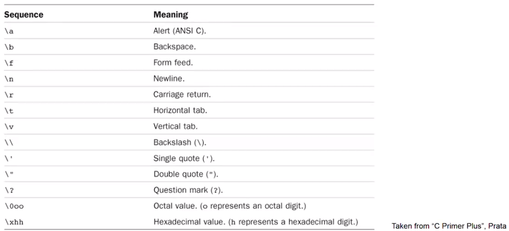

## 19 Format Specifiers

### 19.2 Overview

- Format specifiers are used when displaying variables as output
  - They specify the type of data of the variable to be displayed

```c
int sum = 89
printf("The sum %d\n", sum);
```

- The `printf()` function can display as output the values of variables

  - has wo items or arguments enclosed within the parentheses
  - arguments are separated by comma
  - first argument to the `printf()` routine is always the character string to be displayed
  - along with the display of the character string, you might also frequently want to have the value of a certain program varaibles displayed

- The percent character inside the first argument is a special character recognized by the `print()` function
  - the character that immediately follows the percent sign specifies what type of value is to be displayed

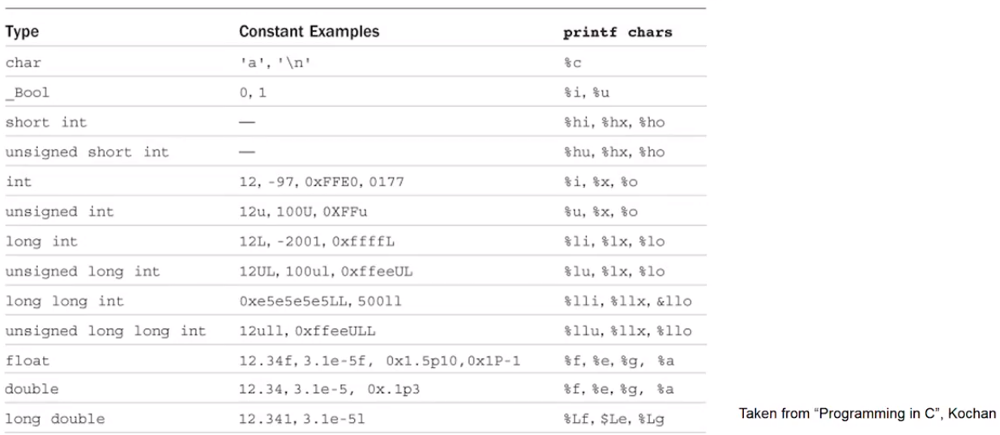

## 20 Command Line Arguments

### 20.1 Overview

- There are times when a program is developed that requires the user to enter a small amount of information at the terminal

- This information might consist of a number indicating the triangular number that you want to have calculated or a word that you want tot have looked up in a dictionary

- Two ways of handling this

  - Requesting the data from the user
  - Supply the information to the program at the time the program is executed (command-line arguments)

- We know that the `main()` function is a special function in C

  - Entry point of the program

- When `main()` is called by the runtime system, two arguments are actually passed to the function

  - the first argument (`argc` for argument count) is an integer value that specifies the number of arguments typed on the command line
  - the second argument (`argv` for argument vector) is an array of character pointers (strings)

- The first entry in this array is a pointer to the name of the program that is executing

```c
int main(int argc, char **argv[])
{
  ...
}
```

## 21 Challenge of Data Types and Variables: Print the Area of a Rectangle

- In this challenge, you are to create a C program that displays the perimeter and area of a rectangle

- The program should create 4 variables of type double

  - one variable to store the width of the rectangle
  - one variable to store the height of the rectangle
  - one variable to store the perimenter of the rectangle
  - one variable to store the area of the rectangle

- The program should perform the calculation for the perimeter of a rectangle

  - Use the `+` operator to addition and the `*` operator for multiplication
  - perimenter is calculated by adding the height and width and then multiplying by two
  - Area is calculated by multiplying the width \* height variables

- The program should display the height, width and perieter variables in the correct format in one first statement

- The program should display the height, width and perieter variables in the correct formatin one print statement

## 22 Challenge of Data Types and Variables: Create and use enum type

- Create a C program that defines an enum type and uses that type to display the values of some variables

- The program should create an enum type named Company

  - Valid values for this type are GOOGLE, FACEBOOK, XEROX, YAHOO, EBAY, MICROSOFT

- The program should create variables of the above enum type that are assigned values: XEROX, GOOGLE and EBAY

- The program should display as output, the value of the three variables with each variable separated by a newline
  - Correct output would be if XEROX, GOOGLE, nad EBAY variables are printed in that order:
    - 2
    - 0
    - 4

## 23 Operators: Overview

### 23.1 Overview

- Operators are functions that use a symbolic name

  - perform mathematical or logical functions

- Operators are predefined in C, just like they are in most other languages, and most operators tend to be combied with infix style

- A _logical operator_ (sometimes called a "Boolean operator") is an operator that returns a Boolean result that's based on the Boolean result of one or two other expressions

- An arithmetic operator is a mathematical function that takes two operators and performs a calculation on them

- Other operators include assignment, relational (<, >, !=), bitwise (<<, >>, ~)

### 23.2 Expressions and Statement

- Statement form the basic program steps of C, and most statements are constructed from expression

- An _expression_ consists of a combination of operators and operands
  - operands are what an operator operates on
  - operands can be constans, variables, or combination of the two
  - every expression has a value

```c
-6
4+21
a*(b+c/d)/20
q=5*2
x=++q%3
```

- Statement are the building blocks of a program (declaration)

  - A program is a series of statements with special syntax ending with a semicolon (simple statements)
  - A complete instruction to the computer

- Declearation statement: `int Jason;`
- Assignment statement: `Jason = 5;`
- Function call statement: `printf("Jason");`
- Structure statement: `while (Jason < 20) Jason = Jason + 1;`
- Return statement: `return 0;`

- C considers any expression to be a statement if you append a semicolon (expression statements)
  - So, `8;` and `3-4;` are perfectly valid in C

### 23.3 Compound Statements

- two or more statements grouped together by enclosing them in brances (block)

```c
int index = 0;
while (index < 10)
{
  printf("hello");
  index = index + 1;
}

```

## 24 Operators: Basic Operators

### 24.1 Overview

- Let's discuss, arithemtic, logical, assigment and relational operations

- An arithmetic operator is a mathemmatical function that takes operands and performs a calculation on them

- A logical operator (sometimes called a "Boolean opeator") is an operatpr that returns a Boolean result that's based on the Boolean result of one or two other operations

- Assignment operators set variable equal to values

  - Assign the value of the expression at its right to the variable at its left

- A relation operator will compare varibales against each other

### 24.2 Arithemetic Operators in C

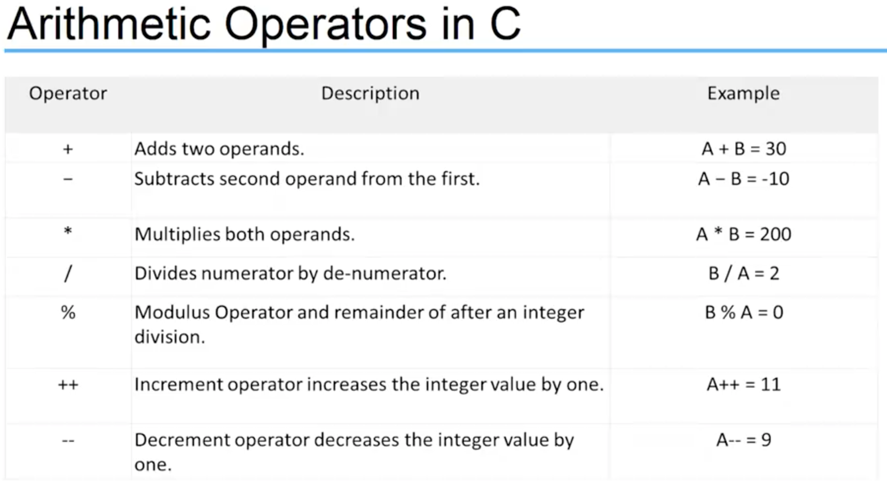

### 24.3 Logical Operators in C


### 24.4 Assignment Operators in C

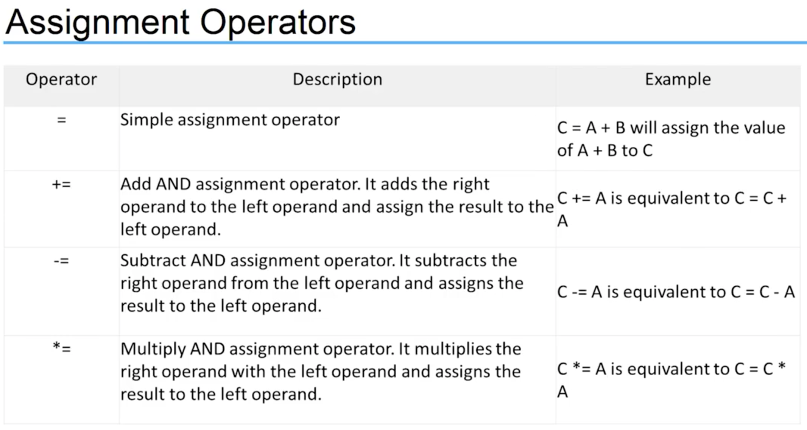
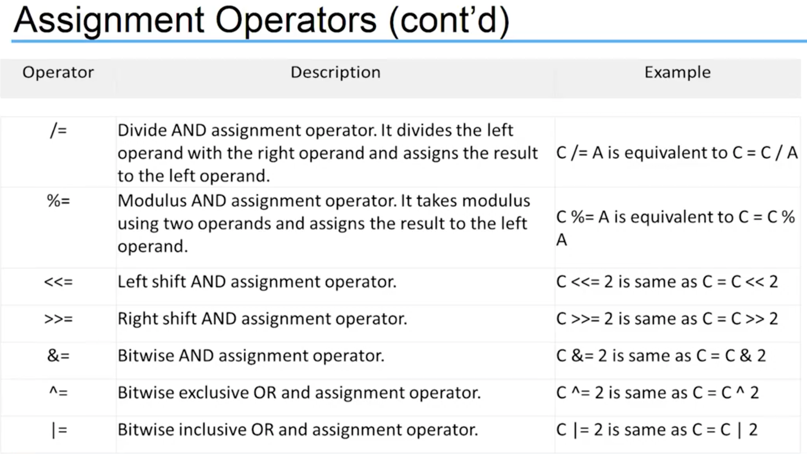

### 24.5 Relational Operators in C

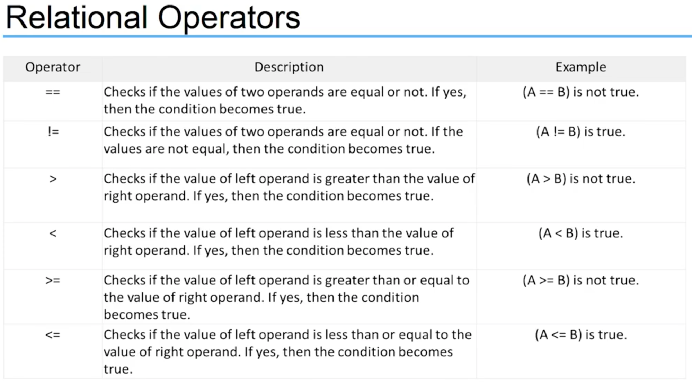

## 25 Bitwise Operators

### 25.1 Overview

- C offers bitwise logical operators and shift operators

  - look something like the logical operators you saw earlier but quite different
  - operate on the bits in integer values

- Not used in the common program
- One major use of the bitwise `AND`, `&`, and the bitwise `OR`, `|`, is in operators to test and bits in an integer variables

- You could use a single integer variable to store several characteristics of a persion.
  - store whether the persion is male or female with one bit
  - use three other bits to specify whether the person can speak French, German, or Italy
  - another bit to record whether the person's salary is $50,000 or more
  - in just four bits you have a substantial set of data recorded

### 25.2 Bitwise Operators (tutorials point)

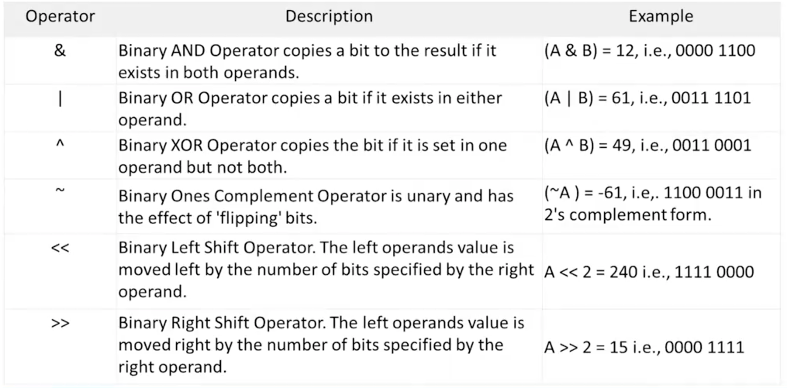

### 25.3 Truth Table

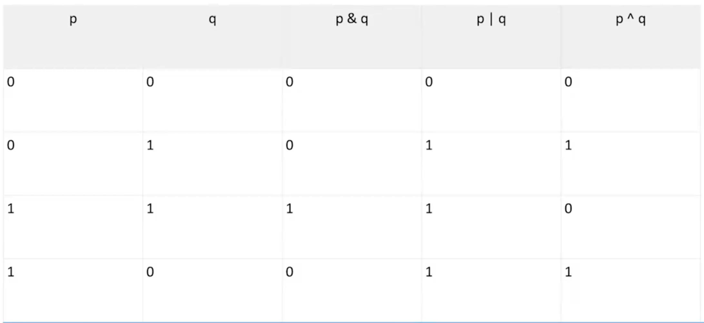

## 26 The Cast and Sizeof Operator

### 26.1 Tye Conversions

- Conversion of data between different types can happen automatically (implicit conversion) by the language or explicit by the program

  - to effectivly develop C programs, you must understand the rules used for the implicit conversion of floating-point and integer values in C

- Normally, you shouldn't mix types, but there are occasions when it is useful

  - remember, C is flexible, gives you the freedom, but, do not abuse it

- Whenever a floating-point value is assigned to an integer variable in C, the decimal portion of the number gets truncated

```c
int x = 0;
float f = 12.125;
x = f;
// value stored in x is the number 12, only the int portiion stored
```

- Assigning an integer variable does not cause any change in the value of the number

  - value is converted by the system and stored in the floating variable

- When performing integer arithmetic
  - if two operands in an expression are integers then any decimal portion resultingfrom a division operation is discarded, even if the result is floating variable
  - if one operand is an int and the other is float then operation is performed operation

### 26.2 The Cast Operator

- As mentioned, you should usually steer clear of autotype conversion, especially of demotions

  - better to do an explicit

- It is possible for you to demand the precise type conversion that you want

  - called a cast and consists of preceding the quantity with the name of desired type
  - parenthses and type name together constitude a cast operator, i.e. (type)
  - The actual type desired, such as long, is substituted for the actual type.

- The type cast operator has a higher precedence than all the arithmetic operations except minus and unary plus.

```c
(int)21.51 + (int)26.99
```

### 26.3 Sizeof Operator

- You can findout many bytes are occupied in memory by a give type using `sizeof` operator

  - `sizeof` is a special keyword in C

- `sizeof` is actually an operator, and not a function

  - evaluated at compile time and not at runtime, unless a variable-length array is used in its argument

- The argument to the sizeof operator can be a variable, an array name, the name of a basic data type, the name of a derived data type, or an expression

`sizeof(int)` will result the number of bytes of type int

- You can also apply the `sizeof` operator to an expression

  - result is the size the value

- Use the sizeof operators bitwise

### 26.4 Other Operators

- The asterisk `*` is an operator that represnets a pointer to a variable

```c
*a;
```

- `? : `is an operator used for comparisons
  - If condition is true ? then value x : other value y
  - name is the ternary operator

## 27 Operator Precedence

### 27.1 Overview

- Operator precedence determins the grouping of terms in an expression and decides how an expression is evaluated

  - Dictates order of evaluation when two operators share an operand
  - Certain operators have higher precedence than others
  - For example, the multiplication operator has a higher precedence than the addition operator

  ```c
  x = 7 + 3 * 2;
  ```

- Can result in 13 or 20 depending on the order of each operands evaluation

- The order of executing the various operations can make a difference, so C needs unambiguous rules for choosing what to do first
- In C, x is assigned 13, not 20 because operator `*` has higher precedece than `+`

  - FIrst gets multiplied with `3 * 2` and then adds into `7`

- Each operator is assigned a `precedence` level

  - Multiplication and division have a higher precedence than addtion and subtraction, so they are performed first

- Whatever is enclosed in parentheses is executed first, shuold just always use () to group expressions

### 27.2 Associativity

- What if two operators have the same precedence?

  - Then associativity rules are applied

- If they shared an operand, they are executed according to the other in which they occur in the statement

  - For most operators, the order is from left to right

```c
1 == 2 != 3
```

- operators `==` and `!=` have same precedence

  - associativity of both `==` and `!=` is left to right

- The expression above is equivalent to

```c
((1 == 2) != 3)
```

- `(1 == 2)` executes first resulting into `0(false)`, then `(0 != 3)` executing resulting into `1(true)`

### 27.3 Table (highest to lowest)

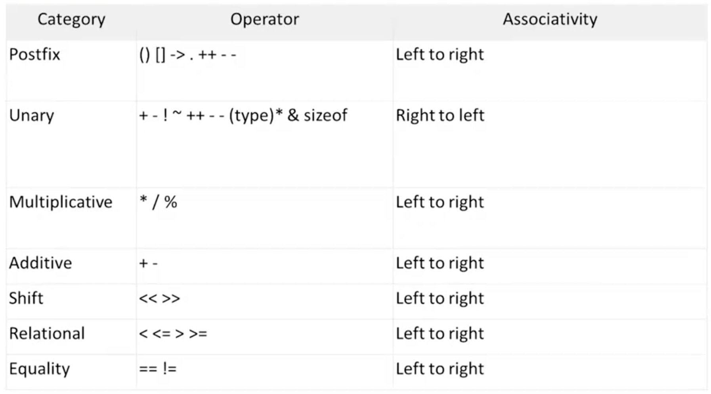

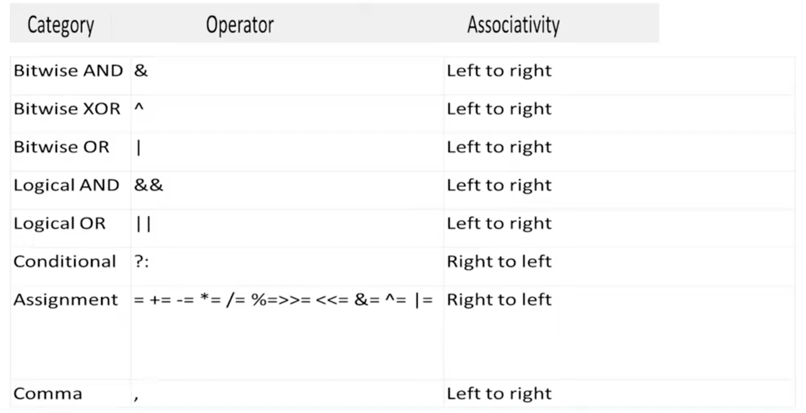

## 28 Challenge of Operators: Converting minutes to years and days

- In this challenge, you are to create a C program that converts the number of minutes to days and years

- The program should ask the user to enter the number of minutes via the termnical

- The program should display as output the minutes and then its equivalent in years and days

- The program should create variables to store (should all be of type double)

  - minutes (int)
  - minutes in year
  - Years
  - Days

- Need to perform a calculation and use arithmetic operators

### 29 Challenge of Operators: Print the byte size of the basic data types

- In this challenge, you are to create a C program that displays the byte size of basic data types supported in C

  - The output varies depending on the system you are running the program

- Display the byte size of the folloing types

  - int
  - char
  - long
  - long long
  - double
  - long double

- You can use the %zd format specifier to format each size

- Use the sizeof operator

- Test on more than one computer to see the differences

## 30 Control Flow Overview

### 30.1 Overview

- The statements inside your source file are generally executed from top to bottom, in the order that they appear.

- Control flow statements, however, break up the flow of execution by employing decision making, looping, and branching, enabling your program to conditionally execute particular blocks of code
  - Decision-making statements (if-then, if-then-else, switch, goto)
  - Looping statements (for, while, do-while)
  - Branching statements (break, continue, return)

### 30.2 Decision Making

- Structures require that the programmer specify one or more conditions to be evaluated or tested by the program
  - If a condition is true then a statement or statement are executed
  - If a condition is false then other statements are executed


### 30.3 If Statements

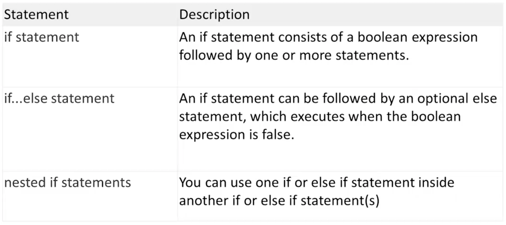

### 30.4 Repeating Code

- There may be a situation, when you need to execute a block of code serveral number of times

  - The statements are executed sequentially: The first statement in a function is executed first, followed by the second, and so on.

- A loop statement allows us to execute a statement or a group of statements multiple times

- Loop control statements change execution from its normal sequence

  - When execution leaves a scope, all automatic objects that were created in that scope are destroyed (`break` and `continue`)

- A loop becomes infinite loop if a condition never becomes false
  - The `for` loop is traditionally used for this purpose

### 30.5 Loop Dataflow


### 30.6 Loops


## 31 If Statements

### 31.1 Overview

- The C programming language provides a general decision-making capability in the form of a `if` statement

```c
if (expression)
  program statement
```

- Translating a statement such as "if it is not raining, then I will go swimming" into the C language is easy

```c
if (it is not raining)
  I will go swimming
```

- The `if` statement is used to stipulate execution of a program statements based upon specified conditions

  - I will go swimming if it is no raining

- The curly brackets are required for compound statements inside the `if` block

### 31.2 If Statement (example)

```c
int score = 95;
int big = 90;

// simple statement if, no brackets

if (score > big)
  printf("Jackpot!\n");

// compound statement if, brackets
if (score > big)
{
  socre++;
  printf("You win\n");
}
```

### 31.3 If with an else

- You can extend the `if` statement with a small addition that gives you a lot more flexibility

**If** the rain today is worse than the rain yesterday,
I will take my umbrella.
**Else**
I will take my jacket.
Then I will go to work.

- This is exactly the kind of decision making the `if-else` statement provides

```c
if (expression)
  Statement1;
else
  Statement2;
```

### 31.4 If with an else (example)

```c
// Program to determine if a number is even or odd

#include <stdio.h>

int main()
{
  int number_to_test, remainder;

  printf("Eneter your number to be tested: ");
  scanf("%i", &number_to_test);

  remainder = number_to_test % 2;

  if (remainder == 0)
    printf("The number is even.\n");

  else
    printf("The number is odd.\n");

  return 0;
}

```

### 31.5 `else if`

- You can handle additional complex decision making by adding an `if` statement to your else clause

```c
if (expression 1)
  program stateemnt 1
else
  if (expression 2)
    program stateemnt 2
  else
    program stateemnt 3
```

- The above extends the `if` statement from a two-valued logic decision to a three-valued logic decision
  - Formatted using teh `else if` construct

```c
if (expression 1)
  program stateemnt 1
else if (expression 2)
  program stateemnt 2
else
  program stateemnt 3
```

### 31.6 `else if` example

```c
// Program to implement the sign funciton
#include <stdio.h>

int main(void)
{
    int number, sign;

    printf("Please type in a number: ");
    scanf("%i", &number);

    if (number < 0)
        sign = -1;
    else if (number == 0)
        sign = 0;
    else // Must be positive
        sign = 1;

    printf("Sign = %i\n", sign);

    return 0;
}
```

### 31.7 Nested `if-else` statement

- A nested `if-else` statements means you can use one if or else if statement inside another if or else if statement(s)

```c
if (boolean_expression 1)
{
  /* Executes when the boolean expression 1 is true */

  if (boolean_expression 2)
  {
     /* Executes when the boolean expression 2 is true */
  }

}
```

### 31.8 Nested `if-else` statement (example)

```c
if (gameIsOver == 0)
  if (playerToMove == YOU)
    printf("You Move\n");

  else
    printf("My Move\n");
else
  printf("The game is over\n");

```

### 31.9 The conditional operator (ternary statement)

- The conditional operator is unique operator

  - unlike all other operators in C
  - Most operators are either unary or binary operators
  - Is a ternary operator (takes three operands)

- The two symbols that are used to denote this operator are the question mark (?) and the colon (:)

- The first operand is placed before the `?`, the second between `?` and the `:`, and the third after the `:`

```c
condition ? expression1 : expression2
```

- The conditional operator evaluates to one of two expressions, depending on whether a logical expression evaluates true or false

- Notice how the operator is arranged in relation to the operands
  - the `?` character follows the logical expression, condition
  - on the right of `?` are two operands, expression1 and expression2, that represnet choices.
  - the value that results from the operation will be the value of expression1 if condition evaluates to true, or the value of expression2 if condition evaluates to false

### 31.10 Conditional operator (example)

```c
x = y > 7 25 : 50;
```

- results in x being set to 25 if y is greater than 7, or to 50 otherwise

- An expression for the maximum or minimum of two varaibales can be written very simply using the conditional operator

## 32 Switch Statement

### 32.1 Overview

- The conditional operator and the if else statements make it easy to write programs that choose between two alternatives

- However, manty times a program needs to chooseone of serveral alternatives

  - You can do this by using if else if...else
  - tedious, prone to errors

- When the value of a variable is successively compared against different values use the switch statement
  - More convenient and efficient

### 32.2 `switch` syntax

```c
switch (expression)
{
  case value_1:
    program statement
    ...
    break;

  case value_n;
    program statement
    program statement
    ...
    break;

  default:
    program statement
    ...
    break;
}

```

### 32.3 `switch` statement details

- The expression enclosed within parentheses is successively compared against the values: value_1, value_2, ..., value_n

  - cases must be simple constants or constant expressions

- If a case is found whose value is equal to expression then the statements that follow the case are executed

  - When more than one statement is included, they do not have to enclosed within braces

- The `break` statement signals the end of a particular case causes execution of the switch statement to be terminated

  - include the `break` statement at the end of every case
  - forgetting to do so for a particular case causes program execution to continue into the next case

- The special optional case called default is executed if the value of expression does not match any of the case values
  - Same as "fall through" else

### 32.4 Switch case example

```c
enum Weekday {Monday, Tuesday, Wednesday, Thursday, Friday, Saturday, Sunday};
enum Weekday today = Monday;

switch(today)
{
  case Sunday:
    printf("Today is Sunday.\n");
  break;
  case Monday:
    printf("Today is Monday.\n");
  break;
  case Tuesday:
    printf("Today is Tuesday.\n");
  break;
  default
    printf("Whatever!.\n");
  break;
}
```

## 33 Challenge of Control Flow: Determine amount of Pay

- In this challenge, you are to create a C program that calculates your weekly pay.

- The program should ask the use to enter the number of hours worked in a week via the keyboard

- The program should display as output the gross pay, the taxes, and the net pay

  - Basic pay rate = $12.00/hr
  - Overtime (in excess of 40 hours) = time and a half
  - Tax rate:
    - 15% of the first $300
    - 20% of the next $150
    - 25% of the rest

- You will need to utilize `if/else` statements

## 34 For Loop

### 34.1 Overview

- Repeating Code:

  - The C programming language has a few constructs specifically designed to handle these situations when you need to use some code repeatedly
  - You can repeat a block of statements until some condition is met or a specific number of times
  - Repeating code without a condition is a forever/infinite loop

- The number of times that a loop is repeated can be controlled simply by a count

  - Repeating the statement block a given number of time (counter controlled loop)

- The number of times that a loop is repeated can depend on when a condition is met
  - The user entering "quit"

### 34.2 `for loop`

- You typically use the `for loop` to execute a block of statements a given number of times

- If you want to display the number from 1 to 10
  - Instead of writing ten statements that can printf(), you would use a for loop

```c
for (int count = 1; count <= 10; ++count)
{
  printf(" %d", count);
}
```

- The `for loop` operation is controlled by what appears between the parentheses that follow the keyword `for`

  - The three control expression that are separated by semicolons control the operation of the loop

- The action that you want to repeat each time the loop repeats is the block containing the statement that calls `printf()` (body of the loop)
  - For single statements, you can omit the braces

### 34.3 `for` syntax

- The general pattern for the `for` loop is:

```c
for (starting_condition; continuation_condition; action_per_iteration)
  loop_statement;
```

- The statement to be repeated is represented by `loop_statement`

  - Cound equally well be a block of several statements enclosed between braces

- The `start_condition` usually (but not always) sets an initial value to a loop control variable

  - The loop control variable is typically a counter of some kind that tracks how often the loop has been repeated
  - Can also declare and initialze several variables of the same type here with the declarations separated by commas
  - Variables will be local to the loop and will not exist once the loop ends

- The `continuation_condition` is a logical expression evaluating to true or false

  - Determines whether the loop should conti to be executed
  - As long as this condition has the value true, the loop will continues
  - Typically checks the value of the loop control variable
  - You can pu any logical or arithmetic expression here as long as you know what you are doing

- The `continuation_condition` is tested at the beginning of the loop rather than at the end

  - Means that the `loop_statement` will not executed at all if the `continuation_condition` starts out as false

- The `action_per_iteration` is executed at the end of each loop iteration
  - Usually an increment or decrement of one or more loop control variables
  - Can modify several variables here, just need to use commas to separate


### 34.4 Another Example

```c
for (int i = 1, j = 2; i <= 5; ++i, j = j+2)
  printf(" %5d", i*j);
```

- The output produced by this fragment will be values 2, 8, 18, 32, and 50 on a single line

### 34.5 `for` example (flexibility)

```c
unsigned long long sum = 0LL;   // Stores the sume of integers
unsigned int count = 0;         // The number of integers to be summed

// Read the number of integers to be sum
printf("\nEnter the number of integers you want to sum: ");
scanf(" %u", &count);

// Sum integers from 1 to count
for (unsigned int i = 1; i <= count; ++i)
  sum += i;

// OR
for (unsigned int i = 1; i <= count; sum += i++)

printf("\nTotal of the first %u number is %llu\n", count, sum);
```

### 34.6 Infinite loop

- You have no obligation to put any parameters in the `for` loop statement

```c
for (;;)
{
  /* statements */
}
```

- The condition for continuing the loop is absent, the loop will continue indefinitely
  - Sometimes useful for monitoring data or listening for connections

## 35 While and Do-While Loops

### 35.1 While Loop

- The mechanisom for repeating a set of statements allows execution to continue for as long as a specified logical expression evaluates to true

- The general syntax for the `while` loop is as follows (one statement in body):

```c
while(expression)
  statement1;
```

or

```c
while(expression)
{
  statement1;
  statement2;
}
```

- The condition for continuation of the while loop is tested at the start (top of the loop)

  - pre-test loop

- If expression starts out false, none of the loop statements will be executed

- If the loop condition starts out as true, the loop body must contain a mechanism for changing this if the loop is to end

### 35.2 Counter Controlled While loop Example

```c
int count = 1;

while (count <= 5)
{
  printf("%i\n", count);
  ++count;
}
```

### 35.3 Logic Controlled While loop Example

```c
int num = 0;
scanf("%d", &num);

while (num != -1)
{
  /* loop actions */
  scanf("%d", &num);
}
```

### 35.4 `do-while` loop

- In the `while` loop, the body is executed while the condition is true

- The `do-while` loop is a loop where the body is executed for the first time unconditionally
- Condition is at the bottom (post-test loop)

- After initial execution, the body is only executed while the condition is true

```c
do
  statement
while (expression);
```

```c
do
{
  prompt_for_password();
  read_user_input();
}
while (input_not_equal_to_password());
```

### 35.5 `do-while` loop example

```c
do
  scanf("%d", &number);
while (number != 20);
```

**_Or counter controlled_**

```c
int number = 4;
do
{
  printf("\nNumber = %d", number);
  number++;
}
while (number < 4);
```

### 35.6 Which loop to use???

- First, decide whether you need an pre or post test loop

  - Usually will be a pre test loop (for or while), a bit better option in most cases
  - It is better to look before you leap (or loop than) after
  - Easier to read if the loop test is found at the beginning of the loop
  - In manay uses, it is important that the loop to skipped entirelly if the test is not initially met

- So, should you use a `for` or a `while`
  - A matter of taste, because what you can do with one, you can do with the other
  - To make a `for` loop like a `while`, you can omit the first and third expressions

```c
for ( ; test; )
```

**_is the same as_**

```c
while (test)
```

### 35.7 `do-while` loop example

- To make a `while` like a `for`, preface it with an initialization and include update statements

```c
initialze;
while(test)
{
  body;
  update;
}
```

**_is the same as_**

```c
for (initialize; test; update)
  body;
```

- A `for` loop is appropriate when the loop involves initializing and updating a variable

- A `while` loop is better when the conditions are otherwise

- Recommendation:
  - `while` loop - logic controlled loops
  - `for` loop - counter controlled loops

```c
while (scanf("%i", &num) == 1)

for (count = 1; count <= 100; count++)
```

## 36 Nested Loops, Break and Continue

### 36.1 Nested Loops

- Sometimes you may want to place one loop inside another

- You might want to count the number of occupants in each house on a street

  - Step from house to house, and for each hous you count the number of occupants

- Going through all the houses could be an oouter loop, and for each iteration of the outer loop you would have an inner loop that counts the occupants

### 36.2 Nested Loops Example (`for` inside a `for`)

```c
for (int i = 0; i <= count; i++)
{
  sum = 0;      // Initialize sum for the inner loop

  // Calculate sum of integers from 1 to i
  for (int j = 1; j <= i; ++j)
    sum += j;

    printf("\n%d\t%d", i, sum);     // Output sum of 1 to i
}
```

### 36.3 Nested Loops Another Example (`while` inside a `for`)

```c
for (int i = 0; i <= count; i++)
{
  sum = 1;      // Initialize sum for the inner loop
  j = 1;        // Initialize integer to be added
  printf("\n1");

  // Calculate sum of integers from 1 to i
  while (j < i)
  {
    sum += ++j;
    printf(" + %d", j);       // Output +j - on the some line
  }

  printf(" = %d", sum);       // Output = sum
}
```

### 36.4 Contiune Statement

- Sometimes a situation arises where you do not want to end a loop, but you want to skip the current iteration

- The `continue` statement in the body of a loop does this

  - All you need to do is use the keyword `continue` in the body of the loop

- An advantage of using `continue` is that it can sometimes eliminate nesting or additional blocks of code

  - Can enhance readbility when the statements are long or are deeply nested already

- Don't use `continue` if it complicates rather than simplifies the code

### 36.5 Contiune Example

```c
enum Day { Monday, Tuesday, Wednesday, Thursday, Friday, Saturday, Sunday };

for (enum Day day = Monday; day <= Sunday; ++day)
{
  if (day == Wednesday)
    continue;
  printf("It's not Wednesday!\n");
  /* Do something usefule with day */
}
```

### 36.6 Break Statement

- Normally, after the body of a loop has been entered, a program executes all the statements in the body before doing the next loop test

  - We learned how continue works
  - Another statement named `break` alters this behavior

- The `break` statement causes the program to immediately exit from the loop it is executing

  - Statements in the loop are skipped, and execution of the loop is terminated
  - If the break statement is inside nested loops, it affects only the innermost loop containing it
  - Use the keyword `break;`

- `break` is often used to leave a loop when there are two separate reasons to leave

- `break` is also used in `switch` statement

### 36.7 Break Example

```c
while (p > 0)
{
  printf("%d\n", p);
  scanf("%d", &q);
  while (q > 0)
  {
    prinft("%d\n", p*q);
    if (q > 100)
      break;        // break from inner loop
    scanf("%d\n", &q);
  }

  if (q > 100)
    break;          // break from outer loop
  scanf("%d\n", &p);
}
```

## 37 Challenge of Control Flow: Guess the Number

### 37.1 Requirements

- Generate a random number from 0 to 20

- Ask the use to guess it

  - User should only be able to enter numbers from 0-20

- The program will indicate to the user if each guess is too high or too low

- The player wins the game if they can guess the number within five tries

### 37.2 Generating a Random Number

- To generate a random number from 0-20
  - include the correct system libraries

```c
#include <stdlib.h>
#include <time.h>
```

- Create a time variable

```c
time_t t;
```

- Initialize the random number generator

```c
srand((unsigned) time(&t));
```

- Get the random number (0-20) and store in an int variable

```c
int randomNumber = rand() % 21;
```

## 38 Arrays: Creating and using Arrays

### 38.1 Arrays

- It is very common to in a program to store many data values of a specified type

  - In a sports program, you might want to store the scores for all grames or the scores for each player
  - You could write a program that does this using a different variable for each score
  - If there are a lot of grames to store then this is very tedious
  - Using an array wil solve this problem

- Arrays allows you to group values together under a single name

  - You do not need separate variables for each item of data

- An arrays is a fixed number of data items that are all of the same type

### 38.2 Declaring an Array

- The data items in an array are referred to as elements

- The elements in an array have to be the same type (`int`, `long`, `double`, etc)

  - You cannot "mix" data types, no such thing as a single array of ints and doubles

- Declaring to use an array in a program is simliar to a normal variable that contains a single value
  - Different is that you need a number between square brackeets `[]` following the name

```c
long numbers[10];
```

- The number between square brackets defines how many elements the array contains
  - Called the size of the array or the array dimension

### 38.3 Accessing an array's elements

- Each of the data items stored in an array is accessed by the same name

- You select a particular element by using an index (subscript) value between square brackets following the array name

- index values are sequential integers that start from zero

  - index values for elements in an array of size 10 would be from 0-9
  - Arrays are zero based
    - `0` is the index value for the first array element
    - For an array of 10 elements, index value 9 refers to the last element

- It is a very common mistake to assume that arrays start from one

  - Referred to as the off-by-one error
  - You can use a simple integer to explicitly reference the element that you want to access
  - To access the fourth value in an array, you use the expression arrayName[3]

- You can also specify an index for an array element by expression in the square brackets following the array name

  - The expression must result in an integer value that corresponds to one of the possible index values

- It is very common to use a loop to access each element in an array

```c
for (i = 0; i < 10; i++)
  printf("Number is %d\n", numbers[i]);
```


### 38.4 Array out of bounds

- If you use an expression or a variable for an index value that is outside the range for the array, your program may crash or the array can contain garbage data

  - Referred to as an out of bounds error

- The compiler cannot check for out of bounds errors so your program will still compile

- Very important to ensure that your array inedxes are always within bounds

### 38.5 Assigning values to an Array

- A value can be stored in an element of an array simply by specifying the array element on the left side of a equal sign

```c
grades[100] = 95;
```

- The value 95 is stored in element number 100 of the grades array

- Can also use variables to assign values to an array

### 38.6 Example of using an array

```c
#include <stdio.h>

int main(int argc, char **argv)
{

    int grades[10];         // Array storing 10 values
    int count = 10;         // Number of values to be read
    long sum = 0;           // Sum of the numbers
    float average = 0.0f;   // Average of numbers

    printf("\nEnter the 10 grades:\n");     // Prompt for the input

    for (int i = 0; i < count; ++i)
    {
        printf("%2u>", (i + 1));
        scanf("%d", &grades[i]);            // Read a grade
        sum += grades[i];                   // Add it to sum
    }

    average = (float) sum / count;

    printf("Sum of grades: %lu\n", sum);
    printf("Average of grades: %.2f\n", average);

    return 0;
}
```

## 39 Array Initialization

### 39.1 Initializing an Array

- You will want to assign initial values for the elements of your array most of the time

  - Defining initial values for array elements makes it easier to detect when things go wrong

- Just as you can assign inital values to variables when they are declared, you can also assign inital values to an array's elements

- To initialize an array's values, simply provide the values in a list
  - Values in the list are separated by commas and the entire list is enclosed in a pair of braces

```c
int counters[5] = {0, 0, 0, 0, 0};
```

- Declares an array called counters to contain five integer values and initializes each of these elements to zero

```c
int integers[5] = {0, 1, 2, 3, 4};
```

- Declares an array named integers and sets the value of integers[0] to 0, integers[1] to 1, integers[2] to 2, and so on

- It is not necessary toccompletely initialize an entire array

- If fewer initial values are specified, only an equal number of elements are initialzed
  - Remaining values in the array are set to zero

```c
float sample_data[500] = {100.0, 300.0, 500.5};
```

- Initialized the first values of `sample_data` to 100.0, 300.0, and 500.5, and sets the remaining 497 elements to zero

### 39.2 Designeated Initializers

- C99 added a feature called designated initializers

  - Allows you to pick and choose which elements are initialized

- By enclosing an element number in a pair of brackets, specific array elements can be initialized in any order

```c
float sample_data[500] = { [2]=500.5, [1]=300.0, [0]=100.0}
```

### 39.3 Example of traditional initialization

```c
#include <stdio.h>

#define MONTHS 12

int main()
{

  int days[MONTHS] = {31, 28, 31, 30, 31, 30, 31, 31, 30, 31, 30, 31};
  int index;

  for (index = 0; index < MONTHS; index++)
    printf("Month %d has %2d days.\n", index+1, days[index]);

  return 0;
}
```

### 39.4 Example of designated initialization

```c
#include <stdio.h>

#define MONTHS 12

int main()
{

  // int days[MONTH] = {31, 28, 31, 30, 31, 30, 31, 31, 30, 31, 30, 31};
  int days[MONTHS] = {31, 28, [4] = 31,30,31, [1]=29};
  int index;

  for (index = 0; index < MONTHS; index++)
    printf("Month %d has %2d days.\n", index+1, days[index]);

  return 0;
}
```

### 39.4 Repeating an initial value

- C does not provide any shortcut mechnisoms for initializing array elements

- No way to specify a repeat count

- If it were desired to initially set all 500 values to sample_data to 1, all 500 would have to be explicitly assigned

- To solve this problem, you will want to initialize the array inisde the program using a loop

```c
#include <stdio.h>

int main(void)
{
  int array_values[10] = {0, 1, 4, 9, 16};
  int index;

  for (index = 5; index < 10; ++index)
    array_values[index] = index*index;

  for (index = 0, index<10; ++index)
    printf("array_values[%i] = %i", index, array_values[index]);

  return 0
}
```

## 40 Multidimensional Arrays

### 40.1 Overview

- The types of arrays that you have been exposed to so far are all linear arrays

  - A single dimension

- The C language allows arrays of any dimension to be defined

  - Two dimensional arrays are the most common

- You can visualize a two-dimensional array as a rectangular arrangement like rows and columns in a spreadsheet

- One of the most natural applications for a two-dimensional array arises in the case of a matrix

- Two-dimensional arrays are declared the same way that one-dimensional arrays are

```c
int matrix[4][5]
```

- Delcares the array `matrix` to be a two-dimensional array consisting of 4 rows and 5 columns, for a total of 20 elements
  - Note how each dimension is between its own pair of square brackets

### 40.2 Initializing a two dimensional array

- Two-dimensional arrays can be initialized in the same manner of a one-dimensional array

- When listing elements for initialization, the values are listed by row
  - The difference is that you put the initial values for each row between braces 0, {}, and then enclose all the rows between braces

```c
int numbers[3][4] = {
  {10, 20, 30, 40},
  {15, 25, 45, 45},
  {17, 27, 37, 47 },
};
```

- Commas are required after each braces that closes off a row, except in the case of the final row

- The use of the inner pairs of braces is actually optional, but, should be used for readability

### 40.3 Initializing a 2D array

- As with one-dimensional arrays, it is not required that the entire array be initialized

```c
int matrix[4][5] = {
  {1, 2, 3},
  {4, 5, 6},
  {7, 8, 9}
};
```

- Only initializes the first three elements of each row of the matrix to be indicated values
  - Remaining values are set to 0
  - In thi case, the inner pairs of braces are requied to force the correct initialization

### 40.4 Designated Initialer

- subscripts can allos in the initialization list, in a like manner to single-dimensional arrays

```c
int matrix[4][3] = { [0][0]=1, [1][1] =5}
```

- Intializes the three indicated elements of matrix to be specified values
  - Unspecified elements are set to zero by default
  - Each set of values that initialzes the elements in a row is between braces
  - The entire initializatio goes between another
  - The values for a row are separated
  - Each set of row values is separated from the next seet of a comma

### 40.5 Other dimensions

- Everything mentioned so far about two-dimensional arrays can be generated to three dimensional arrays and further

- You can declare a three-dimensional array in this way

```c
int box[10][20][30]
```

- You can visualize to one-dimensional array as a row of data
- You can visualize a one-dimensional array as a row data
- You can visualize a three-dimensional array as a stack of dat;

## 41 Variable Length Arrays

- C99 intriduced variable-length arrays primarily to allow C to become a btter language for numerical computing
  - VLAs make it easier to convert exsiting librairies of FORTRAN numerical calculation routines to C

```c
int n = 4;
int m = 8;
float a1[5];                    // yes
float a2[5*2 + 1];              // yes
float a3[sizeof(int) + 1];      // yes
float a4[-4];                   // no, size musth be > 0
float a5[0];                    // no, size musth be > 0
float a6[2.5];                  // no, size must be an integer
float a7[(int)2.5];             // yes
float a8[n];                    // not allowed before C99, VLA
float a9[m];                    // not allowed before C99, VLA
```

## 42 Challenge of Array: Generate Prime Numbers

### 42.1 Requirements

- Find the prime numbers from 3-100

- There will be no input to the program

- The output will be each prime number separated by a space on a single line

- You will need to create an array that will store each prime number as it is generated

- You can hard-code the first two prime number (2 and 3) in the primes array

- You should uilize loops to only find prime numbers up to 100 and a loop to print out the primes array

### 42.2 Hints

- The criteria that can be used to identify a prime number is that a number is considered prime if it is not evenly divisible by any other previous numbers

- Can use the following as an exit condition in the innermost loop

  - `p / primes[i] >= primes[i]`
  - a test to ensure that value of p does not exceed the square root of primes[i]

- Your program can be more efficient by skipping any checks for even numbers

## 43 Challenge of Arrays: Create a simple Weather Program

### 43.1 Challenge

- A two dimensional array in a weather program

- This program will find the total rainfall for each year, the average yearly rain fill, and the average rainfall for each month

- Input will be a 2D array with hard-coded values for rainfall amounts for the past 5 years
  - The array should have 5 rows and 12 columns
  - Rainfaill amounts can be floating point numbers

### 43.2 Example output

YEAR RAINFALL (inches)
2020 32.5
2011 37.9
2012 49.8
2013 44.0
2014 32.9

The yearly average is 39.4 inchees.

MONTHLY AERAGES:
Jan Feb Mar Apr May Jun Jul Aug Sep Oct Nov Dec
7.3 7.3 4.9 3.0 2.3 0.6 1.2 0.3 0.5 1.7 3.6 6.7

### 43.3 Hints

- Initialize your 2D array with hard-coded rainfall amounts

- Remember, to iterate through 2 2D array you will need a nested loop

- The key to this solution will be visualize a 2D array and understand how to iterate through how to iterate through one, via a nested loop

- As you are iterating , you can keep a running total(outer loop literate by niang), inner loop

- To get the average monthly rainfa, iterate though the 2D array by having the outer loop go through

## 44 Challenge of Arrays: Create a Simple Weather Program

### 44.1 Requirements

- Uses a two-dimensional array in a weather program

- This program will find the total rainfall for each year, the average yearly rainfall, and the average rainfall for each month

- The input will be a 2D array with hard-coded values for rainfall amounts for the past 5 years

  - The array should have 5 rows and 12 columns
  - Rainfall amounts can be floating point numbers

### 44.2 Example output

YEAR RAINFALL (inches)
2012 32.4
2011 37.9
2012 49.8
2013 44.0
2014 32.9

The yearly average in 39.4 inches.

MONTHLY AVERAGES:

Jan Feb Mar Apr May Jun Jul Aug Sep Oct Nov Dec
7.3 7.3 4.9 3.0 2.3 0.6 1.2 0.3 0.5 1.7 3.6 6.7

### 44.3 Hints

- Initialize your 2D array with hard-coded rainfall amounts

- To iterae through a 2D array you will need a nested loop

- The key to this solution will be to visualize a 2D array and understand how to iterate through one, via a nested loop

- As you are iterating, you can keep a running total (outer loop iterate by year, inner loop iterate by month) to get the total rainfall for all years

- To get the average monthly rainfalls, iterate though the 2D array by having the outer loop go through each month and the inner loop go through each year

## 45 FUnction Basics

### 45.1 Overview

- A function is a self-contained unit of program code designed to accomplish a particular task

- Syntax rules define the structure of a function and how it can be used

- A function in C is the same as subroutines or procedures in other programming languages

- Some functions cause an action to take place

  - `printf()` causes data to be printed on your screen

- Some functions find a value for a program to use
  - `strlen()` tells a program how long a certain string is

### 45.2 Advantages

- Allow for the divide and conquer strategy

  - It is very difficult to write an entire program as a single large main function
    - Difficult to test, debug and maintain

- With divide and conquer, takes can be divided into serveral independent subtasks

  - Reduces the overall complexity
  - Separate functions are written for each subtask
  - We can further divide each subtask into smaller subtask, further reducing the complexity

- Reduce duplication of code

  - Saves you time when writing, testing, and debugging code
  - Reduces the size of the source code

- If you have to do a certain task several times in a program, you only need to write an appropriate function once

  - Program can then sue that function wherever needed
  - You can also use the same function in different programs (`printf`)

- Helps with readability

  - Program is better organized
  - Easier to read and easier to change or fix

- The divide and conquer approach also allows the parts of a program to be developed, tested and debugged independently

  - Reduces the overall development time

- The functions developed for one program can be used in another program

  - Software reuse

- Many programmers like to thik a function as a "black box"

  - Information that goes in (its input)
  - The value or action it produces (its output)

- Using this "black box" thinking helps you concertrate on the program's overall design rather that the details
  - What the function should do and how it relates to the program as a whole before worrying about writting the code

### 45.3 Examples

- You have already used built-in functions such as `printf()` and `scanf()`

- You shoud have noticed how to invoke these functions and pass data to them
  - Argument between parentheses following the function name

e.g.
`printf()` - First argument is usually a string literal, and the succeeding arugments(of which there may none) are a series of variables or expressions whose value are to be displayed

- You should have notice how you can receive information back from a function
- The input is toredin in an argument
- As a return value.

### 45.4 Example

```c
#define SIZE 50
int main(void)
{
  float list[SIZE];

  readies(list, SIZE);
  sort(list, SIZE);
  average(list, SIZE);
}
```

45.5 Implementing functions

- Remember, just calling functions does not work unless we implement the function cod.

- Always use descriptive function names to make it clear what the program does how its organized
  - If you can make the functions gerneral enough, you can reuse them in other programs

### 45.6 `main()` function

- as a reminder, the `main()` is a specially recognized name in the C system
  - indicates C programs must always have a main()
  - all C programs must always have a main()
  - can pass data to it (command line arguments)
  - returaning data optional (error code)


## 46 Defining Functions

### 46.1 Overview

- When you create a function, you specify the function header as the first line of the function definition
  - Followed by a starting curly brace `{`
  - The excutable code in between the starting and ending braces
  - The ending curly brace `}`
  - The block of code between braces following the function header is called the function body
  
- The function header defines the name of the function
  - Parameters (which specify the number and types of values that are passed to the function when it's called)
  - The type for the value that the functon returns

- The function body contains the statements that are executed when the function is called
  - Have access to any values that are passed as arguments to the function

  ```c
  Return_type Function_name( Parameters - separated by commas)
  {
    // Statements...
  }
  ```

- The first line of a function definition tells the compiler (in order from left to right) three things about the function
  - The type of value it returns
  - Its name
  - The arguments it takes

- Choosing meaning function names is just as important as choosing meaningful variable names 
  - Greatly affects the program's readability

### 46.2 Example: Defining Functions

```c
void printMessage(void)
{
  printf("Programming is fun.\n");
}
```

- The first line of the `printMessage()` function definition tells the compiler that the function returns to value: keyword `void`

- Next is its name: `printMessage`

- After that is that it takes no arguments (the second use the keyword `void`)


### 46.3 Defining a Function

- The statements in the function body can be absent, but the braces must be present

- If three are no statements in the body of a function, the `return` type must be `void`, and the function will not do anything
  - Defining a function with an empty body is often useful during the testing phase of a complicated program
  - Allows you to run the program with only selected functions actually doing something
  - You can then add the details for the function bodies step by step, testing at each stage, until the whole thing is implemented and fully tested


  ### 46.4 Naming Functions

  - The name of a function can be any legal name
    - Not a reserved word (such as `int`, `double`, `sizeof`, and so on)
    - Is not the same name as another funciton in your program
    - Is not the same name as any of the standard library functions 
      - Would prevent you from using hte library function

  - A legal name has the same form as that of a variable
    - A sequence of letters and digits
    - First character must be a letter
    - Underline character counts as a letter

  - The name that you choose should be meaningful and relevant to what the function does

  - You will often define function names (and variables, too) that consist of more that one word

  - There are three common approaches you can adopt
    - Separate each of the words in a function name with an underline character
    - Capatialize the first letter of each word
    - Capitalize words after the first (camelCase)

### 46.5 Function Prototypes

- A function prototype is a statement that defines a function
  - Defines its name, its return value type, and the type of each of its parameters
  - Provides all the external specifications for the function

- You can write a prototype for a function exactly the same as the function header
  - Only difference is that you add a semicolon at the end

```c
void printMessage(void);
```

- A function prototype enables the compiler to genenerate the appropriate instructions at each point where you call the function
  - It also checks that you are using the funciton correctly in each invocation

- When you include a standard header file in a program, the header file adds the funciton prototypes for that library to your program
  - The header file `stdio.h` contains function prototyps for `printf()`, among others

- Generally appera at the beginning of a source file prior to the implementations of any functions or in a header file

- Allows any of the funcitons in the file to call any function regardless of where you have placed the implementation of functions

- Parameter names do not have to be the same as those used in the function definition
  - Not required to include the names of parameters in a funciton prototype

- Its good practice to always include declarations for all the functions in a program source file, regardless of where are called
  - Will help keep your programs more consistent in design
  - Prevent any errors from occurring if, at any stage, you choose to call a funciton from another part of your programs

### 46.6 Example: Function Prototypes

```c
#include <stdio.h>

void add();

int main()
{
    add();
    return 0;
}

void add()
{

    add();
    return 0;
}
```

## 47 Functions Arguments and Parameters

### 47.1 Overview

- A parameter is a variable in a function declaration and function definition/implementation

- When a function is called, the arguments are the data you pass into the funcitons parameters. 
  - The actual value of variable that gets passed to the function

- Funciton paramters are defined within the function header
  - Are placeholders for the arguments that need to be specified when the function is called

- The parameters for a funciton are a list of parameter names with their types
  - Each parameter is separated by a comma
  - Entire list of parameters is enclosed between the parentheses that follow the function name

- A funciton can have no parameters, in which case you should put `void` between the parentheses

- Parameters provide the means to pass data to a function
  - Data passed from the calling function to the funciton that is called

- The names of the parameters are local to the function
  - They will asssume the values of the arauments that are passed when the function is called

- The body of the function should use these parameters in its implementation

- A function body may have additional locally defined variables that are needed by the functions' implementation

- When passing an array an argument to a function
  - You must also pass an additional argument specifying the size of the array
  - The function has no means of knowing how many elements there are in the array

### 47.1 Example

- When the `printf()` function is called, you always supply one or more values as arguments
  - First value being the format string
  - The remaining values being any variables to displayed

- Paramenters greatly increase the usefulness and flexibility of a funciton
  - The `printf()` function displays whatever you tell it to display via the parameters and arguments passed

- It is a good idea to add comments before each of your own function definitions
  - Help explain waht the function does and how the arguments are to be used

```c
#include <stdio.h>

void multiplyTwoNumbers(int x, int y)
{
  int result = x * y;
  printf("The product of %d multiplied by %d is: %d\n", x, y, result);
}

int main(void)
{
  multiplyTwoNumbers(10, 20);
  multiplyTwoNumbers(30, 40);
  multiplyTwoNumbers(50, 60);

  return 0;
}
```

## 48 Returning Data from Functions

### 48.1 Overview

  ```c
  Return_type Function_name( Parameters - separated by commas)
  {
    // Statements...
  }
  ```

- The `Return_type` specifies the type of the value returned by the function

- You can specify the type of value to be returned by a funciton as nay of the legal types in C
  - Includes enumeration types and pointers

- The return type can also be type `void` which means no value is returned

### 48.2 The `return` statement

- The `return` statement provides the means of exiting from a function

```c
return;
```

- This form of the `return` statement is used exclusively in a finction where the `return` type has been declared as `void`
  - Does not return a value

- The more general form of the `return` statement is:
```c
return expression;
```

- This form of the `return` statement must be used when the `return` value type has been declared as some type other than `void`

- The value that is returned to the calling program is the value that results when expression is evaluated 
  - Should be of the return type specified for the function


### 48.3 Returning Data

- A function that has statements in the function body but does not return a value must have the return type as `void`
  - Will get an error message if you compile a program that contains a function with a `void` return type that tries toe return a value

- A function that does not have a `void` return type must return a value of the specified return type 
  - Will get an error message from the compiler if return type is different thant specifiied

- If expression results in a value that's a different type from the return type in the funciton header, the compiler will insert a conversion from the type of expression to the one required
  - If conversion is not possible then the compiler will produce an error message

- There can be more than one return statement in a function
  - Each return statement must supply a value that is convertible to the type specified in the function header for the return value

### 48.4 Invoking a Funciton

- You call a function by using the function named followed by the arguments to the funciton between parentheses

- When you call the funciton, the values of the arguments that you specify in the call will be assigned to the parameters in the function

- When the funciton executes, the computation proceeds using the values you supplied as arguments 

- The arguments you specify when you call a funciton should agree in type, number, and sequence with the parameters in the funciton header

### 48.5 Invoking a function and assigning data returned 

- If the function is used as the right side of an assignment statement, the return value supplied by the funciton will be subsittuted for the funciton 
  - Will also work with an expression

```c
int = myFuncitonCall();
```

- The caling function doesn't have to recognize or process the value returned from a called function
  - Up to you how you use values from function calls

## 49 Local and Global Variables

### 49.1 Local Variables

- Variables defined inside a function are known as automatci local variables
  - They are automatcially "created" each time the funciton is called
  - Their values are local to the function

- The value of a local variable can only be accessed by the function in which the variable is defined 
  - Its value cannot be accessed by any other function

- If an initial value is given to a variabel inside a function, that initial value is assigned to the variable each time the function is called

- Can use the `auto` keyword to be more precise, but, not necessary, as the compiler adds this by default

- Local variables ar ealso applicable to any code where the variable is created in a block (loops, if statements)

### 49.2 Global Variables

- The opposite of a local variable

- Global variables value can be accessed by any function in the program

- A global variable has the lifetime of the program

- Global variabels ar edeclared ouside of any function
  - Does not belong to any particular function

- Any function in the program can change the value of a global variable

- If there is a local variabel declared in a function with the same name, then wihtin that function the local variabel will mask the global variable

### 49.3 Example

```c
int myGlobal = 0;         // global variabel

int main()
{
  int myLocalMain = 0;    // local variable
  // Can access myGlobal and myLocal
  return 0;
}

void myFunction()
{
  int x;                  // local variabel
}
// Can access myGlobal and x, cannot access myLocal
```

### 49.4 Avoiding Using Global Variables

- In general, global variables are a "bad" thing and should be avoided
  - Promotes coupling between functions (dependencies)
  - Hard to find the location of a bug in a program
  - Hard to fix a bug once its found

- Use parameters in functions instead
  - If a lot of data, use a `struct`

## 50 Challenge of Functions: Write some functions

- We need to get some practice writing functions
    - Better organized code
    - Avoid duplication
