# CodeWithMosh C++ - Part 2

## 1 Arrays

### 1.1 Creating and Initializing Arrays

```cpp
#include <iostream>

int main() {

    int numbers[4] = {10, 20};

    std::cout << numbers[0] << std::endl;

    return 0;
}
```

### 1.2 Determing the Size of Arrays

```cpp
#include <iostream>

int main() {

    int numbers[4] = {10, 20};

    // Do NOT use this method, big wasting on the memory!!!
    for (int i = 0; i < sizeof(numbers) / sizeof(int); i++)
        std::cout << numbers[i] << std::endl;

    for (int number: numbers)
        std::cout << number << std::endl;

    return 0;
}
```

### 1.3 Copying Arrays

```cpp
#include <iostream>

#define ARRAY_SIZE 4

int main() {

    int first_numbers[ARRAY_SIZE] = {10, 20};
    int second_numbers[ARRAY_SIZE];

    int size = sizeof(first_numbers) / sizeof(int);
    for (int i = 0; i < size; i++)
        second_numbers[i] = first_numbers[i];

    for (int number : first_numbers)
        std::cout << number << std::endl;

    for (int number : second_numbers)
        std::cout << number << std::endl;

    return 0;
}
```

### 1.4 Comparing Arrays

```cpp
#include <iostream>

// #define ARRAY_SIZE 4


int main() {

    int first[] = {10, 20, 30, 40};
    int second[] = {10, 20, 30, 40};

    bool areEqual = true;
    int size = sizeof(first) / sizeof(int);
    for (int i = 0; i < size; i++)
    {
        if (first[i] != second[i])
        {
            areEqual = false;
            break;
        }
    }

    std::cout << areEqual << std::endl;

    return 0;
}
```

### 1.5 Passing Arrays to Functions

```cpp
#include <iostream>

// #define ARRAY_SIZE 4

void printNumbers(const int *numbers, const int size) {
    for (int i = 0; i < size; i++)
        std::cout << numbers[i] << " ";
    std::cout << std::endl;
}

int main() {

    int numbers[] = {10, 20, 30, 40};
    int size = sizeof(numbers) / sizeof(int);
    printNumbers(numbers, size);

    return 0;
}
```

### 1.6 Understanding size_t

Both the `size` function as well as the `sizeof` operator return a value of type `size_t`. `t` here is short for type, or a data type defined in the standard library that is used for representing the size of objects. It's guaranteed to be large enough to contain the size of the largest object the system can handle.

```cpp
#include <iostream>

using namespace std;

int main() {
    int number[] = { 10, 20, 30 };
    cout << "sizeof(int): " << sizeof(int) << endl;
    cout << "sizeof(size_t): " << sizeof(size_t) << endl;
    cout << "sizeof(long long): " << sizeof(long long) << endl;

    return 0;
}
```

```sh
sizeof(int): 4
sizeof(size_t): 8
sizeof(long long): 8
```

An integer takes 4 bytes, but the `size_t` value takes 8 bytes, so it takes more memory and can store larger values. This is equivalent to the `long long` type, which takes 8 bytes of memory.

The difference is that `long long` values are signed by default, so they can be negative or positive, but `size_t` values are always positive, so they can store larger values.

```cpp
#include <iostream>
#include <limits>

using namespace std;

int main() {
    int number[] = { 10, 20, 30 };
    cout << "sizeof(int): " << sizeof(int) << endl;
    cout << "sizeof(size_t): " << sizeof(size_t) << endl;
    cout << "sizeof(long long): " << sizeof(long long) << endl;
    cout << "std::numeric_limits<long long>::min()" << std::numeric_limits<long long>::min() << endl;
    cout << "std::numeric_limits<long long>::max()" << std::numeric_limits<long long>::max() << endl;
    cout << "std::numeric_limits<size_t>::min()" << std::numeric_limits<size_t>::min() << endl;
    cout << "std::numeric_limits<size_t>::max()" << std::numeric_limits<size_t>::max() << endl;

    return 0;
}
```

```sh
sizeof(int): 4
sizeof(size_t): 8
sizeof(long long): 8
std::numeric_limits<long long>::min()-9223372036854775808
std::numeric_limits<long long>::max()9223372036854775807
std::numeric_limits<size_t>::min()0
std::numeric_limits<size_t>::max()18446744073709551615
```

| `size_t` equivalent | machine type |
| ------------------- | ------------ |
| unsing int          | 32 bit       |
| unsing long long    | 64 bit       |

There is nothing magical about it, it's just a data type for representing the sizes, this type is guaranteed to be large enough to contain the size of the largest object the system can handle.

### 1. Unpacking Arrays

- C++: str7uctured binding
- JavaScript: destructuring
- Python: unpacking

```cpp
#include <iostream>

using namespace std;

int main() {
    int values[] = { 10, 20, 30 };
    auto [x, y, z] = values;

    // int x = values[0];
    // int y = values[1];
    // int c = values[2];

    cout << "x: " << x << endl;
    cout << "y: " << y << endl;
    cout << "z: " << z << endl;

    return 0;
}
```

### 1.8 Searching Arrays - Linear Searching

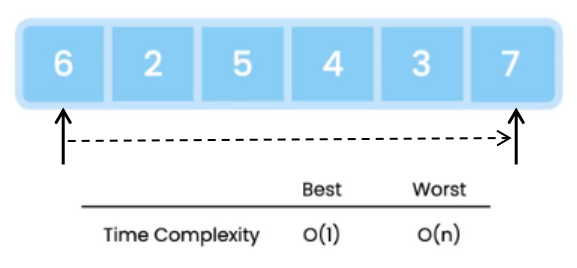

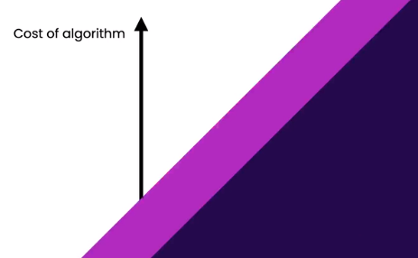

**EXERCISE**

Implement the linear search algorithm.

Create a function for finding a value in an integer array. If the target value exists, return its index; otherwise return -1.

```cpp
#include <iostream>

using namespace std;

int find(int *numbers, int size, int target);

int main() {

    int numbers[] = { 10, 20, 30 };

    int index = find(numbers, 3, 20);

    cout << index << endl;

    return 0;
}

int find(int *numbers, int size, int target) {

    for (size_t i = 0; i < size; i++) {
        if (numbers[i] == target)
            return i;
    }

    return -1;
}
```

### 1.9 Sorting Arrays - Bubble Sorting

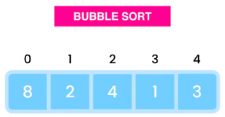

Let's say we have an area of integers and we want to sort this array in an increasing order with bubble sort algorithm.

We scan the array from left to right, and if items are out of order we swap them. So we start off by comparing the items at index 0 and 1, if the right item is smaller than the left item, we swap them because we want to sort this aray in ascending order.

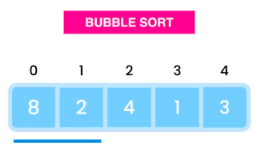

So here 2 is smaller than 9 and we have to swap them, now we compare the items at index 1 and 2.

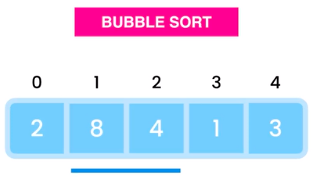

Again the right item is smaller, so we have to swap these items as well.

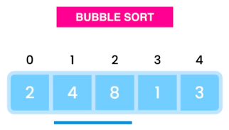

One more time, again we have to swap these items.

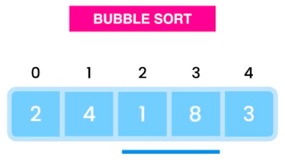

And one last time.

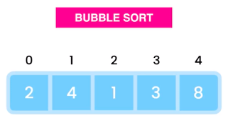

This was our first iteration or first pass, we need multiple passes to fully sowrdness array, at the end of each pass, the next largest item moves to its correct position. So here 8 is in the correct position.

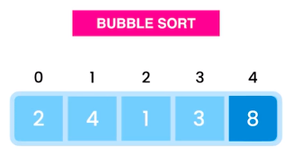

This is why we call this algorithm "Bubble Sword". Because after each pass, the next largest item bubbles up, and moves to its correct position.

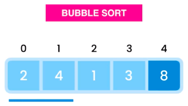

So in the next pass, the next largest item which is 4 will bubble up. Once again we compare the items at index 0 and 1, these items are in the right order, because 4 is greater than 2, so we don't need to swap them.

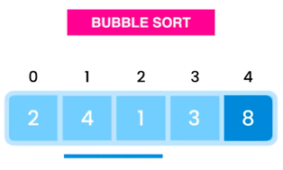

Let's look at the next 2 items, 1 is smaller than 4, so we should swap these items.

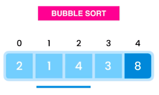

And one more time, again these items are out of order, so we need to swap them.

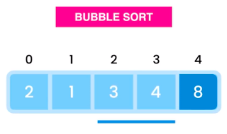

And the last items are in the right order, so we're done with the second pass, now 4 is in the right position.

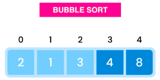

As you can see, our array is almost sorted, we just need one more pass to swap 2 and 1, and then our array will be fully sorted.

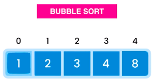

```cpp
#include <iostream>

using namespace std;

void swap(int *numbers, int i, int j);
void sort(int *numbers, int size);

int main() {

    int numbers[] = { 8, 2, 4, 1, 3 };
    int size = sizeof(numbers) / sizeof(int);
    sort(numbers, size);

    for (int i = 0; i < size; i++)
        cout << numbers[i] << endl;

    return 0;
}

void swap(int *numbers, int i, int j) {
    int temp = numbers[i];
    numbers[i] = numbers[j];
    numbers[j] = temp;
}

void sort(int *numbers, int size) {
    for (int pass = 0; pass < size; pass++) {
        for (int i = 1; i < size; i++) {
            if (numbers[i] < numbers[i - 1])
                swap(numbers, i, i-1);
        }
    }
}
```

### 1.10 Multi-dimensional Arrays

```cpp
#include <iostream>

#define ROW 2
#define COL 3

void printMatrix(int matrix[ROW][COL]){
    for (int row = 0; row < ROW; row++)
    {
        for (int col = 0; col < COL; col++)
            std::cout << matrix[row][col] << " ";
        std::cout << std::endl;
    }
}

int main() {

    int matrix[ROW][COL] = {
        {11, 12, 13},
        {21, 22, 23}
    };

    printMatrix(matrix);

    return 0;
}
```

## 2 Pointers

### 2.1 What is a Pointer?

**Pointer is a special variable that hold the address of another variable in memory.**

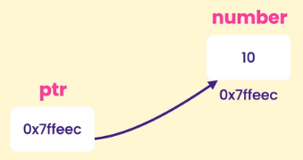

**The reasons for using pointers:**

- Efficently passing large objects
- Dynamic memory allocation
- Enabling polymorphism

### 2.2 Delcaring and Using Pointers

```cpp
#include <iostream>

int main() {

    int number = 10;
    std::cout << "&number: " << &number << std::endl;

    int* ptr = &number;

    std::cout << "ptr: " << ptr << std::endl;
    std::cout << "*ptr: " << *ptr << std::endl;

    // Indirection (de-referencing) operator
    *ptr = 20;
    std::cout << "*new ptr : " << *ptr << std::endl;

    int* newPtr = nullptr;  // NULL - conventional C
                            // 0 - ealier C++

    std::cout << "nullptr: " << newPtr << std::endl;


    return 0;
}
```

### 2.3 Constant Pointers

**3 Scenarios**

1. Data is constant
2. Pointer is constant
3. Both data and pointer are constant

```cpp
/* Scenario 1: Data is constant */

#include <iostream>

int main() {

    const int x = 10;
    // int* ptr = &x; // Error
    const int* ptr = &x;

    int y = 20;
    ptr = &y; // Pointer is not constant

    return 0;
}
```

```cpp
/* Scenario 2: Pointer is constant */

#include <iostream>

int main() {

    int x = 10;
    int* const ptr = &x;

    int y = 20;
    // ptr = &y; // Error

    *ptr = 20;

    return 0;
}
```

```cpp
/* Scenario 3: Pointer and Data are constant */

#include <iostream>

int main() {

    const int x = 10;
    const int* const ptr = &x;

    int y = 20;
    // ptr = &y; // Error

    // *ptr = 20; // Error

    return 0;
}
```

### 2.4 Passing Pointers to Functions

```cpp
#include <iostream>

void increasePrice(double* price) {
    *price *= 1.2;
}

int main() {

    double price = 100;
    double *ptr = &price;
    increasePrice(ptr);

    std::cout << "Price: " << price << std::endl;

    return 0;
}
```

```cpp
#include <iostream>

void swap(int* first, int* second) {
    int temp = *first;
    *first = *second;
    *second = temp;
}

int main() {

    int a = 40;
    int *ptr_a = &a;
    int b = 80;
    int *ptr_b = &b;

    std::cout << "a = " << a << ", b = " << b <<std::endl;

    swap(ptr_a, ptr_b);
    std::cout << "a = " << a << ", b = " << b <<std::endl;

    return 0;
}
```

### 2.5 The Relationship Between Arrays and Pointers

### 2.6 Pointer Arithmetic

```cpp
#include <iostream>

using namespace std;

int main() {

    int numbers[] = { 10, 20, 30 };
    int* ptr = numbers;

    ptr++; // Increament by the size of element

    cout << *ptr << endl; // 20 -> not used
    cout << *(ptr + 1) << endl; // 30

}
```

### 2.7 Comparing Pointers

```cpp
#include <iostream>

using namespace std;

int main() {

    int x = 10;
    int y = 20;

    int* ptrX = &x;
    int* ptrY = &y;
    int *ptrXX = &x;

    if (ptrX == ptrY)
        cout << "ptrX == ptrY: " << "Same" << endl;
    else
        cout << "ptrX == ptrY: " << "Different" << endl;

    if (ptrX == ptrXX)
        cout << "ptrX == ptrXX: " << "Same" << endl;
    else
        cout << "ptrX == ptrXX: " << "Different" << endl;

    return 0;
}
```

In the quality comparisom is avoiding null pointers, as a best practice, whenever we want to use a pointer, we should make sure it's not a null pointer.

Before we are dereferencing the pointer `ptrX`, we should make sure `ptrX` is not an null pointer.

```cpp
if (ptrX != nullptr)
    std::cout << *ptrX;
```

**EXERCISE**

Given this array:

```cpp
int numbers[] = { 10, 20, 30 };
```

Create a pointer that points to the last element in this array.

Use a while loop to iterate over this array, and print the numbers in reverse order.

```cpp
#include <iostream>

using namespace std;

int main() {

    int numbers[] = { 10, 20, 30 };
    int* ptr = numbers;
    int* last = ptr + 2;

    cout << "Last element: " << *last << endl;

    while (ptr != last) {
        cout << *last << " ";
        last--;
    }
    cout << *ptr;
    cout << endl;

    return 0;
}
```

```cpp
#include <iostream>

using namespace std;

int main() {

    int numbers[] = { 10, 20, 30 };
    int* ptr = &numbers[size(numbers) - 1];

    while (ptr >= numbers) {
        cout << *ptr << " ";
        ptr--;
    }
    cout << endl;

    return 0;
}
```

### 2.8 Dynamic Memory Allocation

The second applicational pointers in dynmaic memory allocation, so if you declare an area of integers like this, you are limiting our program to handle a maximum of 10 numbers.

```cpp
int numbers[10];
```

Now what if we run the program and we get more than 10 numbers from the user or as part of reading a file. Well we can increase the size of this array to 100 or 1000 or even more, but again there is always a limit.

Now we receive only a single value from the user then we are wasted a lot of space, just to store a single value. This is where dynamic memory allocation helps, so instead of committing to a high number, like 1000 initially.

We can allocate space for storing let's say 10 numbers, then during our program execution or at runtime. If we need more space we can allocate it on **Demont**, this is dynamic memory allocation.

Now to allocate memory dynamically, we are going to use a different syntax, we cannot use this syntax to declare variables.

So to do that we are going to use the new operator followed by the target type which is on integer array. Here in square brackets we specify the initial size like 10, now this returns an integer pointer.

```cpp
new int[10];
```

Now this returns an integer pointer, so we store it in a variable called numbers.

```cpp
int* numbers = new int[10];
```

Now when we declare a variable using this syntax that variable is declared in a prt of memory called **heap** or **free store**. In contrast with the first syntax that variable is declared on a different part of memory called the **stack**.

The great things about variables declared on the **stack** is that they get automatic clean up, so once they go out of scope, the memory that was allocated to them, gets released automatically.

In this case, you know that the scope of this variable is limited to this function. So once this function finishes execution, our number is variable is going to go out of scope and the memory that was allocated to it will get released automatically.

So it can be reused in the future, now in contrast, when we declare a variable on the heap using the new operator. We programmers are responsible for the cleanup and that means if we don't do our job properly, that memory that was allocted for these variables will never get released and our program will end up consuming more and more memory and eventually is going to crash. We say our program is having a **memory leak**, meaning it's constantly consuming more and more memory.

So once we are finished with this variable, then we should always dealocate memory usin the `delete` operator. Now here we are dealing with an array, so we should type square brackets.

```cpp
delete[] numbers;
```

We can also use this declaration to allocate a single integer on the heap.

```cpp
int* number = new int;
```

Technically there's really no reason we ever want to do with this because it's much easier to declare an integer on the stack, and with this we don't have to wory about cleanup.

**Reset the pointers:**

```cpp
number = nullptr;
numbers = nullptr;
```

This was the basic of dynamic memory allocation, using the `new` and `delete` operators.

## 3 String

## 4 Struct

## 5 Stream
