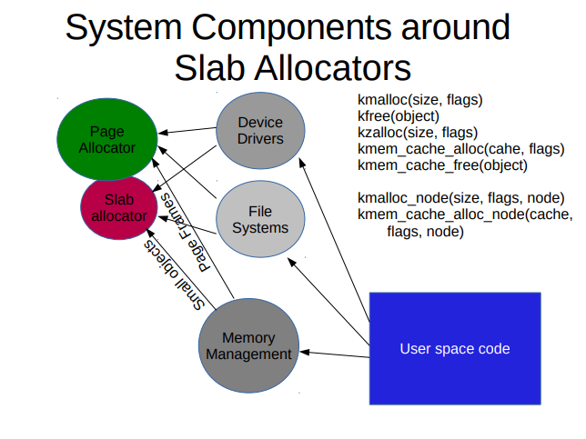
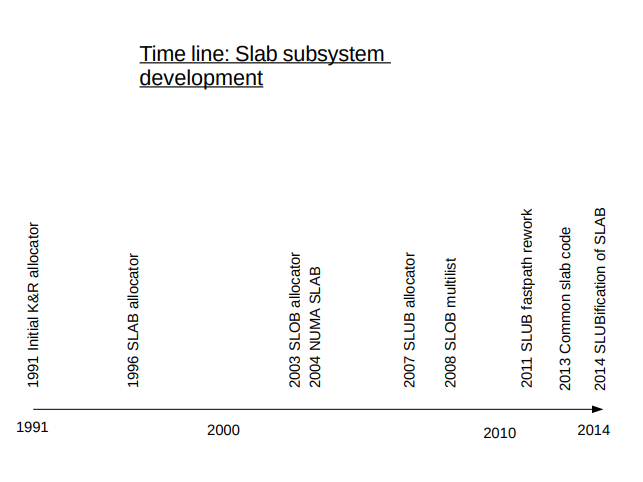

# SL[AUO]B: Kernel memory allocator design and philosophy

## Allocator in Linux

- PAGE_SIZE(4k) basic allocation unit via page allocator.
- Allows fractional allocaiton. Frequently needed for small objects that the kernel allocates f.e. for network descriptors.
- Slab allocation is very performance sensitive.
- Caching.
- All other subsystems need the services of the slab allocators.
- Terminology: SLAB is one of the slab allocator
- A SLAB could be a page frame or a slab cache whole. It's confusing. Yes.

## Slab Allocators Available

- SLOB: K&R allocator (1991-1999)
- SLAB: Solaris type allocator (1999-2008)
- SLUB: Unqueued allocator (2008-today)

- Design philosophies
  - SLOB: As compact possible
  - SLAB: As cache friendly as possible. Benchmark friendly.
  - SLUB: Simple and instruction cost counts.
    - Debugging.
    - Defragmentation.
    - Execution time friendly.

