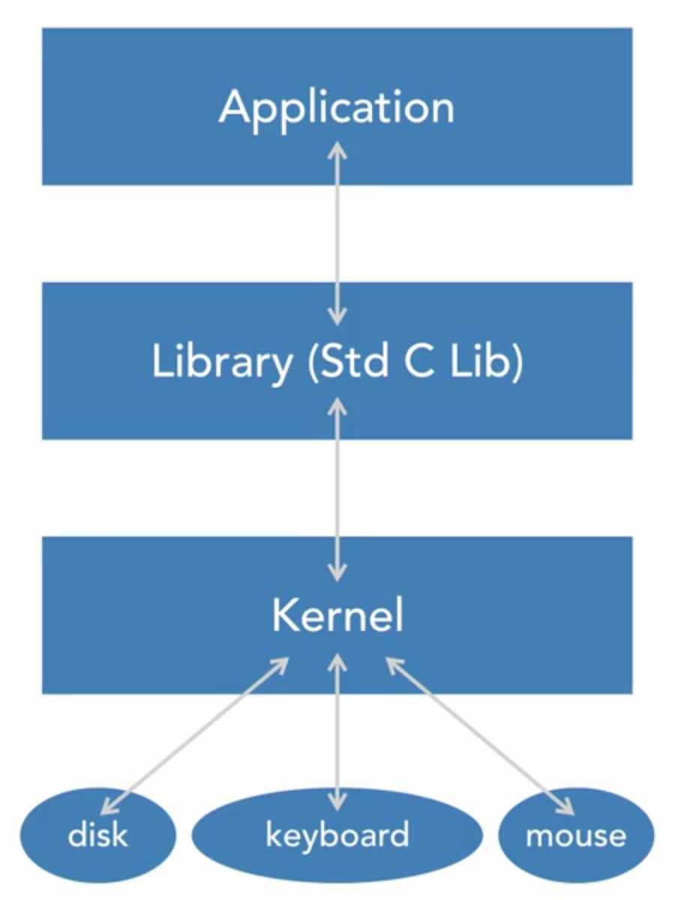

# The Linux Kernel

## 00 inux Kernel Overview

### 00-01 Prerequisites and takeways

- **What You Should know**

  - Be familiar with the Linux
  - Be familiar with C programming
  - Know how to edit files on Linux

- **The Setup**
  - Linux machine with root access availble
  - Virtual machine could be helpful (In case somethong damages happen)
  - Ensure the safety of you data befor econtinuing

### 00-02 What is Linux Kernel

- **The Kernel is a Program**

  - Often with a name link vmlinuz<KERNEL\*\*VERSION>
  - Loaded a run by a boot loader, like GRUB
  - Has command-line parameters

- **The Kernel is an API**

  - System calls
  - Virtual file system entries
    - proc
    - sys
    - deb ugfs
  - Device files (system calls)

- **The Kernel is a Gatekeeper**

  - Enforces privileges (capabilities)
  - Executes supervisor intructions
  - Implements security policies
  - Controls access to hardware and other resources

- **The Kernel is Modular**

  - Kernel image is relative small
  - Kernel image is sufficient to boot to user space
  - Optional functionality is added after booting
  - It allows for alternatives; for example, loading only divers required for present hardware

### 00-03 Where is Linux Kernel

```sh
cd /boot
```

```sh
uname -r
```

```=>
5.15.0-52-generic
```

```sh
ls -l /boot/vmlinuz-5.15.0-52-generic
```

```=>
-rw------- 1 root root 11442496 Oct 13 2022 /boot/vmlinuz-5.15.0-52-generic
```

This file will be loaded by GRUB to memory during the bootloading.

## 01 Surveying the Linux Kernel

### 01-01 Discover and Control Hardware

[Application] <-> [Library](Std C Lib) <-> [Kernel] <-> [Hardware](disk|keyboard|mouse)


- **The Software Layers to and from Hardware**

  - Applications call functions in libraries. Some of those functions invoke kernel system calls.
  - Some system calls interact with hardware

- **Commands for HW info**

  - `lshw` and `lspci`
  - `lsusb` and `lsbk`
  - `lscpu` and `lsdev`

Notes: Not all Linux distros have these commands available

- **Cmds for HW Control and Conifg**

  - `hdparm`
  - Write (e.g., `echo`) to `proc`, `dev`, or `sys files`
  - `inb` and `outb`
  - `setpci`

**_Try_**

### 01-02 Understanding System Call Mechanics

- **System Calls**

  - System calls are functions implemented by the kernel and meant to be called from user space
  - There are about 300
    - See `include/uapi/asm-generic/unistd.h`
  - They are documented in man section 2
  - They are called through the standard library (e.g., libc)

- **System Call Mechanics**

  - Standard library uses architecture-dependent means to invoke the system call mechanism
  - Suitably sized parameters are usually put in registers
  - The kernel is invoked, determines which system call, and calls it

- **System Call Return**
  - If an error, system calls return a negative value to the library
  - On error, the library sets "`errno`" to `abs(return value)`, and returns `-1`
  - When no error, library usually does not set `errno` and returns the value it obtained from the kernel

Enter `/usr/src/linux-5.3.0/include/uapi/asm-generic`

```sh
ls -l unistd.h
wc -l unistd.h
grep -i read unistd.h
grep "define __NR" unistd.h | wc -l
man read # READ(2) -> in kernel
man kill # KILL(1) -> in user space
man 2 kill # KILL(2) -> in kernel
```

### 01-03 Reading Messages from the Kernel

- **printk**

  - `pintk()` is the kernel's function for code to print messages. It is like C's `printf()`
  - It is sent to RAM buffer and system console
  - Important enough ones are shown on the console
  - Loggibg daemon way send to file or elsewhere

- **Displaying Kernel Messages**
  - `dmesg` shows RAM buffer message from kernel
  - Log file (e.g., `/var/log/messages`) has kernel message and more
  - `tail -f /var/log/messages` or `tail -f /var/log/dmesg` can be handy

```sh
dmesg
dmesg | wc -l
dmesg | grep command
journalctl -t kernel
journalctl -t kernel | command
journalctl -t kernel -f
```

### 01-04 /proc, /sys, and Device Files

- **Virtual Filesystems**

  - The `proc` and `sysfs` filesystems are virtual filesystems
  - Their contents are not stored on disk
  - Each file and directory entry has an associated function in the kernel that produces the contents on demand

- **`/proc`**

  - The proc filesystems is mounted on `/proc` at boot
  - `proc` gets its name from "process""
  - `proc` contains lots of process info and lots more
  - Kernel tunable variables are an important part of `proc`

- **`/proc` Process Info**

  - Each process has a directory named with its PID
  - It has info on memory, program, files and lots more
  - There are hundreds of files and directories per process
  - Threads have entries under the directory "task"

- **`/sys`**

  - The sysfs filesystem is mounted on `/sys` at boot
  - `sysfs` is for "kernel object" info
  - In particular, it is hardware info (e.g., PCI device info)

- **Device Files**

  - Character and block divers use device files
  - Device files have a major number, minor number, and type (c or b)
  - The kernel maintains a relationship between the three characteristics and what driver to call
  - The driver can implement different functions for different minor numbers

- **Divers and Device Files**
  - A character driver, for example, can implement `open()`, `read()`, `write()` and `ioctl()`
  - A process opens a device file and then can read, write, etc., with the file descriptor. The kernel arranges to have the driver's function to be called
  - `echo hi > /dev/null` would open, and then write
  - The driver can implement different functions for different minor numbers

```sh
ps -l
cd /proc/{PID}
ls -l | more
cd fd
ls -l
ls -l /proc/interrupts | more
cat /proc/interrupts | more
cat /proc/interrupts | grep timer
cat /proc/interrupts | grep eth0
ls -l /dev/null # 1, 3
echo hi > /dev/null # throw it away
cat /dev/null
ls -l /dev/zero # 1, 5
```

### 01-05 Challenge and Solutions

1. **What kernel version of your system is running?**

```sh
uname -r
```

`uname` means "unix name".

2. **What is the size of the kernel file corresponding to the kernel of your system is running?**

```sh
ls -l /boot # See the kernel files
```

Check the `vmlinuz` file's linked file's size.

3. **How much RAM available to your running kernel?**

When sytem boot up, it will tell the CPU how much RAM to use by kernel.

```sh
free
head /proc/meminfo
```

If the `swap` has been used, there would be some performance problem, whereby needs more RAM for the system.

4. **The command `strace` will display the system-calls and the process makes as runs. Use the `man` command to determine what option of `strace` would show a summary of sum with count of a number of time a process call each system-calls. Using that option to see what system call the most by the command `date`.**

```sh
man strace
# Type `/`
# Type `count` to locate on the content
strace -c date
strace date |& grep read
```

5. **Can you determine using `strace` what system is used to change the directory?**

First of all, enter `/tmp`

```sh
cd tmp
```

But we can't `strace cd /home` because `cd` is a regular command which is not in the `/usr/bin`.

Create a script im `/tmp`

```sh
vi cd
```

Edited `cd` as:

```sh
#!/bin/bash
cd "$@"
```

```sh
chmod +x cd
./cd /etc
strace ./cd /etc
man chdir
```

6. **By looking at `/include/uapi/asm-generic`to determine how many systemcalls has defined in your kernel source>**

Enter `/usr/src/linux-5.3.0/include/uapi/asm-generic`

```sh
grep "define __NR" unistd.h | wc -l
view unistd.h
```

- `/`
- `__NR.*read`
- `syscalls`
- `syscalls` again to find the second `syscalls`
- `:`
- `set number`
- `/unassigned`

7. **Run a `sleep 100 &` to put it in the background, what file does process has opened?**

```sh
sleep 1 # sleep one second
sleep 100 & # Give us the PID
cd {PID}
cd fd
ls -l # There are only 0, 1, 2
```

8. **Does your system has PCI, Ethernet device?**

```sh
lspci | grep -i ethernet
```

9. **Is the kernel availble for ip_forward which is a proxy somewhere set the 1 or 0 on your system.**

```sh
find /proc/sys | grep ip_forward
cat /proc/sys/net/ipv4/ip_forward # 1 or 0
```

```sh
sudo sysctl -a | more
sudo sysctl -a | grep ip_forward
sudo sysctl /proc/sys/net/ipv4/ip_forward # 1 or 0
sudo sysctl /proc/sys/net/ipv4/ip_forward=1
```

10. **According to the system block, do you have block device or disk called sda?If so, do you have device file for partition of sda? How many?**

```sh
ls -l /sys/block | grep -i sda
ls -l /dev/sda*
ls -l /dev/sdb*
sudo strace fdisk -l |& grep sys/dev/block | grep open | wc -l
```

Entere `/var/log` as a parent

```sh
sudo grep -rl BOOT_IMAGE .
sudo ls -l | grep "^c" | grep " 1,"
```

Enter `/tmp` to make a device file of pickle

```sh
cd /tmp
sudo mknod pickle c 1 2
ls -l pickle
```

## 02 Booting

### 02-01 Understanding the Bootloader GRUB

- **GRUB's Role**

  - GRUB comes afster POST, and the BIOS
  - GRUB is installed in a special place on disk
  - GRUB loads the kernel, initial root filesystem, sets up the kernel command line, and then transfer control to the kernel
  - GRUB can be interrupted, and you can interact with it

- **GRUB's Flexibility**

  - GRUB is built with support for filesystem. Therefore, GRUB can find files, like kernel files, by name
  - GRUB can do file name completion
  - GRUB has lots of utilities (do man -k grub)

### 02-02 Configuring GRUB

- **GRUB Configuration**

  - GRUB 1 had a config file, `grub.conf`, that one edited to add, remove, or modify kernel boot choices
  - GRUB 2 is significantly more sophisticated
  - `/etc/default/grub`
  - `/etc/grub.d`

- **New GRUB Entries**

  - Edit or add a config file in `/etc/grub.d`. Normally edit `40_custom`
  - Run `grub2-mkconfig` to generate a new config file

- **GRUB Interatives**
  - Normally pauses efore launching Linux
  - Interrup GRUB by hitting a key (e.g., down arrow)
  - Temporarily edit GRUB configuation
  - Continue with boot with your changes - 'b' or Ctrl-x as indicated

### 02-03 Kernel Command-Line Parameters

- **GRUB Passe Parameters**

  - The kernel processes command-line arguments
  - Unrecognized ones are ignored
  - User space may look at the kernel command-line args, too
  - You can use `dmesg` or `/proc/cmdline` to see

- **Kernel Parameters**

  - In kernel srouce tree, it is `Documentation/kernel-parameters.txt`
  - About 500 kernel parameters are documented there
  - Many are registered `with_setup()` in source

Enter `/usr/src/linux-5.3.0/Documentation/admin-guide`

```sh
view kernel-parameters.txt
/rdinit
/rfkill.default_state
```

### 02-04 Process 1 & Startup Services

- **The Initial Root Filesystem**

  - Frequently start up by mounting a filesystem from RAM. The filesystem that contains "/" is called the root filesystem.
  - Initial RAM disk or RAM filesystem (`initrd`) is used to provided drivers and support for mounting the system's real root file system
  - `initrd` has an `init` that the kernel runs first

- **The First Process (from Disk)**

  - When the `init` from the `initrd` terminiates, the Linux kernel start init again; this time from the real filesystem, which is commonly on disk
  - Historically that program was called "`init`". Now, `init` may be link to `systemd`
  - This process is responsible for starting up system services such daemons like web server

- **System Services**

  - For older Linux systems, there were runlevel scripts to start up the services. These were under `/etc/rc.d`
  - `systemd` service files are under the `/etc/systemd/system`
  - These services are user-space services and not features of the kernel

```sh
which init # /usr/sbin/init
ls -l /usr/sbin/init # -> /lib/systemd/systemd
file /lib/systemd/systemd
ps -ef | grep init
ls -l /sbin/init # -> /lib/systemd/systemd
ls -l /proc/{PID}/exe # -> /usr/bin/bash
sudo ls -l /proc/1/exe # -> /usr/lib/systemd/systemd
ls -l /sbin/init # -> /lib/systemd/systemd
# What is going on here?
ls -ld /lib # lib -> usr/lib
```

### 02-05 `init` RAMFS Images

- **The `initrd`/`initramfs` File**

  - An `initrd`/`initramfs` in `/boot` for each kernel
  - A gzipped CPIO archive when `initramfs`; a gzipped filesystem image (e.g., `ext2`) when an `initrd`
  - Name it something .gz, unzip it, and cpio extract it; **be very careful** and use --no-absolute-filenames, or gunzip and mount for `initrd`

- **Distribution Versions**

  - Distributions and releases very widely in the contents of their `initrd/initramfs` images
  - You can start with the `init` program
  - Booting with `rdinit=/bin/sh` will start with a shell in `initramfs`. `init=/bin/bash` will complete the `initramfs` and then start with a shell on the disk

- ## **Customizing `initrd`/`initramfs`**

  - Unpack the image
  - Make the modifications, repack, replace version in `/boot` (after making a copy of the original just in case), and reboot
  - Need to be on the system console

```sh
mkdir /tmp/adir
cd /boot
ls -l initrd.img
sudo bash # Change the role as root
file `which unmkinitramfs`
unmkinitramfs initrd.img /tmp/adir
cd /tmp/adir
ls # there is main folder
cd main
ls # thereis init file
file init
```
