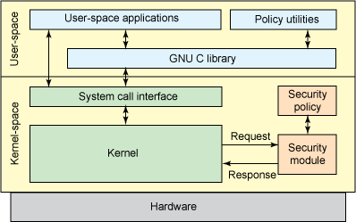

# Linux Security Modules

## Introduction to Linux Security Module

### Let's understand what is Linux security module

- Linux security module (LSM) is the framework integrated into the kernel to provide the neccessary components to implement the mandatory access control (MAC) modules, without having the need to change the kernel source code every time.
- Applicaiton whitelisting has been proven to be one of the most effective vways to mitigate cyber-intrusion attacks.
- A conenient way to implement this widely recommended practice is through the **_"Linux Security Modules"_**.

### What is LSM?

- An LSM is a code compiled directly into the kernel that uses LSM framework.
- The LSM framework is intended to allow security modules to lock down a system by inserting checks whenever the kernel is about to do somethoing interesting.
- The security modules hooks into those check points and for each operation, checks whether the operation is allowed by the security policy currently enforced or not.
- The LSM framework can deny access to important kernel objects, such files, inodes, task structures, credentials, and inter-process communication objects.

### Major and Monior LSMs

- **Major**
  - The major LSMs are all implementations of MAC with configuratable policies loaded from the use space.
  - Only single LSM can be used at a time as they all assumed they had exclusive access to the security context pointers and security identifiers embedded in protected kernel objects.
  - Examples: SELinux, SMACK, AppArmor and TOMOYO
- **Minor**
  - Minor LSMs implements a particular security functionality and are stacked on top of Major LSM and mostly need less security less context.
  - The minor LSMs typcially only contain flags to enbale/disable as opposed to having policy files that are loaded from the user space as part of the system boot up.
  - Examples: Yama, loadPin, SetSafeID and Lockdown

## Linux Security Module Framework

### Overview of LSM Framework

- The LSM framework provides a modular architecture that provides "hooks" built into the kernel and allows security modules to be installed, reinforcing access control.

### Architecture of LSM

- The LSM framework allows third-party access control mechanisms to be linked into the kernel and to modify the default DAC implementation.
- By default the framework does not provide security in itself, it provides infrastructure to support the security modules.
- The LSM framework provides
  - Additional security fields(void \*) to the kernel data structures.
  - Functionality to insert calls to the hook funcitons at critical points in the kernel code to manage the security fields and to perform access controls.
  - It also provides functions to register and unregister security modules.

### LSM Hooks

- Security hooks help to mediate various operations in the kernel
  - These hooks invoke functions defined by the chosen modules.
  - These hooks construct "authorization queries" that are passed to the module.
  - The function calls that can be overridden by security to manage security fields and mediate access to kernel objects.

### LSM Security Data Fields

- LSM framework enables security modules to associate security information to kernel objects
- LSM extends "sensitive data types" with opaque data security fields
- The LSM security fields are simply void \* pointers added in various kernel data structures
- They are completely managed by security modules
