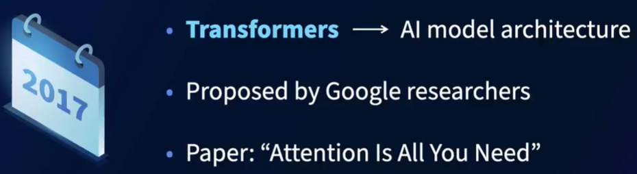
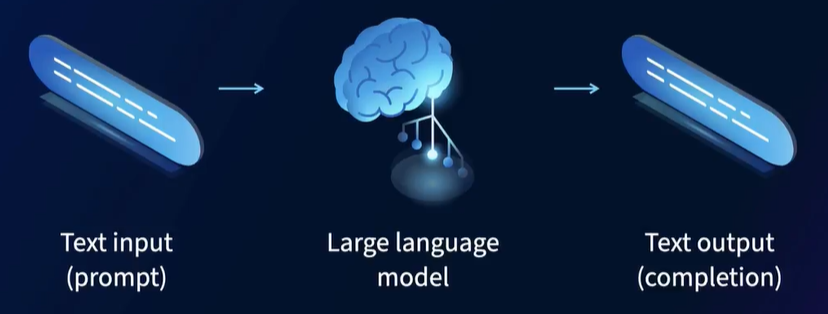
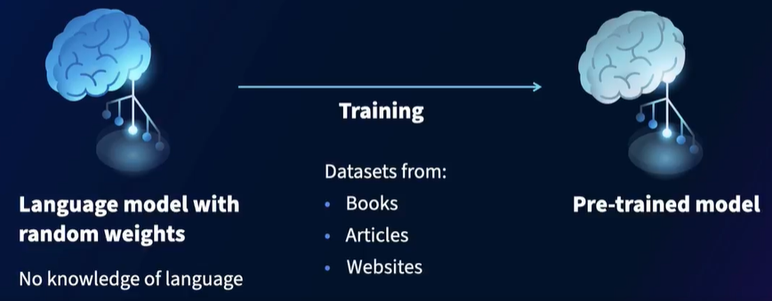
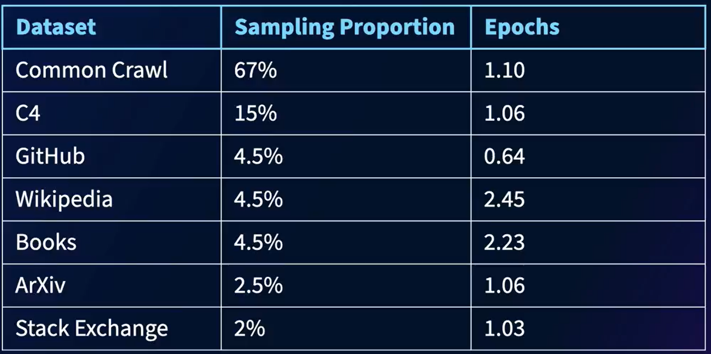
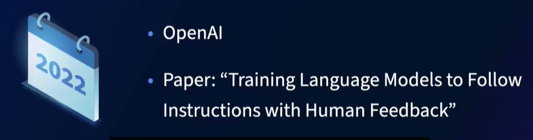
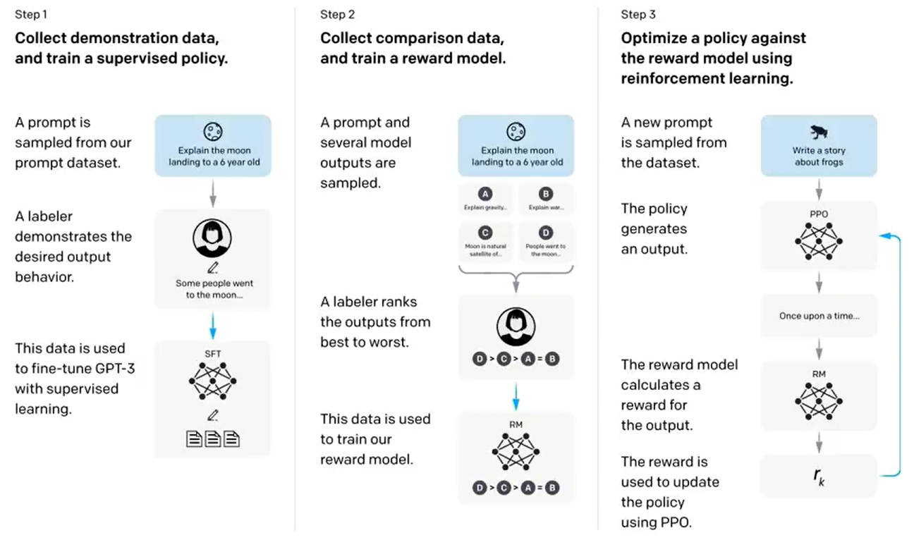
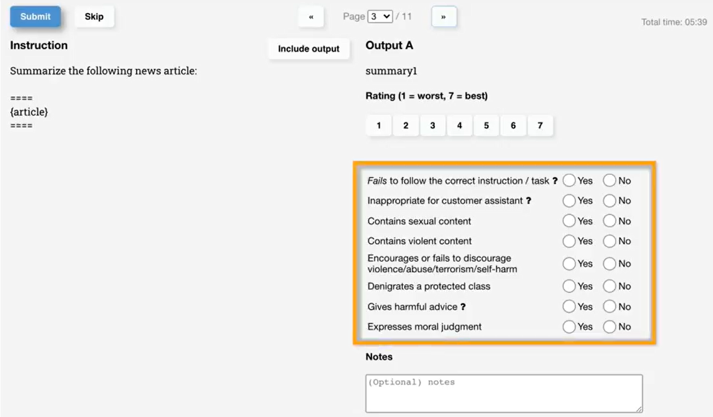

# Introduction to Large Language Model

## 1 Transformers in NLP

### 1.1 What are large language models?

All large language model architecture uses components of **transformers** as part of their architecture.

How do large language model work?

### 1.2 How are large language models trained? Pre-training

Initially, the language model has random weights, and at this point, the model has no knowledge of language. If you prompt it, it would just return gibberrish.

But you train the model and pass it a large corpus of data, it adjusts these weights as part of the training process. And this pre-training stage is very resource heavy.

So you needs lots of data and this includes a variety of different types of data like books, articles and websites.

**Example of LLaMA:**

Now, a proportion of each of these data sets is sampled, given by the differnet percentages when training on the data. 

So the **epochs** give you an idea of how many times the language model saw this data while training.

For example the Common Crawl, the language model saw all of the sample data 1.1 times, it saw the C4 sample data 1.06 times and so on.

### 1.3 Making large language models follow instructions

There two components to this training:

1. Supervised fine-tuning
2. Reinforcement learning from human feedback (RLHF)

**Step 1 / Part 1- supervised training**

The supervisde fine-tuning is in the diagram on the left. The OpenAI reseaerch team would create a prompt, for examplem "Explain the moon landing to a six-year-old," and then a labeler, so that's person who's skilled with working with text data, would then write out what the model should produce as output.

So for example, they may include details like it took place in 1969, the spaceship used was Apollo 11, and two American astronauts, Neil Armstrong ad Buzz Aldrin, became the first human beings to walk on the moon.

They would typically have tens of thousands of such questions, and after this, researchers will typically fine-tune a model.

What they mean **fine-tuning** model? Is that they would pass both the prompt, and the expected output from the label of each prompt to the large language model and train it.

This means after some trainng for a given prompt, the large language gets better at producing output that resembles what a labeler would have written.

**Step 1 / Part 2- supervised training**

Example: Prompt for fine-tuned model: "summerize the following news article"

-> Prompt for fine-tuned model: "summarize the following news article."

-> Fine-tuned model generates five different summary outputs.

The labelers would then rate each of the five summaries, rating them between one and seven, using an interface like this.

Often researchers also want to make sure that the models follow instructions, and do not generate toxic content or fabricate information, so the labelers had to give yes/no answers to questions that address this over on the right.

**Step 2 - Reward**

So this ranking of the articles is used to train another model called the reward model.

Now the reward model takes this input, the rankings from the five or so text generation from the mode, and returns a number.

Now, this number represents the labeler's preference. This reward model could be fine-tuned to take an input ranked text, and output a number that indicates how well the labelers perceived.

**Step 3**

To use reinforcement to otpimze the original language model using the reward model. 

So if the model generates a text that follows the taks intent. That's the crux of reinforcement learning.

This way, a model is encourage generate text, that would receive positive human feedback.

**PPO** - proximal policy optimization

Is the algorithm used to calculte the loos, which is used to update the original lanaguge model.

## 2 Large Language Model Components

### 2.1 Transformer architecture

### 2.2 What are parameters

### 2.3 What are tokens?

### 2.4 What are context lengths?

## 3 Large Language Models

### 3.1 BERT

### 3.2 Scaling laws

### 3.3 Chinchilla

### 3.4 PaLM and PaLM2

### 3.5 ChatGPT and GPT-4

### 3.6 Open LLMs

### 3.7 Comparing large language models