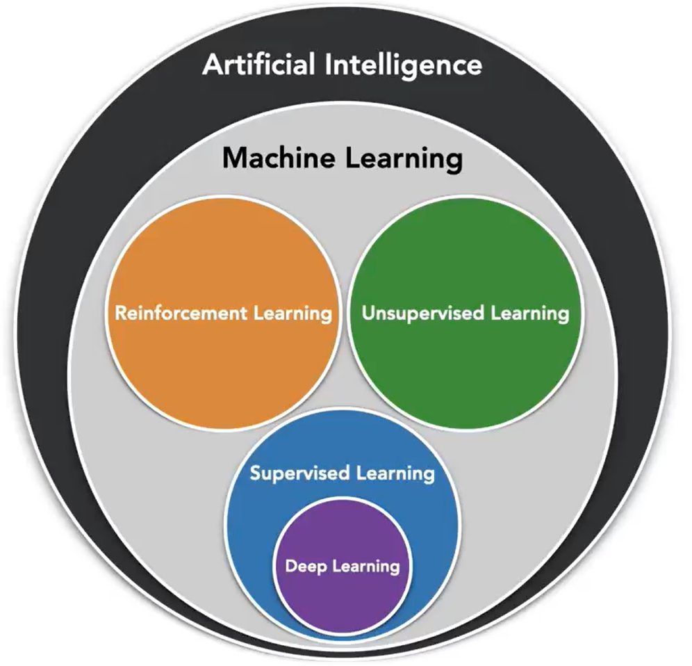
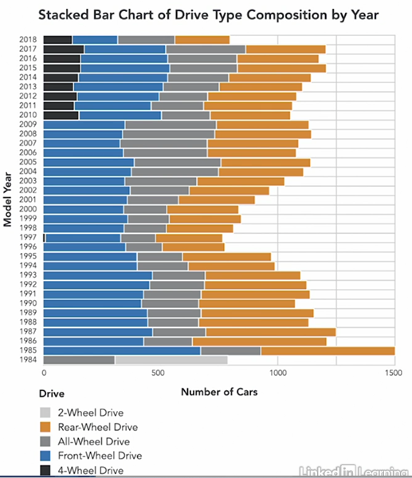

# Machine Learning with Python: Foundations

## 1 Machine Learning

### 1.1 What is machine learning?

**Traditional Programming**

In 1959, computer pioneer Arthur Samuel thought of a different approach. He wondered if computer could infer logic instead of being given explicit instructions. In other words if machines could learn.

**Machine Learning**

Could a computer figure out the best set of instructions that would yield the given output based on the data that was provided to it?

To illustrate this idea, let's say we gave a computer, the numbers on the left as input data, as well as numbers on the right as expected outputs.

As we give the computer more input and output examples, if the computer is able to gradually figure out that a simple linear combination of the input values is a close approximation of the output values.

Then we say that the computer, or machine, is learning.

After we train the model, which is a model that has learned the right set of instrcutions for a given task, going forward, we simply give it input data, and to apply its internal instructions, to provide us with output.

**Supervised Learning**

What we just discussed is a type of machine learning, known as supervised learning.

Supervised learning is useful in solving problems, such as image recognition, text prediction, and spam filtering.

A different type of machine learning is unsupervised learning. with unsupervised learning, we simply ask the machine to evalute. 

**Unsupervised Learning**

With unsupervised learning, we simply ask the machine to evaluate the input data and identify any hidden patterns or relations that exist in the data.

Unsupervised learing is used in movie recommendation systems, and to perform customer segmentation for marketing purposes.

The 3rd type of machine learing is known as reinforcement learning. in this approach, there are two primary entities, the agent and the environment.

**Reinforcement Learning**

The agent figures out the best way to accomplish a task through a series of cycles in which the agent takes an action, and receives immediate positive or negative feedback on the action from the environment. 

After a number of cycles, the agent eventually learns the optimal sequence of actions to take in order to accomplish the task at hand.

Reinforcement learning is commonly used in computer game engines, robotics, and self-driving cars.

### 1.2 What is not machine learning?

#### 1.2.1 The relationship between statistics and machine learning

Some might characterize machine learning as an elevated form of statistics, but it's essential to understand that while machine learning does draw extensively from statistical concepts, its foundation extends beyond statistics to cncompass principles from information theory, calculus, algebra, engineering, and even biology.

Referring to machine learning as glorified statistics is akin to referring to physics as glorified mathematics, or architecture as glorified reclaim.

It's crucial to emphasize that the goals and objectives of machine learning often differ from those of basic statistical modeling.

Machine learning is mostly concerned with results, in the form of predictions. In other words, the primary focus of machine learing is to predict future outcomes based on past events.

Statistical models, on the other hand, are mostly concerned with the relationship between variables. This is known as **inference**. The statistical model, we want to understand what happens to variable B as a result of a change in variable A.

The overlap between the approaches used in machine leanring and those used in statistical modeling are sometimes broadly referred to as statistical learning.

#### 1.2.2 Machine learning, data mining and optimization

These terms refer to approaches that are closely related. They represent the differnet branches in the broad field of data science.

Much like the distinciton, between machine learning and statistics, to contrast between machine learning and data mining revolves around their ultimate objectives.

While machine learning prioritizes prediction by utilizing known data properties, data mining emphasizes on covering previously unknown patterns in data.

In the field of business analytics, the traditional understanding of machine learning is often referred to as predictive analytics, data mining as descriptive analytics, and optimization as prescriptive analytics.

We use prescriptive analytics to identify patterns in historical data, predictive analytics to predict future outcomes, and prescriptive analytics to get a recommendation of the best course of action to take.

#### 1.2.3 The remaining terms

- **Deep learning** is one of many machine learning approaches that fall under the umbrella of what is known as supervised machine learning.
  - Supervised learning, along with reinforcement learning, and unsupervised learning, make up the 3 major branches of machine learning.

- **Artificial Intellligence** 
  - Though often used interchangeably, machine learning is not the same thing as artificial intelligoence or AI.
  - Machine learning is a subfield in artificial intelligence.
  - In other words, all machine learning is AI, but not all AI is machine learning.
  - A large field of computer science that deals with the simulation of intelligent behaivor and computers. This includes behaviors such as:
    - visual perception
    - speech recognition
    - decision-making
    - translation between languages

Artificial intelligence models can be categorized in several differnt ways. One approach is to classify them based on the type of function they perform.

#### 1.2.4 Discriminative AI & Generative AI

**Discriminative AI Models**

Models that focus on categorizing input data or on predicting a future outcome based on historical data.

When provided with the text of customer reviews of a local restaurant, a discriminative model can correctly label each review as either satisfied, unsatisfied, or neutral. It is able to determine the probability that a particular review belongs to a certain category givin the input text.

**Generative AI Models**

Models that are designed to create content based on user input. 

We can use a generative AI model to generate innovative texts, complete sentences, and even craft entirely fresh pieces of writing.

One of the prominent generative AI methodologies gaining significant attention today are **large language models**, also known as LLMs.

LLMs are generative AI models that are really good at understanding and generating human-like text, based on the input or prompts they receive.

### 1.3 What is unsupervised learning?

- Unsupervised learning is the process of building a descriptive model
- Descriptive models are used to summarize and group unlabeled data in new and interesting ways

Let's assume that we are part of the analytics team at the local credit union. our task is to figure out better ways to market our products to our bank card customers.

Instead of creating a marketing strategy for each customer, we could decide to use machine learning to group or segment our customers based on simlarity, and then create a marketing strategy for each segment.

Let's also assume that we already have two kinds of information about our customers:
1. Historical information about the spending habits of your customers.
   - With this information, we could assign a spending score to each customer, depending on how often they use their bank card and how much money they spent on an annual basis.
2. Demographic information about each customer (age, gender, income, education level, etc.)

In order to segment customer based on similarity, we pass the historical data to unsupervised machine learning model. This type of model is called an unsupervised model, because there is no pre-existing rubric, or which to evaluate the models output. In other words, there is no external supervisor telling the model, whether its output is right or wrong. 

Unsupervised machine learning models analyze the input they receive using a descriptive approach in order to highlight the patterns or interesting relationships that exist in the data.

**Example:**

Our objective is to group customers based on spending score and income level alone.

On a two-dimensional plane, each of our customers could be represented this way. Using just a spending score and income level, an unsupervised machine learning model could automatically evaluate each customer and group them based on how similar they are to other customers.

With each customer assigned to a group, we then assign them a segment label. This is customer segmentation.

With this information, we can develop a marketing strategy targeted to each segment with the expectation that customers within each group will likely respond to a campaingn in a simliar way because they share the same characteristics.

### 1.4 What is supervised learning?

- Supervised learning is the process of training a predictive model
- Predictive models are used to assign lables to unlabeled data based on patterns learned from previously labeled historical data

If we want to predict the outcome of a new event, we can use a predictive model that has been trained on similar or related events to predict the outcome. 

Let's assume that we work in the analytics department of a local creadit union. Our task is to develop a machine learning model that predicts loan risk. Specifically, we would like to build a model that predicts whether a particular customer will or will not default on a loan.

Let's also assume that we already have two kinds of information about the loans our bank has previously issued.

1. Descriptive informaiton about previous loans (loan amount, loan grade, income, purpose, etc)
2. The outcome or each previous loan
   - The outcome data is a lable that tells us whether the borrower paid back the loan in full or whether the borrower defaulted on the loan.
  
Before we can use a supervised machine learning model to predict the outcome of a new loan, we first have to train the model using historical loan data.

In machine learning, we call the input the independent variables, and we call the output the dependent variable.

The independent variables and dependent variable make up what is known as a training data.

If our training data consists of 10 previously issued loans by our credit union, then the independent variables are the loan amount, the grade of the loan and the stated purpose for the loan, while the dependent variable is outcome variable, default.

The default varibale has two levels or values. They are "yes", which means the borrower failed to pay back the loan in full; and no, which means that the borrower paid the loan back in full.

The train on model, we provide it with three independent variables and we provide it with the dependent variable or outcome as well. With these two sets of values, the machine learns the patterns in the data, and builds a set of instructions that connect the input to the output.

This set of instructions represent the trained model. After a model has been trained, we can evaluate how well its instructions explain the relationship between the independent variables and the dependent variable.

One way to do this is to provide the trained model, in order to see what output values it will predict. By comparing the predicted outcomes with the actual outcomes.

We cam score the performance of the model, based on how many of them match. We call this the **predictive accuracy** of the model.

The higher the socre, the better the model is. And the lower the score, the worse the model is.

This definition presents 3 components:
- Experience **E**  
  - The training data
- Class of tasks **T**
  - Predict who will default
- Performance measure **P**
  - Predictive accuracy

**Reword the supervised machine leaning definition as:  **

### 1.5 What is reinforcement learning?

Reinforcement learning is the science of learning to make decisions from interaction.

It has many applications like autonomous driving, robotics trading and gaming.

Reinforcement learning is very similar to early childhood learning. A toddler sees something, does something, gets positive or negative feedback, then adjusts his or her future behavior accordingly.

Unlike unsupervised learning where the objective is to identify unknown patterns is unlabeled data and supervise learning where the objective is to learn patterns in previously labeled data. Reinforcement learning attempts to tackle two distinct objectives:
- Finding previously unknown solutions to a problem to existing problem
  - The machine that plays chess better than any human ever.
- Finding solution to problems that arise due to unforeseen circumstances
  - The machine that is able to find an alternatiev route through a terrain, after a mudslide has altered the expected route.
  
Reinforcement learning involves true primary entities that repeatadly interact with each other. One of them is the agent and the other is environment.

The agent interacts with the environment by taking actions. The environment responds to the actions of the agent, by providing feedback or observations to the agent.

The feedback provided by the environment comes in two forms, state and reward.
- The state describes the impact of the agents's previous actions on the environment, and the possible actions the agent can take.
- Each action is associated with a numeric reward, which the agent receives as a result of taking a particular action.

The agent's primary objective is maximize the sum of rewards it receives over the longterm.

Let's also assume that the first player is not agent, and plays Os while agent is a second player and plays Xs.

The first move of the game could look something like this. The table to the right is konwn as a policy table. It represents states an rewards.

Columns A1 to C3 are the positions on the board. While column D is reward associated with each state. Each row represents an available state or action that agent can make, given that the first player has played O in position A3. 

One stands for player one and two stands for player two. Notice that column A3 is taken, and is therefore grayed out the pre-filled with one. This means that the agent can play any position on the board excpet A3, given the available actions and rewards, the agent must evalute each possible action and choose the one that yields the highest reward. This is known as exploitation.

Since all of the actions currently have the same reward, the agent randomly decides to play B2, in the second move, if the first player plays B3, then the state table via shown here.

Once again, the agent was choose the action that yields the highest reward. Since all of these actions have a reward of 0.5, the agent randomly settles on a play of C3.

The process repeats a 3rd time for player one and for player two. At the end of each player's third move, the environment determines that player one has won the game.

This is knwon as a terminal state. The coin cycle of learning has ended. At the end of the learning cycle, because the action taken by the agent in the 3rd move resulted in the victory, the reward associated with that action is updated by the environment from 0.5 to 1 in the policy table.

This is known as a backup, using the mathematical equation, the reward associated with the agents's second move is also backed up in the policy table, as well as a reward associated with the agent's first move.

As a result of the higher rewards associated with the sequence of actions, the agent took in the first learning cycle, during subsequent learning cycles, if the agent encounters a state similar to the one that it encountered in the first cycle, it will choose to take the same action that it did in the first cycle, in order to maximize reward.

This brings up an important challenge with reinforcement learning. The challenge is known as the exploration versus exploitation trade-off.

If left unchecked, an agent will always prefer to take actions that he has tried in the past and found to be effective in maximizing reward.

However, the exploitation, in order to discover a new sequence of actions with potentially higher reward, the agent was try actions that it has not selected before, or that do not initially appear to maximize reward. 

In other words, the agent sometimes has to choose actions with little to no consideration for their associated reward, this is known as exploration.

An agent that focuses only on exploitation will only be able to solve problems, it has previously encountered. An agent focuses only on exploration will not learn from prior experience. A balanced approach is needed for effective reinforcement learning.

### 1.6 What are the steps to machine learning?

There 6 major steps in the machine learning process.

#### 1.6.1 Data Collection

During the data collection step, our objective is to identify and gather the data we need for machine learning.

- For unsupervised learning, this is the unlabeled data with unknown patterns that we intend to discover.

- For supervised learning, this is the labeled historical data that we intend to use to train and evaluate our model.

- For reinforcement learning, this is the data that helps our agent learn which actions yield the most reward.

If we liken the machine learning process to the process of making a delicious bowl of salad, then the data collection step is like gathering all the ingredients that would go into a salad into a single basket.

#### 1.6.2 Data Exploration

Data exploration is a process of describing visualizing, and analyzing data in order to better understand it. With data exploration, we can answer questions such as, how many rows and columns are in the data?

What type of values are stored in the columns of the data? Are there missing, inconsistent, or duplicate values in the data? And are there outliers in the data?

If we liken the machine learning process to the process of making a bowl of salad, then the data exploration step is like inspecting every ingredient to make sure that it is fresh, ripe, and/or exactly what we want.

#### 1.6.3 Data Preparation

Data preparation is the process of making sure that our data is suitable for the machine learning approach that we intend to use. 

It involves resolving data quality issues, such as missing data, noisy data, outlier data, and class imbalance.

Data preparation also involves modifying or transforming the structure of our data in order to make it easier to work with. This includes normalizing the data, reducing the number of rows and columns in the data.

Going back to our salad analogy, the data preparation step is when we begin to cut the vegetables we plan to use in our salad. 

Depending on the type of salad we want, we may decide to cube the vegetables, slice the vegetables, or shred the vegetables. If we plan on adding chicken to the salad, this is also the stage when we either grill, bake, or saute the chicken.

Successful data science relies on good data. The data doesn't have to be perfect, but it should be good. The saying garbage in, garbage out is especially important when it comes to machine learning.

Because of how important good data is, it is not unusual to spend up to 80% of our time collecting, exploring, and preparing data.

#### 1.6.4 Modeling

Modeling is the process of choosing and applying the right machine learning approach that works well with the data we have and solves a problem at hand.

Modeling is the most well-known stage in the machine learning process. In order to apply the right type of model, we must be clear about our objective.

Knowing what type of machine learning we intend to do, and what machine learning approach is capable or incapable of will go a long way in helping us be successful in this stage.

In the salad analogy, the modeling stage is analogous to mixing the ingredients that we previously prepared. Depending on the type of salad we want, we mix more of some ingredients and less than others. We also decide which ingredients to include and which to avoid altogether.

#### 1.6.5 Evaluation

As the name suggests, our objective in this stage is to assess how well the machine learning approach we chose worked. There are several ways to do this.

- In supervised learinng, where our goal is to predict a label or value, we evaluate a model by measureing how well it does in predicting labels for previously unseen data.
  
- In unsupervised learning, we usually take a more subjective approach. A good unsupervised learning model is one that provides us with results that make sense to us.

The evaluation stage is when we taste test our salad. If the salad more salt or pepper, we add some seasoning. If the salad feels a bit fry, we add some dressing.

Depending on how well a model performs, we may need to build it again with slightly different data or with different settings. 

The idea here is to make a change that has a meaning ful positive impact on the performance of our model. This is usually an iterative process.

#### 1.6.6 Actionable Insight

This means identifying a potential course of action based on the result of the machine learning model. For supervised learning and reinforcement learning, this is the stage where we decide whether or not to deploy our model to production.

- In unsupervised learning, this is the stage where we decide what to do with the patterns identified by our model.

As for our salad, this is when we decide whether or not to serve it.

## 2 Collecting Data for Machine Learning

### 2.1 Things ot consider when collecting data

#### 2.1.1 Accuracy

For supervised machine learing problems, we use historical data that has outcome labels, or response values to train the model. Ensuring that the data is accuate is criticially important to success of their approach.

Supervised learning algorithms use this data as a baseline for the learning process. It serves as a source of truth, upon which patterns are learned in order to make future predictions.

If this data is inaccurate, then the algorithm's future predictions cannot be trusted. This is why this dat ais often referred to as ground truth data.

Ground truth data can either come with an existing label based on a prior event, such as whether a bank customer defaulted on a loan or not, or it can require that a label be initially assigned to it by domain experts, such as whether an email is spam or not.

Regardless of whether labels already exist, or need to be assigned, we should alawys have a plan to validate ground truth data after it has been acquired.

#### 2.1.2 Relevance

The type of data we collect to describe an observation should be relavant in explaining the label or the response associated with the observation.

For example, collecting data on the shoe size of bank card customers has no relevance, in explaining whether a particular borrower will or will not default on the loan.

Conversely, excluding information about a customer's income could have an adverse impact on the effectiveness of a model that attempts to predict loan outcomes.

#### 2.1.3 Quantity

The amount of data needed to successfully train a model depends on the type of machine learning approach chosen. This is a 3rd consideration, quantity.

Some machine learing algorithms work well with little data while others require a large amount of data to provide meaningful results.

Understand the characteristics of the machine learning algorithm we intend to use can provide us with guidance on how much data we need to collect.

#### 2.1.4 Variability

For example, if we intend to consider the income of a borrower as a predictor of loan outcome, then our ground truth data should include customers of sufficiently different income levels.

By doing this, we allow our model to gain a broader understanding of how income level impacts loan outcomes.

#### 2.1.5 Ethics

There are several ethical issues to consider during the data collection process.
- privacy
- security
- informed consent and bias

If bias exists in the data used to train a model, then the model would also replicate the bias in its predictions. As one can imagine, bias predictions could prove quite harmful, espeicially in situation where unfavorable decisions are being made based on a machine learning model.

Bias in ground truth data is often non-intentional. It sometimes stems from implicit human bias in the data collection process, or from the absence of existing data on certain subpopulations.

### 2.2 How to import data in Python

...

## 3 Understanding Data for Machine Learning

### 3.1 Describe your data

- How many rows and columns are in the data?
- What type of data do we have?
- Are there missing, inconsistent, or duplicate values in the data?

In machine learning we use certain key terms to describe the structure and nature of our data.

- The term **instance** refers to a row of data
  - An instance is an individual independent example of the concept represented by the data set.
  - A data set consists of several instances.
  - An instance is sometimes referred to as a record or an observation.
  - In this example, each loan application is represented by an instance. Each instance is described by a set of attributes or features.

- A **feature** refers to a column of data.
  - A feature is a property or characteristic of an instance. 
  - Features are sometimes referred to as variables.
  - In this example, a customer name, the loan amount, the loan grade, the loan purpose, and the loan outcome are all features of a loan instance.

- Feature can be **categorized** based on the data they hold.
  - A feature can be described as **categorical**.
  - A **categorical feature** is an attribute that holds data stored in discreet form. 
  - Categorical features are typically limited to a reasonable set of possible values.
  - In this example, customer name, grade, purpose, and default are categorical features.
  

- A feature can also be described as **continuous**. 
  - A continuous feature is an attribute that holds data stored in the form of an integer or real number.
  - A continuous feature has an infinite number of possible values between its lower and upper bounds.
  - In this example, the loan amount is a continous feature.
  
  - Other examples of continuous features include features such as temperature, height, weight, and age.
  - Please note that not all numeric values are continuous. A numeric scale such a Likert scale that goes from 1 to 5 is categorical and not continuous. It does not have an infinite number of possible values between its lower bound o f1 and its upper bound of 5.
  

- Feature can also be categorized base on their function - **class or response**. 
  - Use the values of a set of features known as independent variables to predict the value of another feature known as the dependent variable.
  - If the dependent variable is categorical, we referred to it as the **class**.
  - However, if it is continuous, we refer to it as a **response**.

- The **dimensionality** of a data set represents the number of features in the dataset.
  - The higher the dimensionality of a dataset, the more detail we have about each instance.
  - High dimensionality also means higher computational complexity.
  

- **Sparsity** and **Density** describe degree to which data exists for the features in the dataset.
  - For example, if 20% of the values in the dataset are missing or undefined, we say that data set is 20% sparse.
  - Density is the complement of sparsity. Therefore, a data set that is 20% sparse, is 80% dense.  

### 3.2 How to summarize data in Python

Check the jupyter notebook.

### 3.3 Visualize your data

#### 3.4.1 Data Exploration 

- **Understand your data by describing and visulizing**
  - How many rows and columns are in the data?
  - What type of data do we have?
  - Are thre missing, inconsistent, or duplicate values in the data?
  - 

During data exploration, even after using sophisticated statistical techniques to analyze data, certain patterns are best understood when represented with visualization.

1. **Comparison**
  Comparison visualization illustrate the difference between two or more items
   
   Comparison visulization provide insights:
     - Is a feature important?
     - Does the median value of feature differ between subgroups?
     - Does a feature have outliers?

2. **Relationship**
   Relationship visulizations illustrate the correlation beween two or more variables
     
     Comparison visulization provide insights:
       - Is a feature important?
       - How do two features interact with each other?
       - Does a feature have outliers?

3. **Distribution**
   Distribution visualizations show the statistical distribution of the values of a feature
     
     Distribution visulization provide insights:
      - Does a feature have outliers?

4. **Composition**
   Composition visualizations show the component makeup of the data
     
     Composition visulization provide insights:
      - How much does a subgroup contribute to the total?
      - The relative or absolute change in the composition of a subgroup over time?

### 3.4 How to visualize data in Python

Check the jupyter notebook.

## 4 Preparing Data for Machine Learning

### 4.1 Common data quality issues

Data preparation is a process of making sure that our data is suitable for the machine learning approach that we choose to use. 

In computing, the saying, "Garbage in, garbage out," is used to express the idea that incorrect or poor quality input will invariably result in incorrect or poor quality output.

If proper care is not taken on the front-end to properly deal with data quality issues before building the model, then the model output will be unreliable, misleading, or simply wrong.

#### 4.1.2 Missing Data

One of the most commonly encountered data quality issues is that of missing data.

There are several reasons why data could be missing. They include changes in data collection methods, human error, bias, or simply the lack reliable input.

Before we resolve the missing data, we should attempt to understand why the data is missing and if there is a pattern to the missing values.

There are several approaches to dealing with missing data:
- Simply remove all instances with features that have a missing value.
  
- Use an indicated value, so just NA, unknown, ir negative one to represent missing value.
  

#### 4.1.3 Imputation

An alternative approach is to use a method known as imputation. Imputation is this use of a systematic approach to fill in missing data by using the most probable substitute values.

There are several approaches to imputation:
- Median imputation
  - With using median imputation, we can resolve the missing value in the amount column by replacing the missing value with a median of the non-missing values.
    

#### 4.1.4 Outliers

An outlier is a data point that is significantly different from other observations within the dataset. 

Outliers manifest either as instances with characteristics different from most other instances, or as values of a feature that are unusual.

Supervised machine learning algorithms learn by identify rules or estimating the function that explains the value of dependent varaiable, based on the values of independent variables.

If the values of the dependent variable are categorical, we refer to them as **class** labels, and the proportion of examples belongs to each class label is known as a class distribution.
- **Class** means the attribute or feature that is described by the other features within an instance
    

#### 4.1.5 Class Imbalance

For most real world problems, the class distribution of the historical data is not uniform. For example, the vast majority of people who take oout loans pay them back.

This means the historical loan datasets will typically have a lot more examples of people will repay their loans than examples of people who default on their loans.

**Class Imbalance:** 
- Occurs when the distribution of values for the class is not uniform.
- Class imbalance is a well-known problem in machine learning
- If not properly accounted for, class imbalance can lead to rather misleading predictions

There are several ways to resolve class imbalance:

1. Under sample the majority class.
  - Randomly remove some of the instances of the majority class in an attempt to even the class distribution.

### 4.2 How to resolve missing data in Python

... 

### 4.3 Normalizing your data

#### 4.3.1 Introduction

Data preparation is a process of making sure that our data is suitable for the machine learning approach.

Specifically data preparation involves modifying or transforming the structure of our data in order to make it easier to work with.

One of the most common ways to transform this structure a data is known as **normalization** or **standardization**.

- Normalization ensures that values share a common property
- Normalization often involves scaling data to fall within a small or specified range
- Normalization is often required, reduces complexity, and improves interpretability

#### 4.3.2 Z-Score Normalization

- Transform the data so that it has a mean of 0 and standard deviation of 1. The normalized value *v$^{'}$* is computed as: 
  
  

#### 4.3.3 Min-Max Normalization

### 4.3.4 Log Transformation

- Transform the data by replacing the values of original data with its logarithm, such that:

### 4.4 How to normalize data in Python

...

### 4.5 Sampling your data

In supervised machine learning, our goal is to create a model that maps a given input, which we call independent variables, to the given output, which we call the dependent variable.

In order to properly evaluate whether our model is learning, we have to get an unbiased estimation of its performance, using data that it has not previously seen. To do this, we must first split out previously labeled historical data into training and test datasets. We hold out the test data and use the training data to build or train our model. Then we evaluate our models performance using the test data.

There are several ways to split data for this purpose. The most common approach is known as **sampling**.

- This is the process of selecting a subset of the instances in a dataset as a proxy for the whole.
- The orignal dataset is referred to as the population, while the subset is known as a sample.

Sampling comes in several flavors, example of 20 students: 12 women and 8 men. From this population, we intend to create a sample of 5 students.

This may seem like an odd way to sample data, but it actually is a very important technique in machine learning known as **bootstrapping**. Bootstrap is often used to evaluate and estimate the feature performance of a supervised machine learning model when we have very little data.

Stratified random sampling is a modification of the simple random sampling approach and ensures that the distribution of values for a particular feature within the sample matches the distribution of values for the same feature in the overall population. To do this, the instances in the origial data, the population, are first divided into homogenous subgroups known as strata.

### 4.6 How to sample data in Python

### 4.7 Reducing the dimensionality of your data

### 4.8 Reducing the dimesionality of your data

### 4.9 Chapter Quiz

## 5 Types of Machine Learning Models

### 5.1 Classification vs. regression problems

### 5.2 How to build a machine learning model in Python

### 5.3 Common machine learning algorithms

### 5.4 Chapter Quiz

## 6 Conclusion

### 6.1 Next steps with applied machine learning

### 6.2 Next in this series