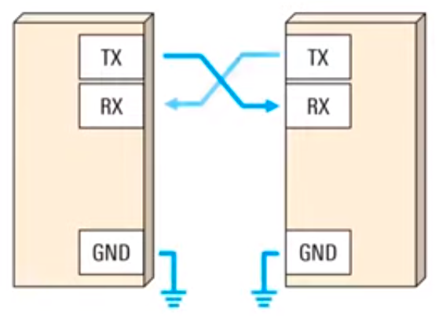
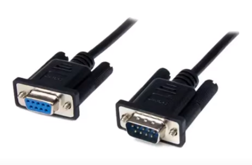
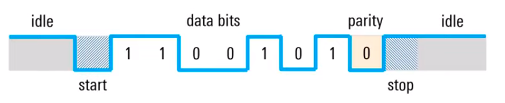
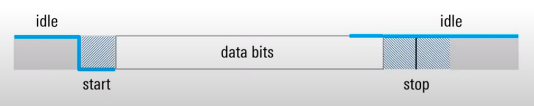
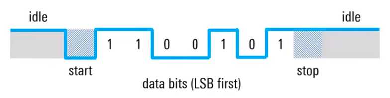
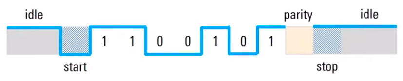
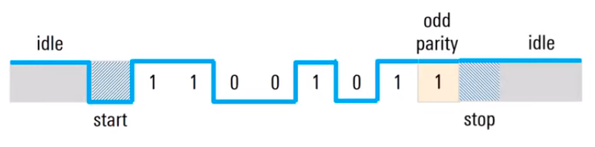

# Notes of UART

## Understanding UART

### What is UART?

- Universal asynchronous receiver / transmitter
- Protocol for exchanging serial data between two devices
- Uses only two wires
  - TX to RX (each direction)
  - Both ends also require a ground connection

- Can be simplex, half-duplex, or full-duplex

### UART application - What is UART? used?

- UART was one of the earliest serial protocols
  - Serial (COM) ports, RS-232, modems, etc.

- Popularity of UART is however descreasing:
  - SPI and I$^2$C between components
  - Ethernet and USB between computers and peripherals
- Still import for lower-speed, low-throughput applications

### About timimg / synchronization

- UART is asynchronous - the transmitter and receiver do not share a common clock

- The transmitter and receiver therfore must:

  - Transmit at the same (know) speed
  - Use the same frame structure / parameters

- Common UART baud rates
  - 4800
  - 9600
  - 19200
  - 57600
  - 115200

### UART frame format

- UART frames consist of:

  - Start / stop bits
  - Data bits
  - Parity bit (optional)

- High voltage ("mark") = 1, low voltage ("space") = 0

- In the idle state, the line is held high.

### Start and stop bits

- The start bit indicates data is comming
  - Transition from idle (high) to low
- The stop bit(s) indicate data is compelete
  - Stay / return to idel (high)
  - Second (optional) stop bit
    - No common in practice

### Data bits

- User (useful) data (comming after the start bit)
- Length: 5 to 9 bits (usually 7 or 8)
- Data is typically sent with the least significant bit (LSB) fisrt

- Example:
  - 7-bit ASCII 'S'(0x52) = 101 0011
    - LSB order = 1100 101
      

### Parity bits (optional)

- Used for error detection
- **Even parity:** number of 1's must be even
- **Odd parity:** number of 1's must be odd

- Example:

  - 7-bit ASCII 'S'(0x52) = 101 0011 -> four 1's
  - If even parity, parity bit is 0 (because number of 1's already even)

  

- Can detect a **single** flipped bit only

### Summary

- UART = universal asynchronous receiver / transmitter

  - Simple, two-wire protocol for exchaning serial data
  - No shared clock - baud rate must be configured the same on both sides
  - Start / stop bits used to frame user data
  - Start / stop used to frame user data
  - Optional parity bit for detecting single-bit errors

- Widdly used serial data protocol, but slowing being replaced by SPI, I$^2$, USB and Ethernet
