# Notes of CMU - Intro to Computer Systems

## 1 Bits, Bytes, and Ints

What we want to understand is what is the bit level representation of numbers. And how does that affect some of the properties you have when you operate then on, and especially looking at the corner cases when things overflow. We sort of don't do what, you might expect them to do.

### 1.1 Representing information as bits

### 1.1.1 Everything is bits

- **Each bit is 0 or 1**
- **By encoding/interpreting sets of bits in various ways**
  - Computers determine what to do (instructions)
  - ...and represent and manipulate nunbers, sets, strings, etc...
- **Why bits? Eletronic Inplementation**
  - Easy to store with bitstable elements
  - Reliably transmitted on noisy and inaccurate wires

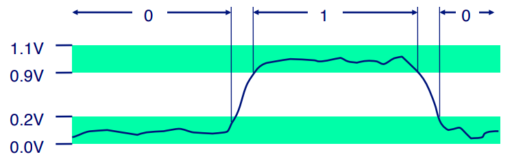

The reason why bits are great is in the digital world we can sort of take what otherwise an analog signal and quantify it. And just say I'm going to say that one range of values.

Let's say it's low voltage - I'm going to call that a $0$. And the high range of value I'm going to call it a $1$. If there is noise or imperfections in the circuit or anything going on, as long as that doesn't exceed these bit's threshold you've set up. Then you'll get a nice clean signal out of it.

### 1.1.2 For example, can count in binary

That's sort of at the core why everything we do, and especially for storing information, it turns out it's much easier to store one bit of information or a digital value than it is to store an analog value.

- **Base 2 Number Representation**
  - Represent $15213_{10}$ as $11101101101101_{2}$
  - Represent $1.20_{10}$ as $1.0011001100110010[0011]_{...2}$
  - Represent $1.5213 \times 10^4$ as $1.1101101101101_{2} \times 2^{13}$

When we do floating-point numbers where what you do is to the right of the binary point - not a decimal point:

$2^{1} 2^{0}$ . $2^{-1} 2^{-2}$

Something to the left of that would have a weight $2^0$, and the next one over would have weight $2^{1}$. But what you do is as you go to the right that adds weight $2^{-1}$ and $2^{-2}$. In otherwords they are $1 \over 2$ and $1 \over 4$.

So we can represent just like you do the decimal representation of fractions. We can do the binary representation of fractions. That's the core of floating point number of representations.

#### 1.1.3 Encoding Byte Values

It gets very annoying if you have say 32 or even 64-bit numbers to be writing the strings 1 and 0 out. So what we use and what's become largely the most common is to group collections of 4 bits at a time into. And then represent that in base 16 or what's known as hexadecimal representation. Using the letters $A$ through $F$ as values $10$ through $15$.

| **Hex** | **Decimal** | **Binary** |
| :-----: | :---------: | :--------: |
|    0    |      0      |    0000    |
|    1    |      1      |    0001    |
|    2    |      2      |    0010    |
|    3    |      3      |    0011    |
|    4    |      4      |    0100    |
|    5    |      5      |    0101    |
|    6    |      6      |    0110    |
|    7    |      7      |    0111    |
|    8    |      8      |    1000    |
|    9    |      9      |    1001    |
|    A    |     10      |    1010    |
|    B    |     11      |    1011    |
|    C    |     12      |    1100    |
|    D    |     13      |    1101    |
|    E    |     14      |    1110    |
|    F    |     15      |    1111    |

- **Byte = 8 bits**
  - Binary &00000000*{2}& to &1111111*{2}&
  - Decimal: $0_{10}$ to $255_{10}$
  - Hexadecimal $00_{16}$ to $FF_{16}$
    - Base 16 numbers representation
    - Use characters $0$ to $9$ and $A$ to $F$
      - $0xFA1D37B$
      - $0xfa1d37b$

#### 1.1.4 Example Data Representations

| C Data Type | Typical 32-bit | Typical 64-bit | x86-64 |
| :---------- | :------------: | :------------: | :----: |
| char        |       1        |       1        |   1    |
| short       |       2        |       2        |   2    |
| int         |       4        |       4        |   4    |
| long        |       4        |       8        |   8    |
| float       |       4        |       4        |   4    |
| double      |       4        |       8        |   8    |
| long double |       -        |       -        | 10/16  |
| pointer     |       4        |       8        |   8    |

There's also a slightly obscure holdover from ancient days of floating point. Where there's a special representation in Intel machines that use a 10 bytes or 80 bit representation. And when you use that on a 64-bit machine they sort of waste an extra 6 bytes out of that. So that everything is aligned in 16 byte increment.

The other thing and this is an important featuer is any address is defined to be the word size of the machine. When they say it's a 64-bit machine, what they really mean is that the addresses are 64-bit values or 8-byte values.

### 1.2 Bit-level manipulations

#### 1.2.1 Boolean Algebra

- **Developed by George Boole in 19th Century**

  - Algebraic representation of logic
    - Encode "True" as 1 and "False" as 0

- **And**

  - **A&B = 1 when both A = 1 and B = 1**
    |&|0|1|
    |-|-|-|
    |0|0|0|
    |1|0|1|

- **Or**

  - **A|B = 1 when either A = 1 or B = 1**
    |\||0|1|
    |-|-|-|
    |0|0|0|
    |1|1|1|

- **Not**

  - **~A = 1 when A = 0**
    |~|0|
    |-|-|
    |0|1|
    |1|0|

- **Exclusive-Or (Xor)**
  - **A^B = 1 when either A = 1 or B = 1, but not both**
    |^|0|1|
    |-|-|-|
    |0|0|1|
    |1|1|0|

#### 1.2.2 General Boolean Algebras

- **Operate on Bit Vectors**

  - Operations applied bitwise

    |     | 01101001 |
    | --- | -------- |
    | &   | 01010101 |
    |     | 01000001 |

    |     | 01101001 |
    | --- | -------- |
    | \|  | 01010101 |
    |     | 01111101 |

    |     | 01101001 |
    | --- | -------- |
    | ^   | 01010101 |
    |     | 00111100 |

    | ~   | 01010101 |
    | --- | -------- |
    |     | 10101010 |

- **All of the Properties of Boolean Algebra Apply**
  So again we will spend a lot of time making use of the fact that in C. And this is one of the features to C that people like, is that you can do these sort of very low level of bit manipulations directly in the language.

#### 1.2.3 Example: Representing & Manipulating Sets

- **Representation**

  - Width w bit vector represents subset of {0, 1, ..., w-1}
  - **$\alpha_{j}=1$ if $j\owns A$**

    - 01101001 {0,3,5,6}
    - _7<span style="color:red">65</span>4<span style="color:red">3</span>21<span style="color:red">0</span>_

    - 01010101 {0,2,4,6}
    - _7<span style="color:red">6</span>5<span style="color:red">4</span>3<span style="color:red">2</span>1<span style="color:red">0</span>_

This example is an imagine we want to represent sets. Where the elements of the set are numbers ranging between 0 and 7. So 1 byte is enought to capture eight cases.

We'll just number the bits from right to left. This bit 0 would represent whether or not the value 0 is the element of the set.

- **Operations**

| Sign | Meaning              | Result of Bits | Result of Set      |
| ---- | -------------------- | -------------- | ------------------ |
| &    | Inersetion           | 01000001       | {0, 6}             |
| \|   | Union                | 01111101       | {0, 2, 3, 4, 5, 6} |
| ^    | Symmetric difference | 00111100       | {2, 3, 4, 5}       |
| ~    | Complement           | 10101010       | {1, 3, 5, 7}       |

These are actaully very common, for example, there are operations at a file I/O. About I/A that you can track which set of possible inputs to the system. Think of different network connections have an input ready for me to read.

And there is a data structure that is sort fo hidden away among some C library calls. But it basically is using exactly this representation about a thousand.

#### 1.2.4 Bit-Level Operations in C

A bits worth of information to represent these sets. And do manipulation on those sets so this is a very common and why do we use representation of sets in computer science.

- **Operations &, |, ~, ^ Available in C**
  - Apply to any "integral" data type
    - long, int, short, char, unsigned
  - View arguments as bit vectors
  - Arguments applied bit-wise
- **Examples (char data type)**
  - ~0x41 -> 0xBE
    - ~01000001 -> 10111110
  - ~0x00 -> 0xFF
    - ~00000000 -> 11111111
  - 0x69 & 0x55 -> 0x41
    - 01101001 & 01010101 -> 01000001
  - 0x69 | 0x55 -> 0x7D
    - 01101001 | 01010101 -> 01111101

#### 1.2.5 Contrast: Logic Operations in C

- Contrast to Logical Operations
  - &&, ||, !
    - View 0 as "False"
    - Anything nonzero as "True"
    - Always return 0 or 1
    - <span style="color:#C70039">Early termination</span>
- **Examples (char data tye)**
  - !0x41 -> 0x00
  - !0x00 -> 0x01
  - !!0x41 -> 0x01
  - <br>
  - 0x69 && 0x55 -> 0x01
  - 0x69 || 0x55 -> 0x01
  - p && \*p (avoids null pointer access)

One thing that's really important and that programmers screw it up all the time. It's to mix up the & and &&, or the | and ||. There is sort of a syntactic similarity, and there is actually somewhat of a semantic relation too.

In particularly this early termination is something that people use a lot, if you want to make sure that you're not accessing a null pointer, you can test whether that's null pointer first before accessing it. If _`p && \*p`_ is 0 or null, then it will do the dereferencing of null.

#### 1.2.6 Shift Operations

There is a curious feature that left shifts are always the same, but there are two different flavors of the right shift.

- **Left Shift: x << y**

  - Shift bit-vector **x** left **y** positions
    - Throw away extra bits on left
    - Fill with 0's on right
      |**Argument x**|01100010|
      |-|-|
      |**<< 3**|00010*000*|
      |**Log. >> 2**|*00*011000|
      |**Arith. >> 2**|*00*011000|

- **Right Shift: x >> y**

  - Shift bit-vector **x** right **y** positions
    - Throw away extra bits on right
  - Logical Shift
    - Fill with 0's on left
  - Arithmetic shift
    - Replicate most significant bit on left
      |**Argument x**|10100010|
      |-|-|
      |**<< 3**|00010*000*|
      |**Log. >> 2**|*00*01000|
      |**Arith. >> 2**|*11*011000|

- Undefined Behavior
  - Shift amount < 0 or ≥ word size

What should happen if I want to shift an 8-bit nunber 8 positions to the left: x << 8?

On most machines you'll get whatever x was, but not zero! Because what will do is it will compute this number mod(8). And the reason that happens is if you think about it, it's looking at just the lower two three bits of the shift amount and ignoring all the rest. So that's effectively like mod(8).

### 1.3 Integers

#### 1.3.1 Representation: unsigned and signed

##### 1.3.1.1 Encoding Integers


**A Simple Example of Unsigned Case:**

| 4   | 3   | 2   | 1   | 0   | w     |
| --- | --- | --- | --- | --- | ----- |
| 16  | 8   | 4   | 2   | 1   | $2^w$ |
| 1   | 0   | 1   | 1   | 0   | x     |

Result: 16 + 4 + 2 = 22

**A Simple Example of Signed Case:**

| 4   | 3   | 2   | 1   | 0   | w     |
| --- | --- | --- | --- | --- | ----- |
| -16 | 8   | 4   | 2   | 1   | $2^w$ |
| 1   | 0   | 1   | 1   | 0   | x     |

Result: -16 + 4 + 2 = -10

- **C short 2 bytes long**

|     | Decimal | Hex   | Binary            |
| --- | ------- | ----- | ----------------- |
| x   | 15213   | 3B 6D | 00111011 01101101 |
| y   | -15213  | C4 93 | 11000100 10010011 |

- **Sign Bit**
  - For 2's complement, most significant bit indicates sign
    - 0 for nonnegative
    - 1 for negative

##### 1.3.1.2 Numeric Ranges

- **Unsigned Values**

  - _UMin_ = 0, 000...0
  - _UMax_ = $2^w$ - 1, 111...1

- **Two's Complement Values**

  - _TMin_ = -$2^{w-1}$, 100...0
  - _TMax_ = $2^{w-1}$ - 1, 011...0

- **Other Values**
  - Minus 1, 111...1

**Values for _W_ = 16**

|      | Decimal | Hex   | Binary            |
| ---- | ------- | ----- | ----------------- |
| UMax | 65535   | FF FF | 11111111 11111111 |
| TMax | 32767   | 7F FF | 01111111 11111111 |
| TMin | -32768  | 80 00 | 10000000 00000000 |
| -1   | -1      | FF FF | 11111111 11111111 |
| 0    | 0       | 00 00 | 00000000 00000000 |

##### 1.3.1.3 Values for Different Word Sizes

These numbers call UMax the biggest unsigned number, TMin the smallest most negative two's complement number, and TMax the largest positive two's complement number.

|          | **8** | **16**  | **32**         | **64**                     |
| -------- | ----- | ------- | -------------- | -------------------------- |
| **UMax** | 255   | 65,535  | 4,294,967,295  | 18,446,744,073,709,551,615 |
| **TMax** | 127   | 32,767  | 2,147,483,647  | 9,223,372,036,854,775,807  |
| **TMin** | -128  | -32,768 | -2,147,483,648 | -9,223,372,036,854,775,808 |

- **Observations**

  - |_TMin_| = _TMax_ + 1
    - Asymmetric range
  - _UMax_ = 2 \* _TMax_ + 1

- **C Programming**
  - #include <limits.h>
  - Declares constans, e.g.,
    - ULONG_MAX
    - LONG_MAX
    - LONG_MIN
  - Values platform specific

##### 1.3.1.4 Unsgined & Signed Numeric Values

- Equivalence
  - Same encodings for nonnegative values
- Uniqueness
  - Every bit pattern represents unique integer value
  - Each representable integer has unique bit encoding
- Can Invert Mappings
  - U2B(x) = B2U$^{-1}$(_x_)
    - Bit pattern for unsigned integer
  - T2B(x) = B2T$^{-1}$(_x_)
    - Bit pattern for two's complement

#### 1.3.2 Conversion, casting

##### 1.3.2.1 Mapping Between Signed & Unsigned

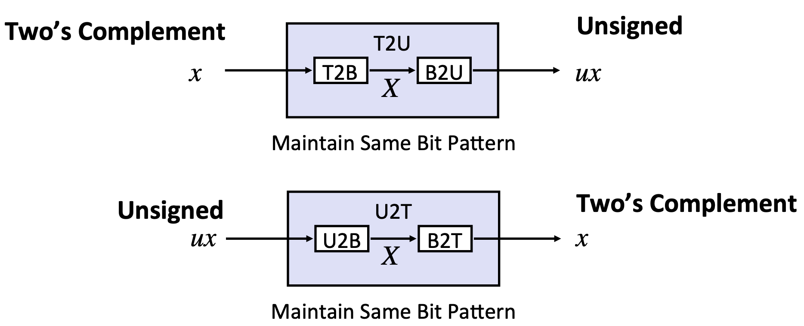

- **Mappings between unsigned and two's complement numbers: <span style="color:#C70039">Keep bit representations and reinterpret</span>**

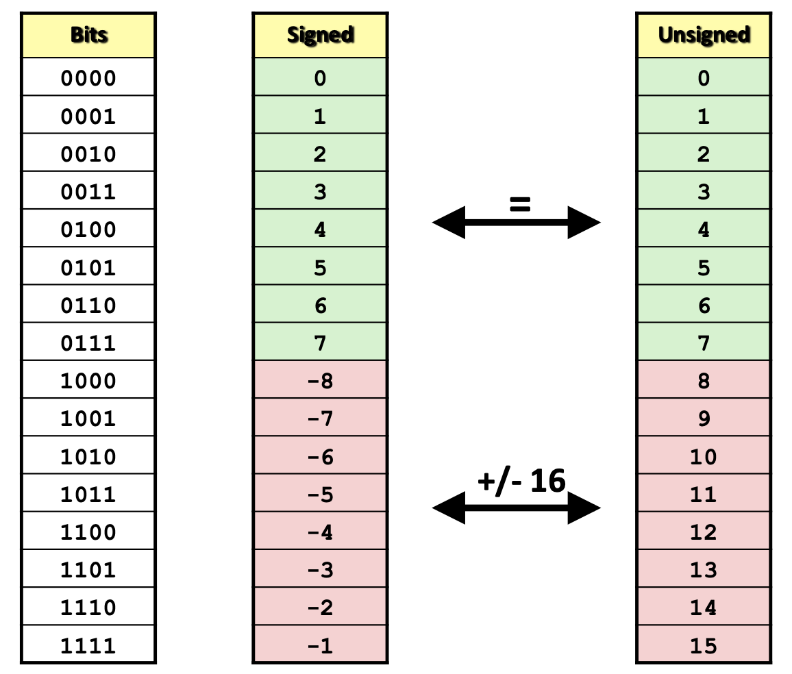

##### 1.3.2.2 Conversion Visualized

- **2's Comp. -> Unsigned**
  - Ordering Inversion
  - Negative -> Bit Positive

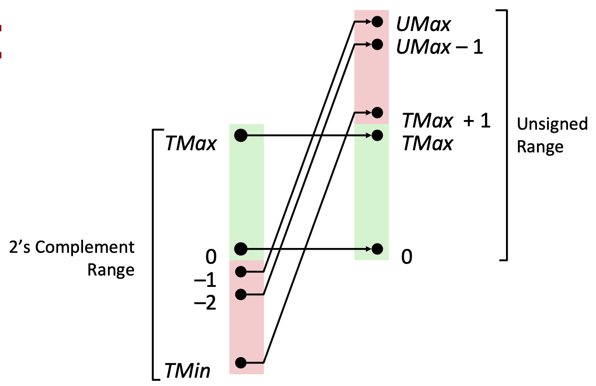

##### 1.3.2.3 Signed vs. Unsigned in C

- **Constants**
  - By default are considered to be signed integers
  - Unsigned if have "U" as suffix
    - 0U, 4354223U
- **Casting**
  - Explicit casting between signed & unsigned same as U2T and T2U

```c
int tx, ty;
unsigned ux, uy;
tx = (int) ux;
uy = (unsigned) ty;
```

- Implicit casting also occurs via assignments and procedure calls

```c
tx = ux;
uy = ty;
```

##### 1.3.2.4 Casting Surprises

- **Expression Evaluation**
  - If there is a mix of unsigned and signed in single expression, **_<span style="color:#C70039">signed values implicitly cast to unsigned</span>_**
  - Includeing comparision operations <, >, ==, <=, >=
  - Examples fow _W_ = 32:
    - TMIN = -2,147,483,648
    - TMAX = 2,147,483,647

| Constant$_{1}$ | Constant$_{2}$        | Relation | Evaluation |
| -------------- | --------------------- | -------- | ---------- |
| 0              | 0U                    | ==       | unsigned   |
| -1             | 0                     | <        | signed     |
| -1             | 0U                    | >        | unsigned   |
| 2,147,483,647  | -2,147,483,647 - 1    | >        | signed     |
| 2,147,483,647U | -2,147,483,647 - 1    | <        | unsigned   |
| -1             | -2                    | >        | signed     |
| (unsigned)-1   | -2                    | <        | unsigned   |
| 2,147,483,647  | 2,147,483,648(U)      | <        | unsigned   |
| 2,147,483,647  | (int)2,147,483,648(U) | >        | signed     |

##### 1.3.2.5 Summary Casting Signed <-> Unsigned: Basic Rules

- **Bit pattern is maintained**
- **But reinterpreted**
- **Can have unexpected effects: adding or subtracting 2$^w$**
- **Expression containing signed and unsigned int**
  - int is cast to unsigned!!!

```c
for (int i = n-1; i >= 0; i--)
  function(i);
```

Here's an interesting question what if we were declared as being unsigned?

```c
for (unsigned i = n-1; i >= 0; i--)
  function(i);
```

The loop will go forever!!! What would most likely happen is we would go from being 0 to being UMax. And that's really big number and the way we'd most likely cause a memory fault because it's so far out of bounds.

```c
for (int i = n-1; i - sizeof(char) >= 0; i--)
  function(i);
```

So _sizeof()_ returns an unsigned value, it's not actually a function, it's built in but it's the result of sizeof is considered to being unsigned.

If you have a signed value in it unsigned in any kind of arithmetic, it will turn treat the combination of the two is unsigned. So it will actually do an unsigned comparison here.

#### 1.3.3 Expanding, truncating

##### 1.3.3.1 Sign Extension

- **Task:**
  - Given _w_-bit signed integer _x_
  - Convert it to _w+k_-bit integer with same value
- **Rule:**
  - Make _k_ copies of sign bit:
  - X' = (x$_{w-1}$, ..., x$_{w-1}$), x$_{w-1}$, x$_{w-2}$, ..., x$_{0}$
    - () -> k copies of MB

[sign_ext.png](./images/sign_ext.png)

**Simple Example:**

| Extented | Original | Value                  |
| -------- | -------- | ---------------------- |
|          | 1110     | -8+4+2 = -2            |
| 1        | 1110     | -16+8+4+2 = -2         |
| 1111     | 1110     | -128+64+...+8+4+2 = -2 |

That's the idea of sign extension and you'll see that a lot in bit patterns. Especially if you see a bit pattern with it starts with a bunch of F's, that tells you the number is negative.

##### 1.3.3.2 Sign Extension Example

```c
short int x = 15213;
int ix = (int) x;
short int y = -15213;
int iy = (int) y;
```

|     | Decimal |         Hex |                              Binary |
| --- | ------: | ----------: | ----------------------------------: |
| x   |   15213 |       3B 6D |                   00111011 01101101 |
| ix  |   15213 | 00 00 3B 6D | 00000000 00000000 00111011 01101101 |
| y   |  -15213 |             |                   11000100 10010011 |
| iy  |  -15213 |             | 11111111 11111111 11000100 10010011 |

- **Converting from smaller to larger integer data type**
- **C automatically performs sign extension**

##### 1.3.3.3 Truncating

|          | Truncated | Base | Value                |
| -------- | --------- | ---- | -------------------- |
| unsinged | 1         | 0101 | 16+4+1 = 21          |
| unsinged | Dropped   | 0101 | 4+1 = 5 = 21_mod(16) |
| singed   | 1         | 0101 | -16+4+1 = -11        |
| singed   | Dropped   | 0101 | 4+1 = 5 = ???        |

##### 1.3.3.4 Summary: Expanding, truncating: Basic Rules

- **Expanding (e.g., short int to int)**

  - Unsigned: zeros added
  - Signed: sign extension
  - Both yield expected result

- Truncating (e.g., unsigned to unsigned short)
  - Unsigned/signed: bits are truncated
  - Result are reinterpreted
  - Unsigned: mode operation
  - Signed: similar to mod
  - For small numbers yield expected behavior

#### 1.3.4 Addtion, negation, multipliation, shifting

##### 1.3.4.1 Unsigned Addition

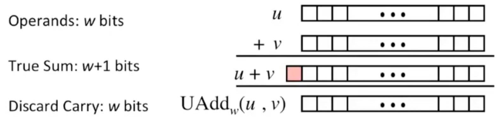

If you take two numbers that range between up to the maximum value of an unsigned number, and then add then. That in principle you might need to get an extra bit to represent that sum.

Unfortunately we can't just go out and add more bits to your computer indefinitely. So we just stop it at some point and say, well, whatever bit happened to be in that sort of next bit position. We're just goig to drop it and pretend it doesn't exist. And say that the result of addition is just whatever the _w_ bit pattern you get if you only consider the first _w_ bits out of it. With no warning no message no error or anything, thi is just it happens silenty.

- Standard Addition Function
  - Ignores carry output
- Implements Modular Arithmetic
  - s = UAdd$_{w}$(_u_, _v_) = _u_ + _v_ mod 2$^w$

| Dropped | Original | Value                         |
| ------- | -------- | ----------------------------- |
|         | 0101     | 4+1 = 5                       |
|         | 1101     | 8+4+1 = 13                    |
| 1       | 0010     | 5+13 mod 2$^4$ = 18 mod16 = 2 |

##### 1.3.4.2 Visulizing (Mathematical) Integer Addition

- **Integer Addtion**
  - 4-bit integers _u_, _v_
  - Compute true sum Add$_{4}$(_u_, _v_)
  - Values increase linearly with _u_ and _v_
  - Forms planer surface

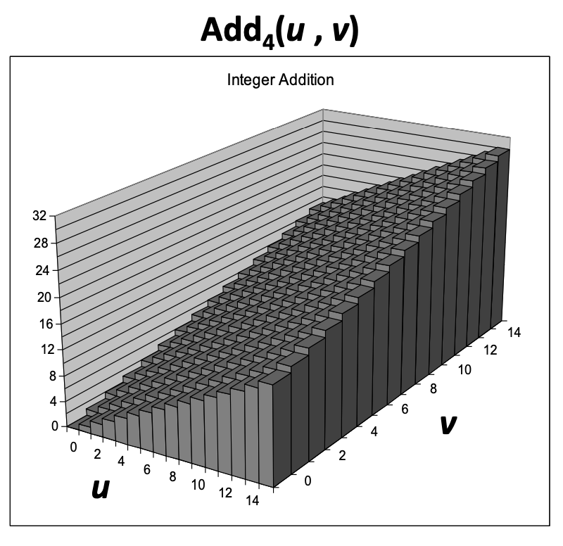

What we'll do is dropping that most significant bit, sort of create a cliff that when you roll over from 15 to 16 instead of it drops all the way down to 0. And that's referred to as an overflow.

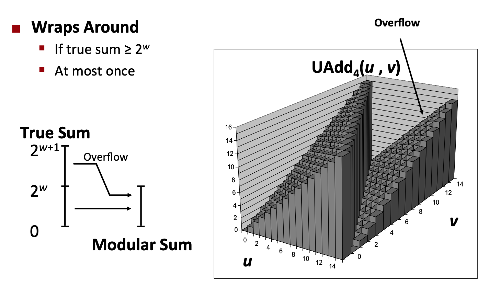

##### 1.3.4.3 Two;s Complement Addition

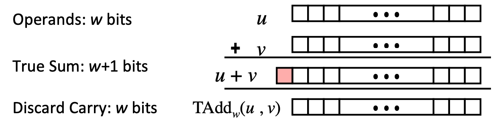

- **TAdd and UAdd have identical bit-level behavior**
  - Signed vs. unsigned addition in C:

```c
int s, t, u, v;
s = (int) ((unsigned) u + (unsigned) v);
t = u + v;
```

Two's complement addition looks just like a regular edition. In other words, we can perform a subtraction. And addition of subtraction of numbers by using this two's complement representation for negative numbers.

- Will give s == t

| Dropped | Original | Value       |
| ------- | -------- | ----------- |
|         | 0101     | 4+1 = 5     |
|         | 1101     | -8+4+1 = -3 |
| 1       | 0010     | 5-3 = 2     |

| Dropped | Original | Value             |
| ------- | -------- | ----------------- |
|         | 1011     | -8+2+1 = -5       |
|         | 0011     | 2+1 = 3           |
|         | 1110     | -5+3 = -8+4+2= -2 |

**Overflow examples:**

| Dropped | Original | Value        |
| ------- | -------- | ------------ |
|         | 1010     | -8+2 = -6    |
|         | 1101     | -8+4+1 = -3  |
| 1       | 0111     | 7 (overflow) |

It's become positive and that's referred to as a negative overflow. The reason of course is the number -9, but we can't represent it in a 4-bit two's complement number, so it overflowed. You'll notice that the +7 differs from -9 by 16.

| Dropped | Original | Value         |
| ------- | -------- | ------------- |
|         | 0111     | 4+2+1 = 7     |
|         | 0101     | 4+1 = 5       |
| 1       | 1100     | -4 (overflow) |

We've taken two positive numbers and added them together and gotten a negative result.

##### 1.3.4.4 TAdd Overflow

- **Functionality**
  - True sum requires _w_+1 bits
  - Drop off MSB
  - Treat remaining bits as 2's comp. integer

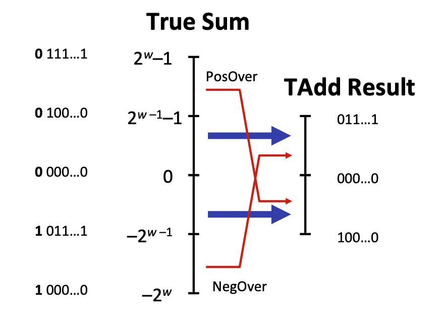

##### 1.3.4.5 Visulizing 2's Complement Addition

- **Values**
  - 4-bits two's comp.
  - Range from -8 to +7
- **Wraps Around**
  - If sum >= 2$^{w-1}$
    - Becomes negative
    - At most once
  - If sum < -2$^{w-1}$ - Becomes positive - At most once

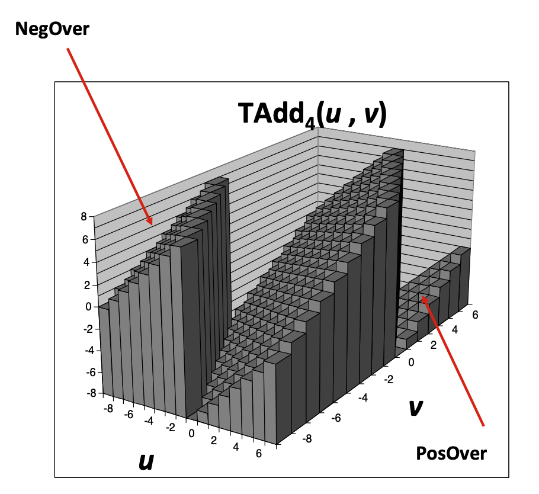

##### 1.3.4.6 Multiplication

Multiplication is basically the same idea. In fact all the operation are the basically the same idea that if you can't represent it within the word size, you just take the lower _w_ bits.

So all these complicated solutions here are just ways or sayings, in principle if you take two _w_ bits numbers and multiply them together. You might need a result may require as much as 2*w* bits to represent.

Before addtion is _w_+1, multiplication you actually have to double, because you're potentially squaring the largest number.

- **Goal: Computing Product of _w_-bit numbers _x, y_**
  - Either signed or unsigned
- **But, exact results can be bigger than _w_ bits**

  - Unsigned: up to 2w bits
    - Result range: 0 $\le$ _x_\*_y_ $\le$ (2$^w$ - 1)$^2$ = 2$^{2w}$ - 2$^{w+1}$ + 1
  - Two's complement min(negative): Up to 2*w*-1 bits
    - Result range: _x_\*_y_ $\ge$ (-2$^{w-1}$\*2$^{w-1}$-1) = -2$^{2w-2}$ + 2$^{w-1}$
  - Two's complement max(positive): Up to 2*w* bits, but only for (_TMin_$_{w}$)$^2$
    - Result range: _x_\*_y_ $\le$ (-2$^{w-1}$)$^2$ = 2$^{2w-2}$

- **So, maintaining exact results...**
  - Would need to keep expanding word size with each product computed
  - Is done in software, if needed
    - e.g., by “arbitrary precision” arithmetic packages

##### 1.3.4.7 Unsigned Multiplication in C

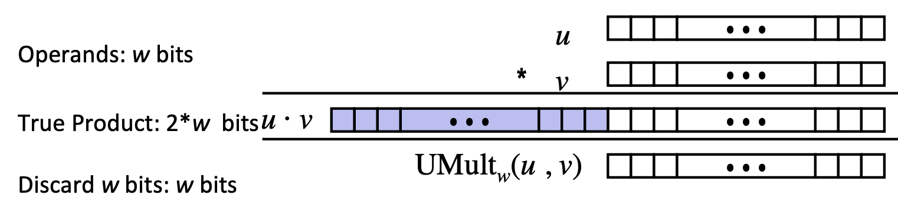

- **Standard Multiplication Funciton**
  - Ignores high order _w_ bits
- **Implements Modular Arithmetic**
  - UMult$_{w}$(_u_, _v_) = _u_ - _v_ mod 2$^w$

| Dropped | Original | Value   |
| ------- | -------- | ------- |
|         | 0011     | 2+1 = 3 |
|         | 0101     | 4+1 = 5 |
|         | 1101     | 15      |

| Dropped | Original | Value         |
| ------- | -------- | ------------- |
|         | 0101     | 4+1 = 5       |
|         | 0101     | 4+1 = 5       |
| 1       | 1001     | 25 mod 16 = 9 |

##### 1.3.4.8 Signed Multiplication in C


- **Standard Multiplication Function**
  - Ignores high order _w_ bits
  - Some of which are different for signed vs. unsigned multiplication
  - Lower bits are the same

| Dropped | Original | Value        |
| ------- | -------- | ------------ |
|         | 0100     | 4            |
|         | 0101     | 4+1 = 5      |
| 1       | 0100     | 20 mod 16 =4 |

| Dropped | Original | Value     |
| ------- | -------- | --------- |
|         | 0101     | 4+1 = 5   |
|         | 0101     | 4+1 = 5   |
| 1       | 1001     | -8+1 = -7 |

##### 1.3.4.9 Power-of-2 Multiply with Shift

There's a trick for multiplying by a power-of-2, which is just to shift the number to the left. You'll often see that when you have in your code, we want to multiply some number by 4, you'll write it in your C code, if you look at the assembly code, you'll see that compiler generated is just says shift it by 2.

- **Operation**
  - **u << k gives u \* 2$^k$**
  - Both signed an unsgined

So when they're doing shifts where you might expect them to be doing multiplicaiton, the reason for that as an optimization is historically the multiplication instruction took a lot longer than a shift instruction.

Say one clock to do a shift, and it used to be like 11, 12, 13 clock cycles to do a multiplication. Nowadays like on computers, we use the shark machines it only takes three clock cycles to do multiplication, because they added a lot of hardware to do that. But three clock cycles is still more time than one.

So when you can get away with a shift, it's generally a better idea. And the compiler has its onw kind of judgement calls on when is it more efficient to substitute one up for another.

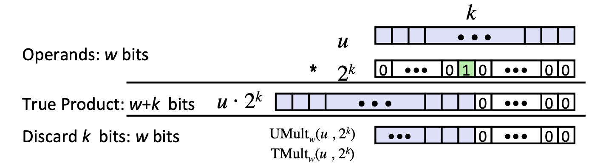

##### 1.3.4.10 Unsigned Power-of-2 Divide with Shift

- **Quotient of Unsigned by Power of 2**
  - **u >> k gives u / 2$^k$**
  - Uses logical shift

Then if you want to divide something by a power-of-2, you can shift it right by this in the same general idea. The only thing that becomes a little bit quirky is what if the number you have is not actually divisible by the power-of-2.

**Unsigned Example:**

- Complement with 0 - Logical Operations
- Result round to 0

| operands | Original | Droped | Value   |
| -------- | -------- | ------ | ------- |
|          | 0110     | 0      | 4+2 = 6 |
| >>       | 0011     | 1      | 2+1 = 3 |
| >>       | 0001     | 1      | 1       |

**Signed Example:**

- Complement with 1 - Arithmetic Operations (most machines)
- Result round to minus infinity -$\infty$

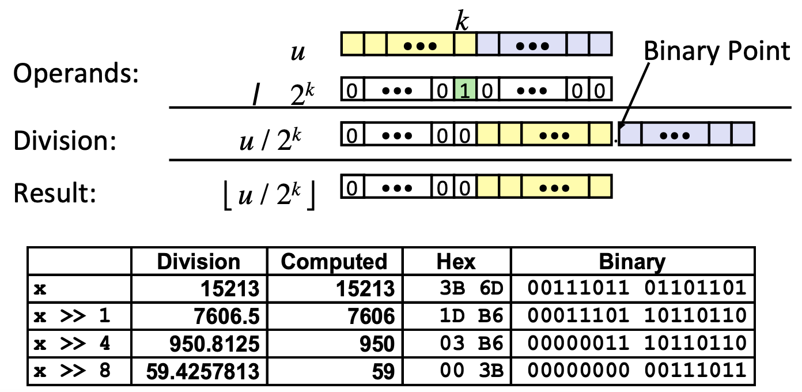

| operands | Original | Droped | Value         |
| -------- | -------- | ------ | ------------- |
|          | 1010     | 0      | -8+2 = -6     |
| >>       | 1101     | 0      | -8+4+1 = -3   |
| >>       | 1110     | 1      | -8+4+2 = -2   |
| >>       | 1111     | 1      | -8+4+2+1 = -1 |

#### 1.3.5 Summary

##### 1.3.5.1 Arithmetic: Basic Rules

- **Addition:**
  - Unsigned/signed: Normal addition followed by truncate, same operation on bit level
  - Unsigned: addition mod 2$^w$
    - Mathematical addtion + possible subtraction of 2$^w$
  - Signed: modified addition mod 2$^w$ (result in proper range)
    - Mathematical addition + possible addition or subtraction of 2$^w$
- **Multiplication:**
  - Unsigned/signed: Normal multiplication followed by truncate, same operation on bit level
  - Unsigned: multiplication mod 2$^w$
  - Signed: modified multiplication mod 2$^w$ (result in proper range)

##### 1.3.5.2 Why Should I Use Unsigned?

- **Don't use without understanding implications**

  - Easy to make mistakes

  ```c
  unsigned i;
  for (i = cnt-2; i >= 0; i--)
    a[i] += a[i+1];
  ```

  - Can be very subtle

  ```c
  #define DELTA sizeof(int)
  int i;
  for (i = CNT; i-DELTA >= 0; i-= DELTA)
    ...
  ```

- **_Do_ Use When Performing Modular Arithmetic**
  - Multiprecision arithmetic
- **_Do_ Use When Using Bits to Represent Sets**
  - Logical right shift, no sign extension

##### 1.3.5.3 Countig Down with Unsigned

- **Proper way to use unsigned as loop index**
  ```c
  unsigned i;
  for (i = cnt-2; i < cnt; i--)
    a[i] += a[i+1];
  ```
- **See Robert Seacord, _Secure Coding in C and C++_**

  - C Standard guarantees that unsigned addition will behave like modular arithmetic
    - 0 - 1 > _UMax_

- **Even beteer**
  ```c
  size_t i;
  for (i = cnt-2; i < cnt; i--)
    a[i] += a[i+1];
  ```
  - Data **size_t** defined as unsigned value with length = word size
  - Code will work even if cnt = _UMax_
  - What if _cnt_ is signed and <0 ?

### 1.4 Representations in memory, pointers and strings

#### 1.4.1 Byte-Oriented Memory Organization

The main point is when you are running program on a computer, from the programming perspective either, even not just as a C programmer. In your mind the memory is just this bit array of bytes. That's numbered from 0 up to some maximum number.

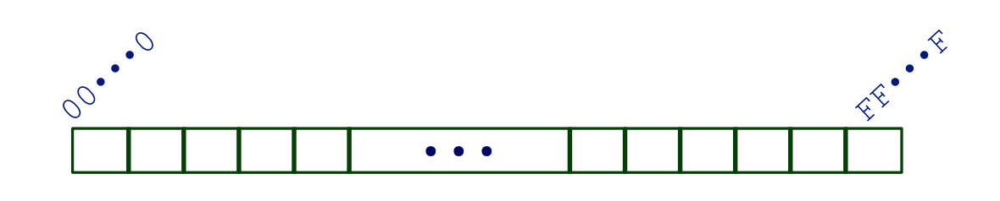

- **Programs refer to data by address**

  - Conceptually, envision it as a very large array of bytes
    - In reality, it's not, but can think of it that way
  - An address is like an index into that array
    - And, a pointer variable stores an address

- **Note: system provides private address spaces to each "process"**
  - Think of a process as a program being executed
  - So, a program can clobber its own data, but not that of others

#### 1.4.2 Machine Words

The hardware doesn't neccessarily define what the word size is, it's a combination of the hardware and the compiler that determines what is the word size being used in the particular program.

```sh
gcc -m32 example.c -o example_32bit
gcc -m64 example.c -o example_64bit
```

- **Any given computer has a "Word Size"**

  - Norminal size of integer-valued data

    - and of addresses

  - Until recently, most machines used 32 bits (4 bytes) as word size

    - Limites addresses to 4GB (2$^{32}$ bytes)

  - Increasingly, machines have 64-bit word size

    - Potentially, could have 18 PB (petabytes) of addressable memory
    - That's 18.4 x 10$^{15}$

  - Machines still support multiple data formats
    - Fractions or multiples of word size
    - Always integral number of bytes

#### 1.4.3 Word-Oriended Memory Orgranization

- **Address Specify Byte Locations**

  - Address of first byte in word
  - Addresses of successive words differ by 4 (32-bit) or 8 (64-bit)

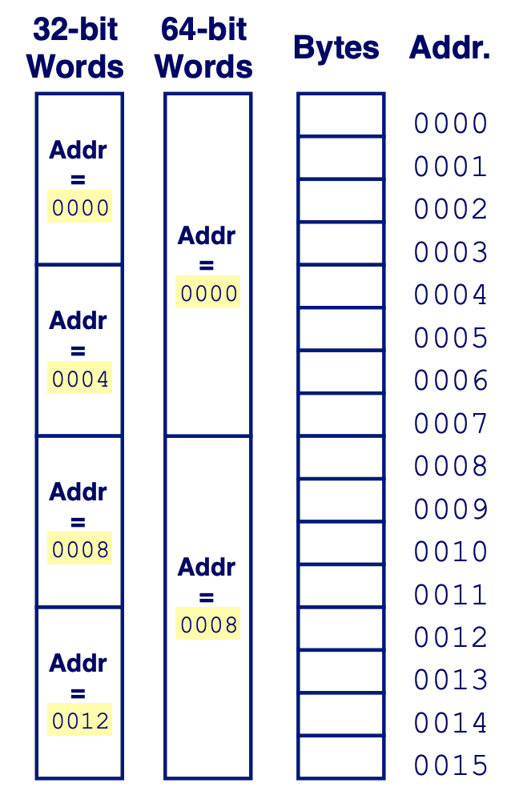

We can see these 32-bit memory are on multiples of 4 if bit boundaries, and same the 64-bit words are on multiples of 8. Those are known as aligned words and will generally will see that the compiler works pretty hard to keep things aligned. Because the hardware runs more efficiently that way.

But the main point is that we can just take as many bytes and collect them together and call it a word for what word size we need.

#### 1.4.4 Example Data Representations

| C Data Type | Typical 32-bit | Typical 64-bit | x86-64 |
| :---------- | :------------: | :------------: | :----: |
| char        |       1        |       1        |   1    |
| short       |       2        |       2        |   2    |
| int         |       4        |       4        |   4    |
| long        |       4        |       8        |   8    |
| float       |       4        |       4        |   4    |
| double      |       4        |       8        |   8    |
| long double |       -        |       -        | 10/16  |
| pointer     |       4        |       8        |   8    |

#### 1.4.5 Byte Ordering

- **So, how are the bytes within a multi-byte word ordered in memory?**

- **Conventions**

  - Big Endian: Sun, PowerPC Mac, Internet
    - Least significatn byte has highest address
  - Littile Endian: x86, ARM processrs running Android, iOS, and Windows
    - Least significant byte has lowest address

- **Example**
  - Variable x has 4-byte value of 0x01234567
  - Address given by &x is 0x100

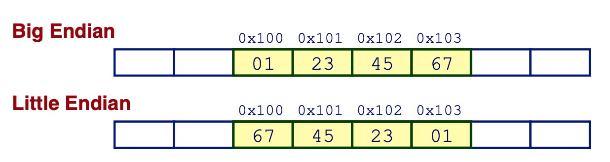

#### 1.4.6 Representing Integers

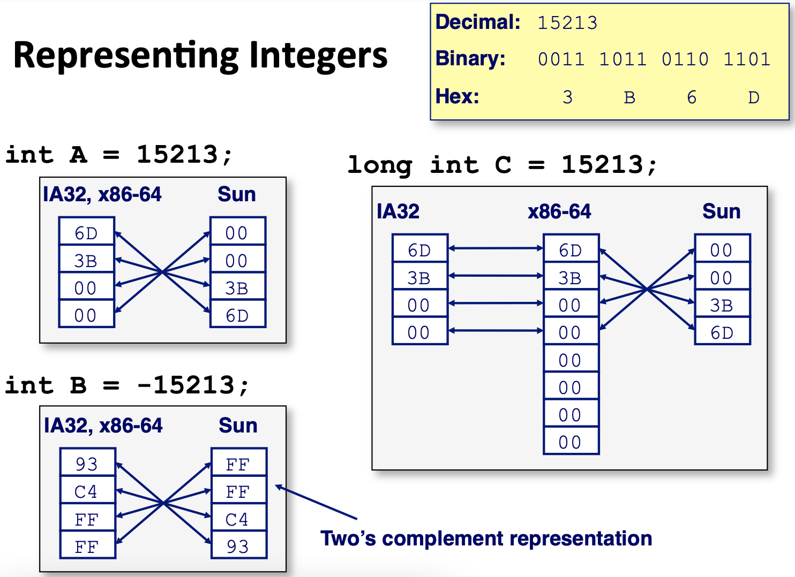

#### 1.4.7 Examining Data Representations

- **Code to Print Byte Representation of Data**
  - Casting pointer to unsigned char \* allows treatment as a byte array

```c
#include <stdio.h>
#include <stdlib.h>

// unsigned char -> general point type
typedef unsigned char *pointer;

void show_bytes(pointer start, size_t len)
{
    size_t i;
    for (i = 0; i < len; i++)
        // %p -> print pointer
        // %x: print hexadecimal
        printf("%p\t0x%.2x\n", start + i, start[i]);
    printf("\n");
}

int main(int argc, char **argv)
{
    int a = 15213;
    printf("int a = 15213; \n");
    show_bytes((pointer) &a, sizeof(int));

    return 0;
}
```

```sh
int a = 15213;
0x7ffeef79374c	0x6d
0x7ffeef79374d	0x3b
0x7ffeef79374e	0x00
0x7ffeef79374f	0x00
```

If you run this on a x86 machine, you see that there is these addresses with a lot of `7F`s. What that mean is it's in the upper end of this 47 bit address space.

#### 1.4.8 Representing Strings

- **Strings in C**
  - Represented by array of characters
  - Each character encoded in ASCII format
    - Standard 7-bit encoding of character seet
    - Character "0" has code 0x30
      - Digit _i_ has code 0x30+_i_
    - String should be null-terminated
      - Final character = 0
- **Compatibility**
  - Byte ordering not an issue

#### 1.4.9 Integer C Puzzles

**Initialization**

```c
int x = foo();
int y = bar();
unsigned ux = x;
unsigned uy = y;
```

- x < 0 => (x \* 2) < 0 => False for TMin
- ux >= 0
- x & 7 == 7 => (x << 30) < 0 => True
- ux > -1 => Always False
- x > y => -x < -y => False
- x \* x >= 0 => False
- x > 0 && y > 0 => x + y > 0
- x >= 0 => -x <= 0 => True
- x <=0 => -x >= 0 => False for Tmin
- (x|-x) >> 31 == -1 => True

## 2 Floating Point

### 2.1 Background: Fractional binary numbers

#### 2.1.1 Fractional binary numbers

- **What is 1101.101$_{2}$?**

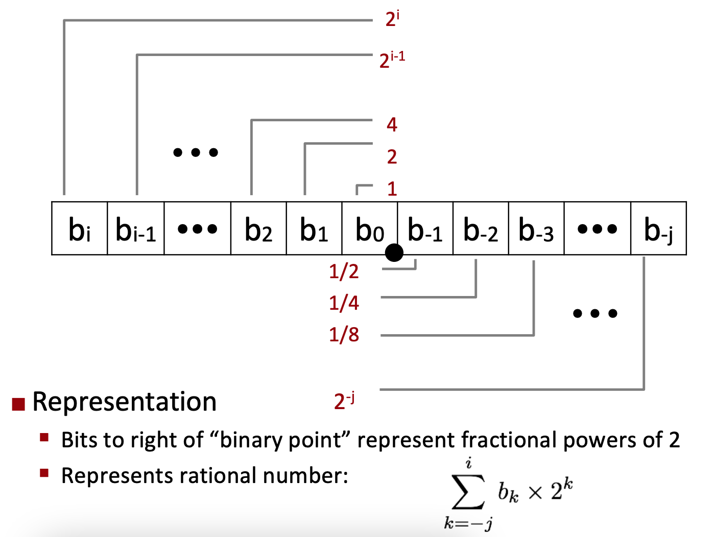

- **Exmaples:**

| Value  | Representation |
| ------ | -------------- |
| 5 3/4  | 101.11         |
| 2 7/9  | 10.111         |
| 1 7/16 | 1.0111         |

- **Observations**
  - Divide by 2 by shifting right (unsigned)
  - Multiply by 2 by shifting left
  - Numbers of form 0.1111111.... are just below 1.0
    - 1/2 + 1/4 + 1/8 + ... + 1/2$^i$ + ... -> 1.0
    - Use notation 1.0 - $\epsilon$

#### 2.1.1 Representable Numbers

- **Limitation #1**

  - Can only exactly represent numbers of the form x/2$^k$
    - Other rational number have repeating bit representations

- **Exmaples:**

| Value | Representation         |
| ----- | ---------------------- |
| 1/3   | 0.01010101[01]...      |
| 1/5   | 0.001100110011[0011]   |
| 1/10  | 0.00011000110011[0011] |

- **Limitation #2**
  - Just one setting of binary point within the _w_ bits
    - Limited range of numbers (very small values? very large?)

### 2.2 IEEE floating point standard: Definition

#### 2.2.1 IEEE floating point standard

- **IEEE Standard 754**

  - Established in 1985 as uniform standard floating point arithmetic
    - Before that, many idiosyncratic formats
  - Supported by all major CPUs

- **Driven by numerical concerns**
  - Nice standards for rouding, overflow, underflow
  - Hard to make fast in hardware
    - Numerical analysts predominated over hardware designers is defining standard

#### 2.2.2 Floating Point Representation

- **Numerical Form:**
  **(-1)$^s$M2$^E$**

  - Sign bit **_s_** determines whether number is negative or positive
  - Significant **_M_** normally a fractional value in range [1.0, 2.0).
  - Exponent **_E_** weights value by power of two

- **Encoding**
  - MSB S is sign bit **_s_**
  - exp field encodes **_E_** (but is not equal to E)
  - frac field encodes **_M_** (but is not equal to M)

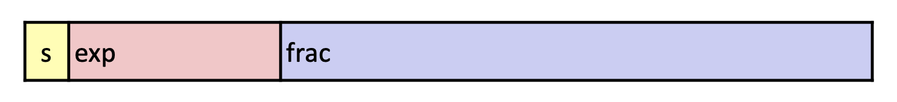

#### 2.2.3 Precision options

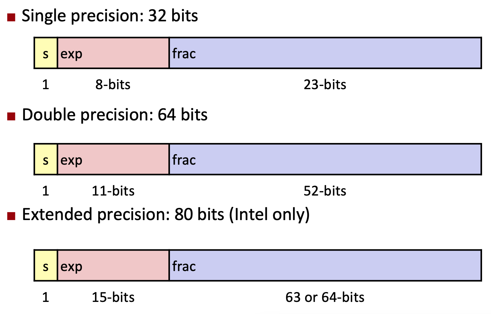

#### 2.2.4 "Normalized" Values

<span style="font-size:1.5em">**v = (-1)$^s$M2$^E$**</span>

- **When: exp != 000...0 and exp != 111...1**

- **Exponent coded as a biased value: E = Exp - Bias**

  - Exp: unsigned value of exp field
  - Bias = 2$^{k-1}$, when k is number of exponent bits
    - Single precision: 127 (Exp: 1...254, E: -126...127)
    - Double precision: 1023 (Exp: 1...2046, E: -1022...1023)

- **Significant coded with impplied leading 1: M = 1.xxx...x$_{2}$**
  - xxx...x: bits of frac field
  - Minimum when frac = 000.0 (M = 1.0)
  - Maximum when frac = 111.1 (M = 2.0 - $\epsilon$)

#### 2.2.5 Normalized Encoding Example

<span style="font-size:1.5em">**v = (-1)$^s$M2$^E$**</span><br>
<span style="font-size:1.5em">**E = Exp - Bias**</span>

- **Value: float F = 15213.0;**

  - 15213$_{10}$ = 11101101101101$_{2}$
  - = 1.1101101101101$_{2}$ x 2$^{13}$

- **Signficant**

  - M = 1.<ins>1101101101101</ins>$_{2}$
  - frac = <ins>1101101101101</ins>0000000000$_{2}$

- **Exponent**

  - E = 13
  - Bias = 127
  - Exp = 140 = 10001100$_{2}$

- **Result**

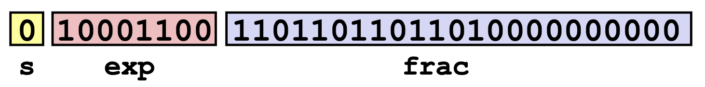

- **0 <= Exp <= 0111111 = 255**
- **-127 <= E <= 255-127 = 128**

#### 2.2.6 Denormalized Values

Now these normalized values always have this implied one, when we want to represent numbers closer to zero, that limits us. So there is another type of floating point number called the denormalized values.

- **Condtion: exp = 000...0**

- **Exponent value: E = 1 - Bias (instead of E = 0 - Bias)**
- **Significant coded with implied leading 0: M = 0.xxx...x$_{2}$**

  - xxx...x: bits of frac

- Cases
  - exp = 000...0, frac = 000...0
    - Represents zero value
    - Note distinct values: +0 ad -0 (why?)
  - exp = 0000...0, frac != 000...0
    - Numbers closest to 0.0
    - Equispaced

#### 2.2.7 Special Values

- **Condition: exp = 111...1**

- **Case: exp = 111...1, frac = 000...0**

  - Represents value $\infty$ (infinity)
  - Operation that overflows
  - Both positive and negative
  - E.g., 1.0/0.0 = -1.0/-0.0 = +$\infty$, 1.0/-0.0 = -$\infty$

- **Case: exp = 111...1, frac != 000...0**
  - Not-a-Number (NaN)
  - Represents case when no numeric value can be determined
  - E.g., sqrt(-1), $\infty$ - $\infty$, $\infty$ x 0

#### 2.2.7 Visualization: Floating Point Encoding

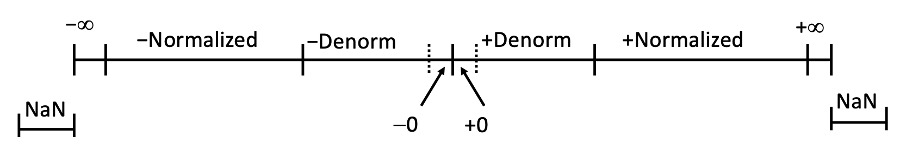

### 2.3 Example and properties

#### 2.3.1 Tiny Floating Point Example

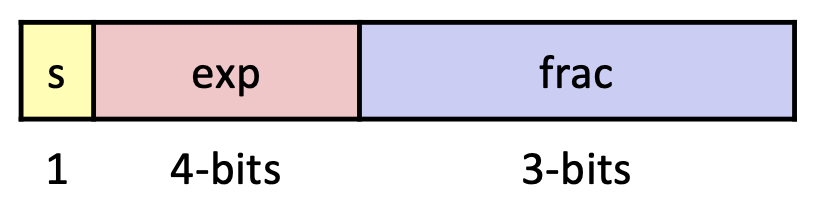

- **8-bit Floating Point Representation**

  - the sign bit is in the most significant
  - the next four bits are the exponent, with a bias of 7
  - the last three bits are the **frac**

- **Same general form as IEEE Format**
  - normalized, denormalized
  - representation of 0, NaN, infinity

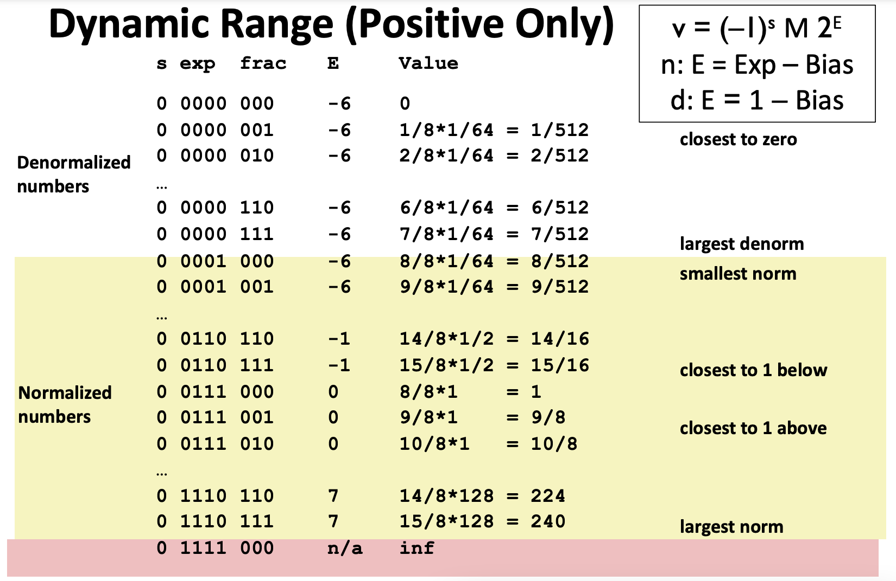

#### 2.3.2 Distribution of Values

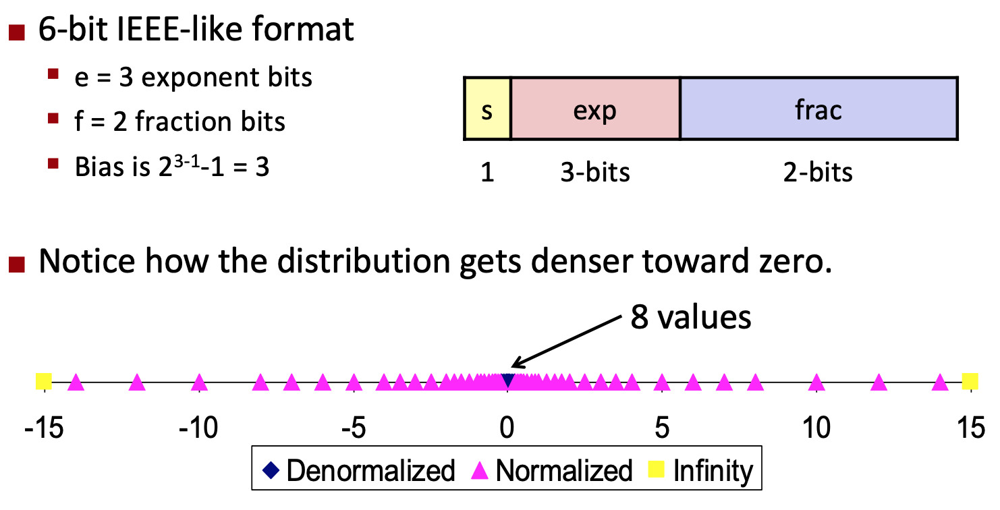

You can see that the values are very dense around zero, so they've very spaced very closely together. And then every time you increase the exponent by one, the numbers are spaced twice as far apart as the previous, the numbers that were represented by the previous exponent.

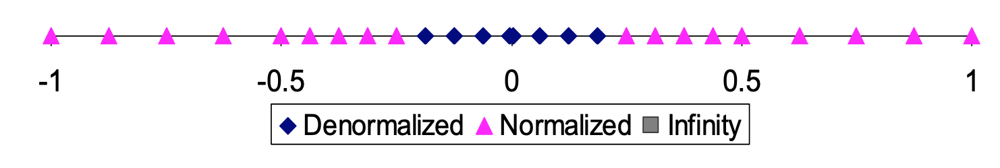

#### 2.3.3 Special Properties of the IEEE Encoding

- **FP Zero Same as Integer Zero**

  - All bits = 0

- **Can (Almost) Use Unsigned Integer Comparison**
  - Must first compare sign bits
  - Must consider -0 = 0
  - NaNs problematic
    - Will be greater than any other values
    - What should comparison yield?
  - Otherwise OK
    - Denorm vs. normalized
    - Normalized vs. infinity

### 2.4 Rounding, addition, multiplication

#### 2.4.1 Floating Point Operations: Basic Idea

- **x + y = Round(x + y)**

- **x $\times$ y = Round(x $\times$ y)**

- Basic idea
  - Fisrt **compute exact result**
  - Make it fit into desired precision
    - Possibly overflow if exponent too large
    - Possibly **round to fit into** _frac_

#### 2.4.2 Rounding

- **Rounding Modes (illustrate with $ rounding)**

|                        | $1.40 | $1.60 | $1.50 | $2.50 | -$1.50 |
| ---------------------- | ----- | ----- | ----- | ----- | ------ |
| Towards zero           | $1    | $1    | $1    | $2    | -$1    |
| Round down (-$/infty$) | $1    | $1    | $1    | $2    | -$2    |
| Round up (+$/infty$)   | $2    | $2    | $2    | $3    | -$1    |
| Neraest Even (default) | $1    | $2    | $2    | $2    | -$2    |

#### 2.4.3 Closer Look at Rount-To-Even

- **Default Rounding Mode**

  - Hard to get any other kind without dropping into assembly
  - All others are statistically biased
    - Sum of set of positive numbers will consistenly be over- or under- estimated

- **Applying to Other Decimal Places / Bit Positions**
  - When exactly halfway between two possible values
    - Round so that least significant digit is even
  - E.g., round to nearest hundredth
    - 7.894999 7.89 (Less then half way)
    - 7.895001 7.90 (Greater then half way)
    - 7.895000 7.90 (Half way - round up)
    - 7.885000 7.88 (Half way - round down)

#### 2.4.4 Rounding Binary Numbers

- **Binary Fractional Numbers**

  - "Even" when least significant bit is 0
  - "Half way" when bits to right of rounding position = 100...$_{2}$

- **Examples**
  - Round to nearest 1/4 (2 bits right of binary point)

| Value  | Binary                    | Rounded     | Action        | Rounded Value |
| ------ | ------------------------- | ----------- | ------------- | ------------- |
| 2 3/32 | 10.00<ins>011</ins>$_{2}$ | 10.00$_{2}$ | (<1/2 - down) | 2             |
| 2 3/16 | 10.00<ins>110</ins>$_{2}$ | 10.01$_{2}$ | (>1/2 - up)   | 2 1/4         |
| 2 7/8  | 10.11<ins>100</ins>$_{2}$ | 11.00$_{2}$ | (1/2 - up)    | 3             |
| 2 5/8  | 10.10<ins>100</ins>$_{2}$ | 10.00$_{2}$ | (1/2 - down)  | 2 1/2         |

#### 2.4.5 Floating Point Multiplication

- <span style="color:red">**(-1)$^{s1}$ M1 2$^{E1}$ $\times$ (-1)$^{s2}$ M2 S$^{E2}$**</span>
- **Exact Result: <span style="color:red">(-1)$^{s}$ M1 2$^{E}$</span>**

  - Sign s: s1 ^ s2
  - Significant M: M1 $\times$ M2
  - Exponent E: E1 + E2

- **Fixing**

  - If M > 2, shift M rightm increment E
  - If E out of range, overflow
  - Round M to fit _frac_ precision

- **Implementation**
  - Biggest chore is multiplying significants

#### 2.4.6 Floating Point Addition

- <span style="color:red">**(-1)$^{s1}$ M1 2$^{E1}$ + (-1)$^{s2}$ M2 S$^{E2}$**</span>

  - Assume E1 > E2

- **Exact Result: <span style="color:red">(-1)$^{s}$ M1 2$^{E}$</span>**

  - Sign s, significant M:
    - Result of signed align & add
  - Exponenet E: E1

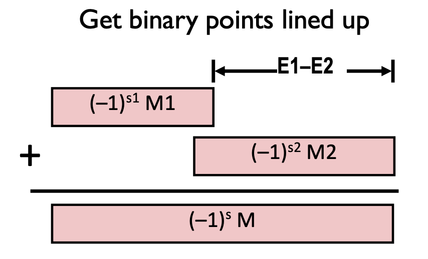

- **Fixing**
  - If M >= 2, shift M right, increment E
  - If M < 1, shift M left k positions, decrement E by k
  - Overflow if E out of range
  - Round M to fit _frac_ precision

#### 2.4.7 Mathematical Properties of Floating Point Add

Remember that those great realities that ints aren't really integers and floats aren't really reals. Just as we saw when we looked at two's complement representation integers, it's not exactly they're not exactly like real integers. And operations on them aren't exactly like real integers, but they follow very predictable mathematical properties. They are similar to integers, but not quite.

So the same thing holds for floating point numbers, they follow very predictable mathematical properties, but they're somewhat different from the reals.

- **Compare to those Abelian Group**

  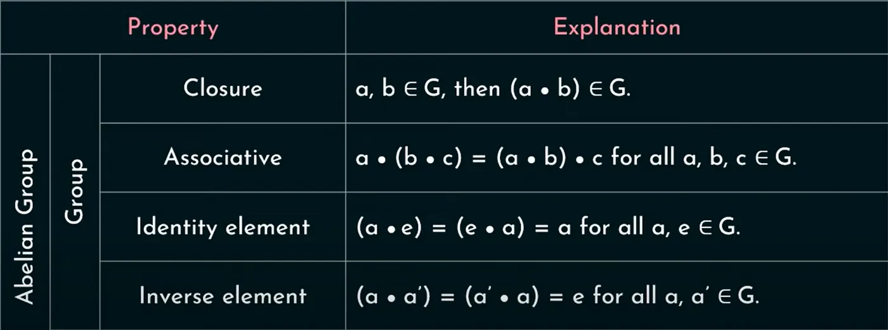

  - Closed under addition? **<span style="color:red">Yes<span>**
    - But may generate infinity or NaN
  - Commutative? **<span style="color:red">Yes<span>**

    _The big thing with addition is that it doesn;t associate, it's communtative but it's not associative._

  - Associative? **<span style="color:red">No<span>**
    - Overflow and inexactness of rounding
    - (3.14 + 1e$^{10}$) - 1e$^{10}$ = 0, 3.14 + (1e$^{10}$ - 1e$^{10}$) = 3.14
  - 0 is additive identity?
  - Every element has additive inverse? **<span style="color:red">Yes<span>**
    - Yes, except for infinities & NaNs **<span style="color:red">Almost<span>**

- **Monotonicity**
  - a >= b => a+c >= b+c? **<span style="color:red">Almost<span>**
    - Except for infinities & NaNs

#### 2.4.8 Mathematical Properties of Floating Point Multiplication

- **Compare to Commutative Ring**

  - Closed under multiplication? **<span style="color:red">Yes<span>**
    - But may generate infinity or NaN
  - Multiplication Commutative? **<span style="color:red">Yes<span>**
  - Multiplication is Associative? **<span style="color:red">No<span>**
    - Possibility of overflw, inexactness of rounding
    - (1e$^{20}$ _ 1e$^{20}$) _ 1e - 20 = inf, 1e$^{20}$ \* (1e$^{20}$ - 20) = 1e$^{20}$
  - 1 is multiplication identity? **<span style="color:red">Yes<span>**
  - Multiplication distributes over addition? **<span style="color:red">No<span>**
    - Possibility of overflow, inexactness of rounding
    - 1e$^{20}$ _ (1e$^{20}$ - 1e$^{20}$) = 0.0, 1e$^{20}$ _ 1e$^{20}$ - 1e$^{20}$ \* 1e$^{20}$ = NaN

- **Monotonicity**
  - a >= b => a\*c >= b\*c? **<span style="color:red">Almost<span>**
    - Except for infinities & NaNs

### 2.5 Floating point in C

- **C Guarantees Two Levels**

  - `float` single precision
  - `double` double precision

- Conversions/Casting

  - Casting between `int`, `float`, and `double` changes bit representation
  - `double`/`float` -> int
    - Truncates fractional part
    - Like rounding toward zero
    - Not defined when out of range or NaN: Generally sets to TMin
  - `int` -> `double`
    - Exact conversion, as long as `int` has <= 53 bit word size
  - `int` -> `float`
    - Will round according to rounding mode

- **Puzzles: For each of the following C expressions, either:**

  - Argue that it is ture for all argument values
  - Explain why not true

  Assume either `d` not `f` is `NaN`

  ```c
  #include <stdio.h>

  int main(int argc, char **argv)
  {
      int x = -8;
      float f = -444.444;
      double d = -88.88888;

      printf("x = %d, f = %f, d = %f\n", x, f, d);
      printf("x == (int)(float)x => %d\n", (x == (int)(float)x));
      printf("x == (int)(double)x => %d\n", (x == (int)(double)x));
      printf("f == (float)(double)f => %d\n", (f == (float)(double)f));
      printf("d == (double)(float)d => %d\n", (d == (double)(float)d));
      printf("f == -(-f) => %d\n", (f == -(-f)));
      printf("2/3 == 2/3.0 => %d\n", ((2/3) == (2/3.0)));
      printf("d > f => (-f > -d) => %d\n", (-f > -d));
      printf("d * d >= 0.0 => %d\n", (d * d >= 0.0));

      f = -1.54334E-34;
      d = -88.88888;
      printf("Changed f = %f, d = %f\n", f, d);
      printf("(d+f)-d == f => %d\n", ((d+f)-d == f));

      return 0;
  }
  ```

  Result:

  ```sh
  x = -8, f = -444.444000, d = -88.888880
  x == (int)(float)x => 1
  x == (int)(double)x => 1
  f == (float)(double)f => 1
  d == (double)(float)d => 0
  f == -(-f) => 1
  2/3 == 2/3.0 => 0
  d > f => (-f > -d) => 1
  d * d >= 0.0 => 1
  Changed f = -0.000000, d = -88.888880
  (d+f)-d == f => 0
  ```

## 3 Machine-Level Programming I: Basics

### 3.1 History of Intel processors and architectures

#### 3.1.1 Intel x86 Processors

The x86 is sort of a colloquial term for Intel processors. The reason is that the first one was called the 8086, and then they kind of skipped 81, but them they went to 8286 and so forth 8386. The one thing in common was 86,so people just call it x86.

One thing that's important to this and it will have influence on what the program look like is, x86 is a language like english. That's been an accrual and evoluton of different feature layered on top of each other, and not always in a elegant way. So just like english there's sort of quirky things ... it's a language that just got there, because of a bunch of decisions that locally were probably the right thing to do, but globaly were not.

There's other instruction sets that are much cleaner and easier to understand. But we figure it;s just the same reason that you learn english instead of leanring esperanto or something like that. That's a much more useful language.

- **Dominate laptop/desktop/server market**

- **Evolutionary design**

  - Backwards compatible up until 8086, introduced in 1978
  - Added more features as time goes on

- **Complex intructon set computere (CISC)**
  - Many different instructions with many different formats
    - But, only small subset encountered with Linux programs
  - Hard to match performance of Reduced Instruction Set Computers (RISC)
  - But, Intel has done just that!
    - In terms of speed. Less so for low power.

#### 3.1.2 Intel x86 Evolution: Milestones

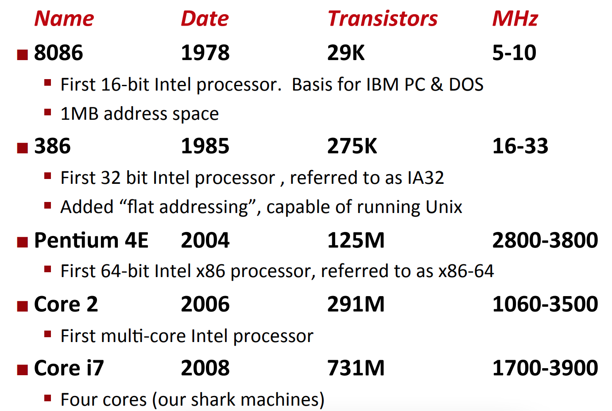

- **Machine Evelution**
  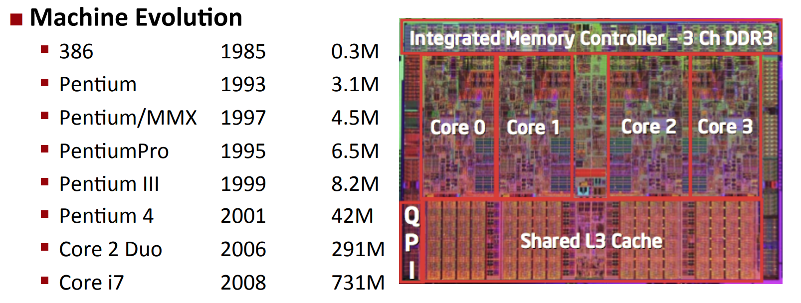

- **Added Features**
  - Instructions to support multimedia operations
  - Instructions to enable more efficient conditional operations
  - Transition from 32 bits to 64 bits
  - More cores

#### 3.1.3 2015 State of the Art

_If you describe something as state-of-the-art, you mean that it is the best available because it has been made using the most modern techniques and technology._

- **Core i7 Broadwell 2015**

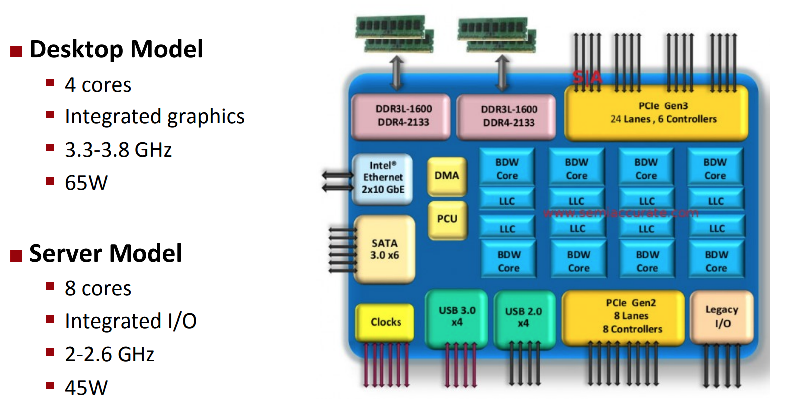

#### 3.1.4 x86 Clones: Advanced Micro Devices (AMD)

- **Historically**

  - AMD has followed just behind Intel
  - A little bit slower, a lot cheaper

- **Then**
  - Recruited top circuit designers from Digita Equipment Corp. and other downward trending companies
  - Build Opteran: tough competitor to Pentium 4
  - Developed x86-64, their own extension to 64 bits
- **Recent Years**
  - Intel got its act together
    - Leads the world in semiconductor technology
  - AMD has fallen behind
    - Relies on external semiconductor manufaturer

#### 3.1.5 Intel's 64-Bit History

- **2001: Intel Attempts Radical Shift from IA32 to IA64**
  - Totally different architecture (Itanium)
  - Executes IA32 code only as legacy
  - Performance disapointing
- **2003: AMD Steps in with Evolutionary Solution**
  - x86-64 (now called "AMD64")
- **Intel Felt Obligated to Focus on IA64**
  - Hard to admit mistake or that AMD is better
- **2004: Intel Announces EM64T extension to IA32**
  - Extended Memory 64-bit Technology
  - Almost identical to x86-64!
- **All but low-end x86 processor support x86-64**
  - But, lots of code still runs in 32-bit mode

#### 3.1.6 ARM

ARM actually is an acronym for Acorn RISC Machine, RISC means reduced instruction set computer. An acorn means the seed of oak tree, it was a Britsh company that decided to make its own personal computers in the early days of it and they said "we are going to buy those chips from Intel, we're going to make them ourselves". So they designed and manufactured their own chips.

Well as a company a computer manufacturer it was a complete bust. But it turned out that they'd come up with a fairly good instruction set that was sufficiently simple that it could be put on chips and better yet it could be customized.

ARM is now a company of its own headquartered in Cambridge England, the reason why part of they're successful therefore is becuase it tends to be a lower power processor requirement than an x86 machine because it's simpler.

But the other is that they don't actually sell processors, they sell companies the rights the licensing rigts to use their designs. So if you look at like a cell phone processor the actual ARM processor is a little tiny of it on the chip. And they'll have other stuff to make the graphics go better to improve your phone calls and so forth.

So they're really selling what intellectual property is as opposed to chips.

### 3.2 C, assembly, machine code

#### 3.2.1 Definitions

- **<span style="color:red">Architecture:</span> (also ISA: Instruction Set Architecture) The parts of a proccessor design that one needs to understand or write assembly/machine code.**

  - Example: instruction set specification, registers.

- **<span style="color:red">Microarchitecture:</span> Implementation of the architecture.**

  - Examples: cache sizes and core frequency.

- **Code Forms:**
  - <span style="color:red">Machine Code:</span> The byte-level programs that a processor executes
  - <span style="color:red">Assembly Code:</span> A text representation of machine code
- **Example ISAs:**
  - Intel: x86, IA32, Itanium, x86-64
  - ARM: Used in almost all mobile phones

#### 3.2.2 Assembly/Machine Code View

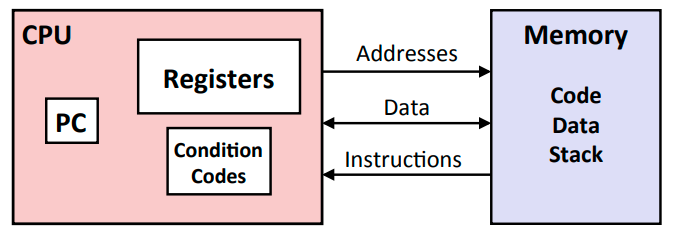

From a programmer machine level programmer perspective, things are a bit different than you see when you write C code.

First of all there is some ver yvisible parts of the instruction the machine state, that you can examine and test and operate on and you must in fact. You would never know understand what those are if you're just thinking in terms of C.

In particular there's some sort of a program counter to tell you what address is the instruction that you're going to execute next and where is that located in memory.

Then there's a set of registers which are part of that the programmer actually makes use of. You can think of them as a very small number of memory locations, but rather than iving an address from 0 up to n-1 or something. You actaully give them by name as specifically.

There is another sort of state, that's just a few bits worth of state that talked about what are the results of some recent instructions, where they did it produce a value of 0, did it produce a negative or a positive value. And those are used to implement conditional branching.

So that's sort of the processor and then the other part of is the memory, that you can think of logically as just an array of bytes, that's what the machine level programmer sees.

It's actaully kind of a fiction in different way, there's sort of a collabration between the operating system and the hardware, what they all virtual memory to make it look each program running on the processor. Has its own independent array of bytes that it can access. Even though they actaully share values within the physical memory itself.

Further more, the idea of a cache is not visible here at all. Beacause it just is automatically loaded with recent stuff. The only thing that will look different is if you read access that memory, it will go faster. But it's mot visible in terms of there's no instructions to manipulate the cache. There's no way you can directly access the cache.

- **Programmer-Visible State**
  - **PC: Program counter**
    - Address of next instruction
    - Called "RIP" (x86-64)
  - **Register file**
    - Heavily used program data
  - **Condition codes**
    - Store status information about most recent arithmetic or logical operation
    - Used for condition branching
  - **Memory**
    - Byte addressable array
    - Code and user data
    - Stack to support precedures

#### 3.2.3 Turning C into Object Code

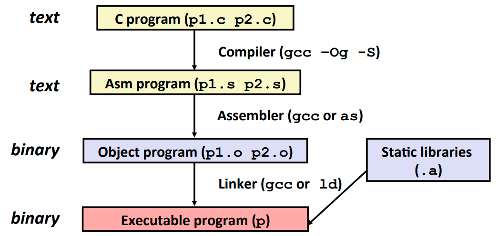

- Code in file **`p1.c`, `p2.c`**
- Compile with command: **`gcc -Og p1.c p2.c -o p`**
  - Use basic optimization (**`-Og`**) (New to recent versions of GCC)
  - Put resulting binary in file **`p`**

#### 3.2.4 Compiling Into Assembly

**C Code (sum.c)**

```c
long plus(long x, long y);

void sumstore(long x, long y, long *dest)
{
    long t = plus(x, y);
    *dest = t;
}
```

```sh
gcc -Og -S sum.c
```

**Produces file sum.s**

_<span style="color:red"> Warning: Will get very differnt results on different machines.</span>_

**Generated x86-64 Assembly on shark machine**

```asm
sumstore:
	pushq	%rbx
	movq	%rdx, %rbx
	call	plus
	movq	%rax, (%rbx)
	popq	%rbx
	ret
```

- Those `%` are the actual names of registers - remember that the registers are given by name.
- `pushq` means push something onto a stack.
- `move` means move copy it from one place to another.
- `call` means to call some procedure.
- `pop` is the counterpart to `push`.
- `ret` is exit return out of this particular function.

The **`-Og` ** is a specification of what kind of optimization we want the compiler to do. If you don't say anything - just don't give any directive, it will generate compeletely unoptimized code and it's actually very hard to read that code, it was very tedious the way it works.

If you say **`-O1`**, which is what people used to do to turn on the optimizer, it turns out tha as GCC as they've gotten more advanced, it does a lot of optimizations now. That for the purpose of this course make the code pretty hard to understand.

So just with one of the most recent generations of GCC came out with this level called **`g`** for debugging. Purpose of this course a nice level that sort of does the obvious kind of optimizations to make the code readable.

-> Check the actuall `sum.s` file...

The reason is there are various directives that aren't really directly part of the code itself. The fact they start with a period **`.`** is an indication that these aren't actaully instructions, they're something else. And they all are related to what the information that needs to be fed to a debugger, for it to be able to locate various parts of the program. And some information for the linker to tell it that this is globally defined function. And various other things that you don't really need to at least think about initially. So we sort of take those out the program just to make them more readable.

#### 3.2.5 Assembly Characteristics: Data Types

In integer data types, they don't distingush signed versus unsigned in how it gets stored. Even at an address or a pointer, is just stored as a number in a computer, and doesn't have any special significance to it.

A floating point is handled in a very differnt way, on the other hand with a different set of registers.

The program itself is in x86 it's just a series of bytes.

And things like arrays and structs you think of as fundamental datatypes don't exist in the machine level. They're sort of constructed artificially by the compiler.

- **"Integer" data of 1, 2, 4, or 8 bytes**

  - Data values
  - Addresses (untyped pointers)

- **Floating point data of 4, 8, or 10 bytes**

- **Code: Byte sequences encoding series of instructions**

- **No aggregate types such arrays or structures**
  - Just contiguously allocated bytes in memory

#### 3.2.6 Assembly Characteristics: Operations

- **Perforam arithmetic function on register or memory data**

- **Transfer data between memory and register**

  - Load data from memory into register
  - Store register data into memory

- **Transfer control**
  - Unconditional jumps to/from procedures
  - Conditional branches

#### 3.2.7 Object Code

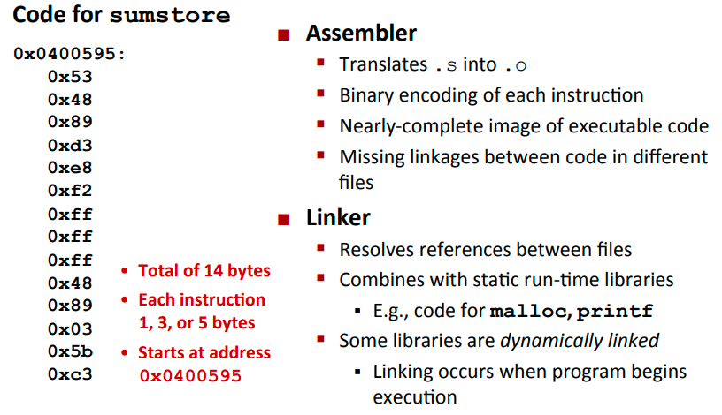

#### 3.2.8 Machine Instruction Example

```c
*dest = t;
```

- **C Code**

  - Store value `t` where designated by `dest`

  What that will typically and not always but this sort of way to think about that at the machine level is.

  `T` or some local value would by typically store in a register.

```asm
movq %rax (%rbx)
```

- **Assembly**
  - Move 8-byte value t omemory
    - Quad words in 86-64 parlance
  - Operands:
    `t`: Register %rax
    `dest`: Register %rbx
    `_dest_: MemoryM[%rbx]

```s
0x400r59r: 48, 89, 03
```

- **Object Code**
  - 3-byte instruction
  - Stored at address 0x40059

#### 3.2.9 Dissembling Object Code

**Disassmembled**

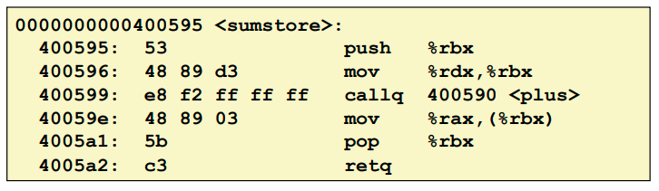

- **Disassemble**

```sh
objdump -d sum
objdump -d sum > sum.d
```

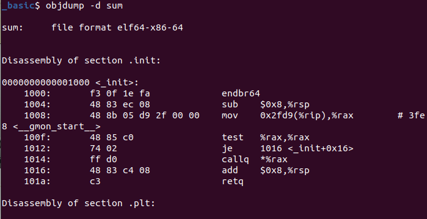

- Useful tool for examining object code
- Analyzes bit pattern of series of instructions
- Produces approximate rendition of assembly code
- Can be run on either `a.out` (completed executable) or `.o` file

#### 3.2.10 Alternate Disassembly

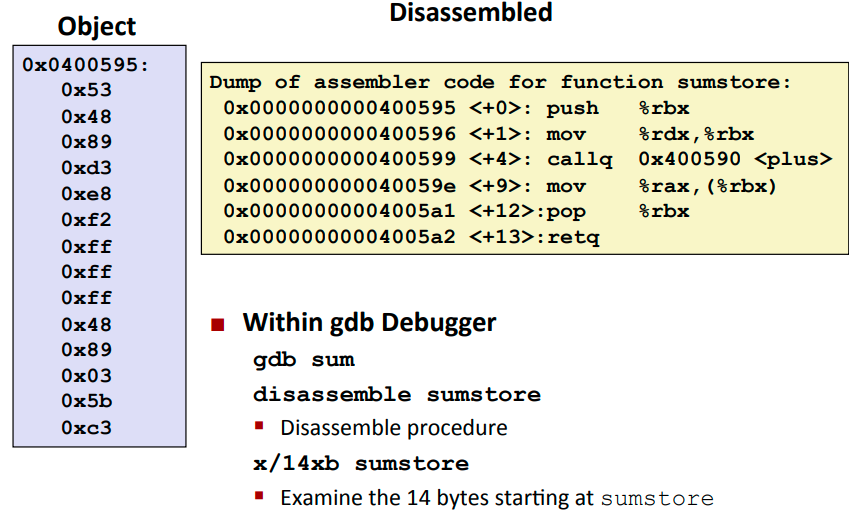

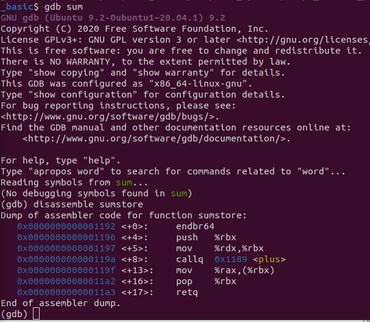

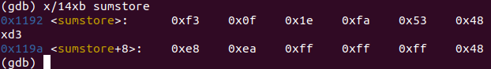

#### 3.2.11 What can be Disassembled?

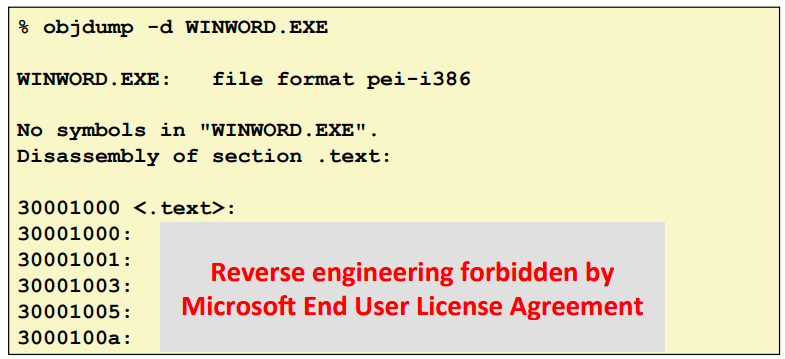

- **Anything that can be interpreted as exectuable code**
- **Disassembler examines bytes and reconstructs assembly source**

### 3.3 Assembly Basics: Registers, operands, move

#### 3.3.1 x86-64 Integer Registers

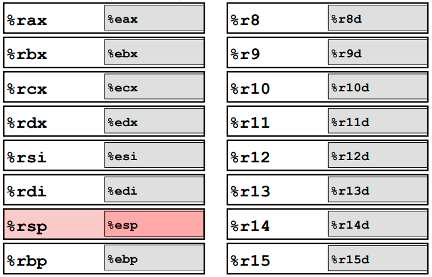

- Can reference low-order 4 bytes(also low 1 & 2 bits)

For each register if you use the `%r` name of it, you'll get 64 bits. If you use `%e` version of it you'll get 32 bits.

Remember `%e` is just the low-order bits a of a larger `%r` entity. In fact it goes beyond that you can also reference the lower order 16 bits and the low order 1 byte, within each of these registers as well.

#### 3.3.2 Some History: IA32 Registers

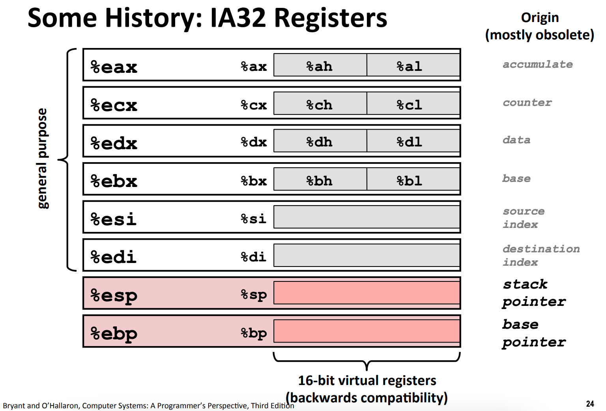

#### 3.3.3 Moving Data

- **Moving Data**

```asm
movq Source, Dest;
```

The `movq` instruction in x86 is actually can do a lot of things, because it can take different types of information or what they call **operands**. So the source is some where you're copying from the source to the destination.

- **Operand Types**

  - _<span style="color:red">Immediate:</span>_ Constant integer data

    - Example: `$0x400, $-533`
    - Like C constant, but prefiexed with `$`
    - Encoded with 1, 2, or 4 bytes

    It's actually a number that's baked into the program, that you want to copy into some other location.

  - _<span style="color:red">Register:</span>_ One of 16 integer registers

    - Example: `%rax, %r13`
    - But `%rsp` reserved for special use
    - Others have special uses for particular instructions

    It's one a specially namaed memory of locaitons.

  - _<span style="color:red">Memory:</span>_ 8 consecutive bytes of memory at address given by register

    - Simplest example: `(%rax)`
    - Various other "address modes"

    It's the array of bytes that you typically you have to specify what's the address that you either reading from if it's the source are you writing to it's the destination.

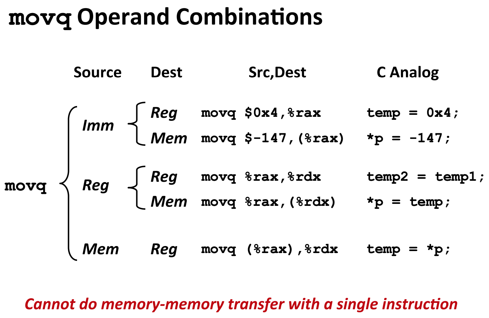

**The `movq` instruction gives you all these possibilities:**

- An immediate value can be written to a register or directly to memory.
- A register value can be copied to another register or write to memory. Or you can take a value from memory (read it from memory) and copy it to a register.

#### 3.3.4 Simple Memory Addressing Modes

When you put the name of a register in parentheses, that's just saying use this register whatever that that's an address, and use that address to reference some memory location.

- **Normal (R) Mem[Reg[R]]**
  - Register R specifies memory address
  - Aha! Pointer derefercing in C

```asm
movq (%rcx),%%rax
```

This is equivalent of dereferencing a pointer and putting it in a temporary.

- **Displacement D(R) Mem[Reg[R]+D]**
  - Register R specifies start of memory region
  - Constant displacement D specifies offset

```asm
moveq 8(%rbp),%rdx
```

**Example:**

```c
void swap (long *xp, long *yp)
{
  long t0 = *xp;
  long t1 = *yp;
  *xp = t1;
  *yp = t0;
}
```

```asm
swap:
  movq  (%rdi), %rax  # rdi -> destinaion index -> *xp, ax -> accumulate -> t0
  movq  (%rsi), %rdx  # rsi -> source index -> *yp, dx -> data -> t1
  movq  %rdx, (%rdi)
  movq  %rax, (%rsi)
  ret
```

**Understanding Swap():**

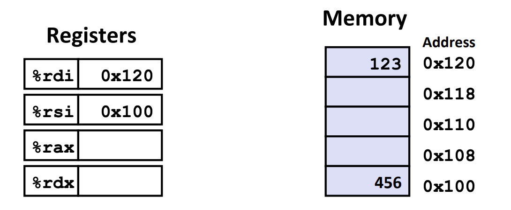

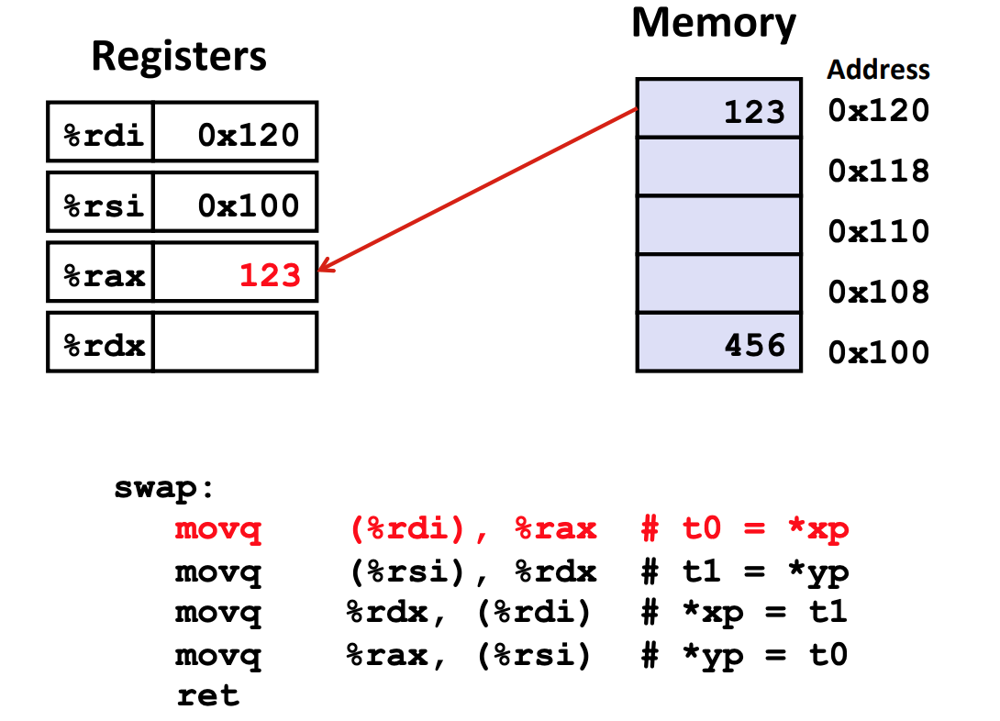

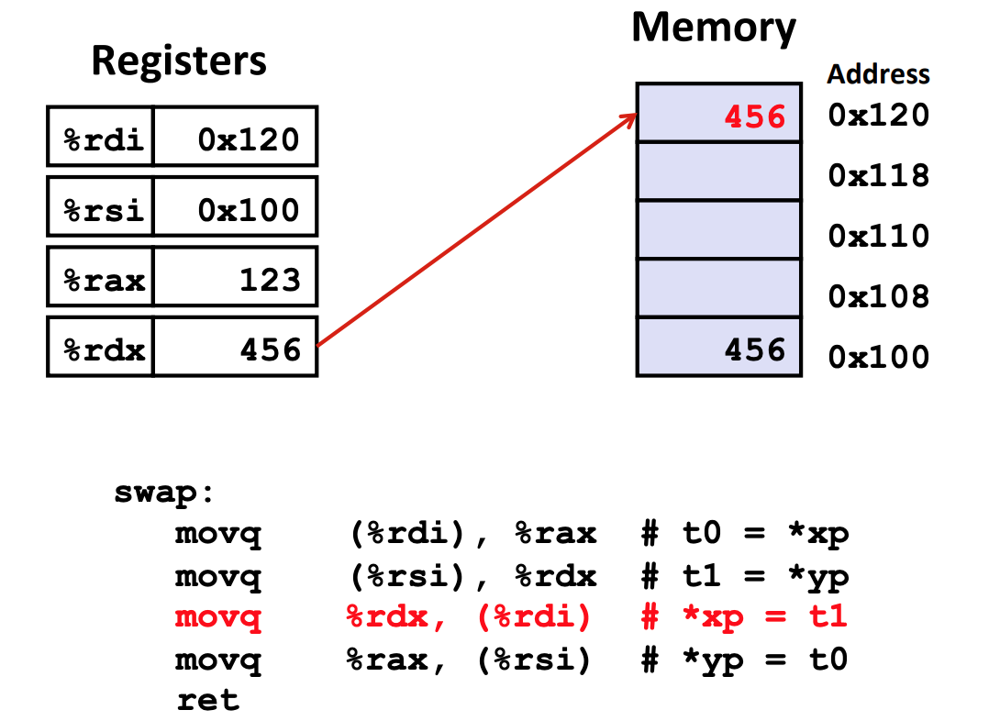

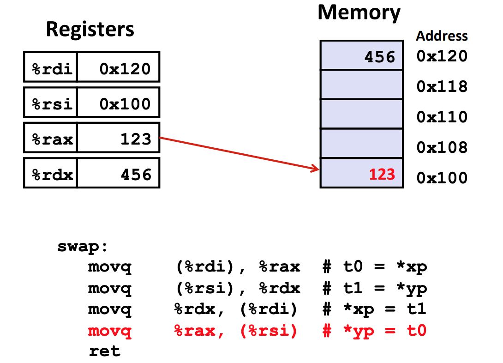

#### 3.3.5 Complete Memory Addressing Modes

- **Most General Form**
  **D(Rb, Ri, S) Mem[Reg[Rb] + S\*Reg[Ri] + D]**

  - D: Constant "displacement" 1, 2, or 4 bytes
  - Rb: Base register: Any of 16 integer register
  - Ri: Index register: Any, except for `%rsp`
  - S: Scale: 1, 2, 4, or 8 (_why these numbers?_)

This is useful for implementing array references, where there can be actually two registers involved.

There can be a displacement which is a constant offset and a scale factor which will be 1, 2, 4, 8. The general idea of this is to take `Ri` register known as an index register, you multiply it by the scale factor. You add the value of `Rb` register and the constant displacement `D`.

It turns out this will be the sort of natural way to implement array referecncing. Basically you can think of this is an array index. I have typically scale it by however many bytes my data type is. This

So if it is an `int` type I have to scale it by four, if it is `long` I hava to scale it by eight. That's where these scale factors will come in.

- **Special Cases**
  - **(Rb, Ri) Mem[Reg[Rb] + Reg[Ri]]**
  - **D(Rb, Ri) Mem[Reg[Rb] + Reg[Ri] + D]**
  - **(Rb, Ri, S) Mem[Reg[Rb] + S\*Reg[Ri]]**

**Examples:**

| Register | Address |
| -------- | ------- |
| %rdx     | 0xf000  |
| %rcx     | 0x0100  |

| Expression      | Address Computation | Address |
| --------------- | ------------------- | ------- |
| 0x8(%rdx)       | 0xf000 + 0x8        | 0xf008  |
| (%rdx, %rcx)    | 0xf000 + 0x100      | 0xf100  |
| (%rdx, %rcx, 4) | 0xf000 + 4\*0x100   | 0xf400  |
| 0x80(, %rdx, 2) | 2\*0xf000 + 0x80    | 0x1e80  |

### 3.4 Arithmetic & logical operations

#### 3.4.1 Address Computation Instruction

- **leaq Src, Dest**

  - Src is address mode expression
  - Set Dst to address denoted by expression

- **Uses**

  - Computing address without a mmeory reference
    - E.g., translation of `p = &x[i];`
    - Computing aithmetic expression ofthe form `x + k*y`
      - k = 1, 2, 4, or 8

- **Example**

```c
long m12(long x)
{
  return x*12;
}
```

**Converted to ASM by compiler:**

```asm
leaq (%rdi, %rdi, 2)  %rax  # t <- x + x*2
salq $2, %rax               # return t<<2
```

If you multiply x by 12, it will turn it into an address computation, then it adds `%rdi + 2*%rdi`, so that the 3\*%rdi us store in %rax. And then `salq` means shift left by two.

#### 3.4.2 Some Arithmetic Operations

- **Two Operand Instructions:**

| Format  |          | Computation        |
| ------- | -------- | ------------------ |
| `addq`  | Src,Dest | Dest = Dest + Src  |
| `subq`  | Src,Dest | Dest = Dest - Src  |
| `imulq` | Src,Dest | Dest = Dest \* Src |
| `salq`  | Src,Dest | Dest = Dest << Src |
| `sarq`  | Src,Dest | Dest = Dest >> Src |
| `shrq`  | Src,Dest | Dest = Dest >> Src |
| `xorq`  | Src,Dest | Dest = Dest ^ Src  |
| `andq`  | Src,Dest | Dest = Dest & Src  |
| `xorq`  | Src,Dest | Dest = Dest \| Src |

- Also called `shlq` Arithmetic Logical

- **Watch out for argument order!**
- **No distinction beween signed and unsigned (why?)**

#### 3.4.3 Some Arithmetic Operations

- **One Operand Instructions**
  - `incq` Dest Dest = Dest + 1
  - `dncq` Dest Dest = Dest - 1
  - `negq` Dest Dest = Dest
  - `notq` Dest Dest = ~Dest

#### 3.4.4 Arithmetic Expression Example

```c
long arith (long x, long y, long z) (long x, long y, long z)
{
  long t1 = x + y;
  long t2 = x + t1;
  long t3 = x + 4;
  long t4 = y * 48
  long t5 = t3 + t4
  long rval = t2 * t5;
  long rval = t2 * t5;
}
```

Here is one that just does a bunch of junk of arithmetic instructions, it converts into the following assembly code.

```asm
arith:
  leaq  (%rdi,%rsi), %rax     # t1
  addq  %rdx, %rax            # t2
  leaq  (%rsi,%rsi,2), %rdx
  salq  $4, %rdx              # t4
  leaq  4(%rdi,%rdx), %rcx    # t5
  imulq %rcx, %rax            # rval
  ret
```

You see it's using this `leaq` instruction mutiple times to do addition in various forms. It also has shifting and multiplication, you saw in the original code it just has addtion and multiplication. Here the assembly code has various instructions, there is only one multiply whereas, it has twice in the c code.

So the compiler is sort of scrambiling things around trying to find clever way to implement what you are asking for using less comlex expensive less time-consuming instructions.

| Register | Use(s)         |
| -------- | -------------- |
| %rdi     | Argument **x** |
| %rsi     | Argument **y** |
| %rdx     | Argument **z** |
| %rax     | t1, t2, rval   |
| %rdx     | t4             |
| %rcx     | t5             |

**Interesting Instructions**

- `leaq`: address computation
- `salq`: shift
- `imulq`: multiplication
  - But, only, used once

That this instruction here corresponds to this computation of `t1`, it's adding two values and giving it a new name it's putting in `%rax`. Similarly this one is adding `z` to `t1` and storing it back in `%rax`.

The `x+4` doesn't show up directly here, it turns out what it does is it jumps right at head to `long t4 = y * 48`. It does it by computing shifting that left by 4, because 3/\*16 = 48.

And then the `t4` here that `x+4` actaully shows up in `leaq  4(%rdi,%rdx), %rcx`, it just uses the displacement field of this computation to add 4 to some other values.

### 3.5 Machine Programming I: Summary

- **History of Intel processors and architectures**

  - Evolutionary design leads to many quriks and artifacts

- **C, assembly, machine code**

  - New forms of visible state: program conter, register, ...
  - Compiler must transform statements, expressions, procedures into low-level instructions sequences

- **Assembly Basics: Registers, operands, move**

  - The x86-64 move instructions cover wide range of data movement forms

- **Arithmetic**
  - C compiler will figure out different instruction combinations to carry out computation

## 4 Machine-Level Programming II: Control

### 4.1 Control: Condition codes

#### 4.1.1 Processor State (x86-64, Partial)

- **Infomration about currently executing program**
  - Temporary data
    - `(%rax, %rcx, ...)`
  - Location of runtime stak
    - `(%rsp)` -> current statk top
  - Location of current code control point
    - `(%rip, ...)`
  - Status of recent tests
    - `(CF, ZF, SF, OF)`
    - There are actually 8 of them
    - They are all one bit flags and they get set not directly
    - Side effect of other operations that take place
    - They're the basis for which conditional operation gets decided

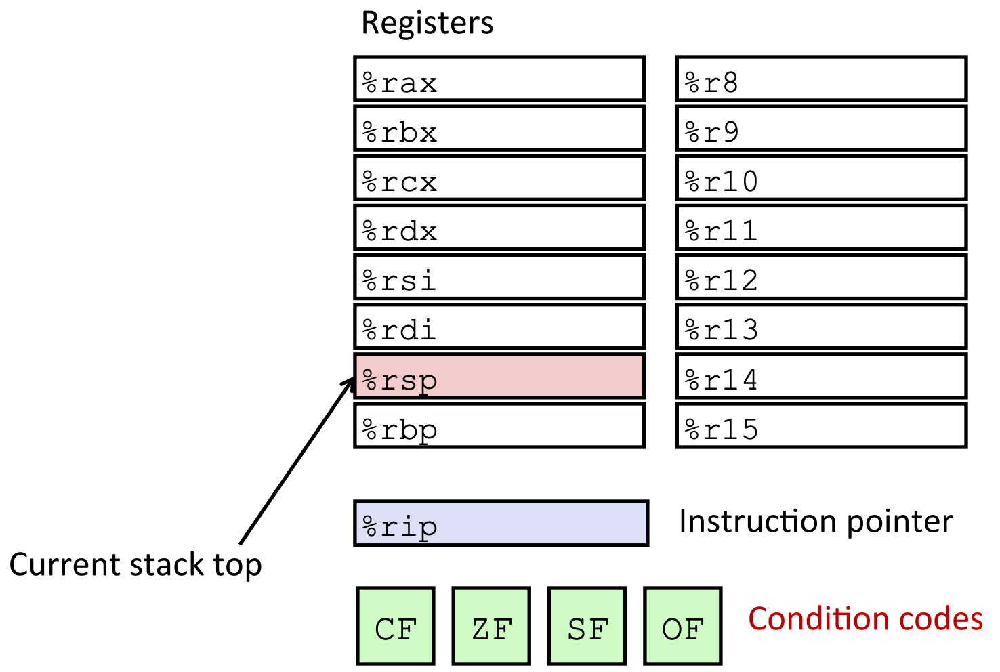

#### 4.1.2 Conditon Codes (Implicit Setting)

- **Single bit register**

| Register(Unsigned) | Meanning   | Register(Signed) | Meanning      |
| ------------------ | ---------- | ---------------- | ------------- |
| CF                 | Carry Flag | SF               | Sign Flag     |
| ZF                 | Zero Flag  | OF               | Overflow Flag |

- **Implictly Set (think of it as side effect) by arithmetic operations**
  Example: `addq` Src,Dest <-> `t = a+b`
  `CF set` if carry out from most significant bit (unsigned overflow)
  `ZF set` if `t == 0`
  `SF set` `t < 0` (as signed)
  `OF set` if two's-complement (signed) overflow
  `(a>0 && b> 0 && t>0) || (a<0 && b <0 && t>=0)`

### 4.2 Conditional branches

### 4.3 Loops

### Switch Statements
