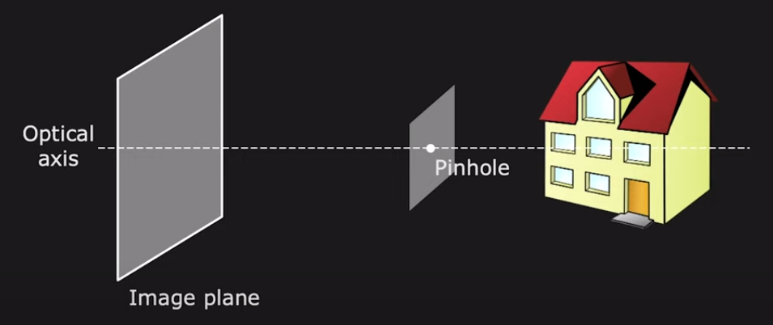
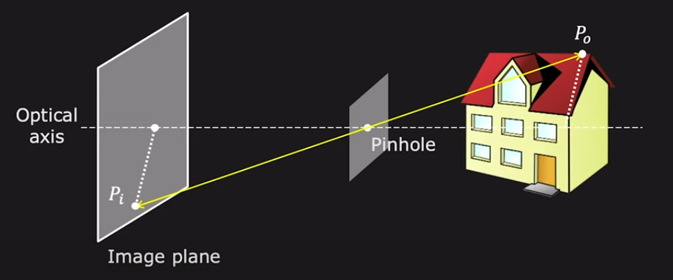
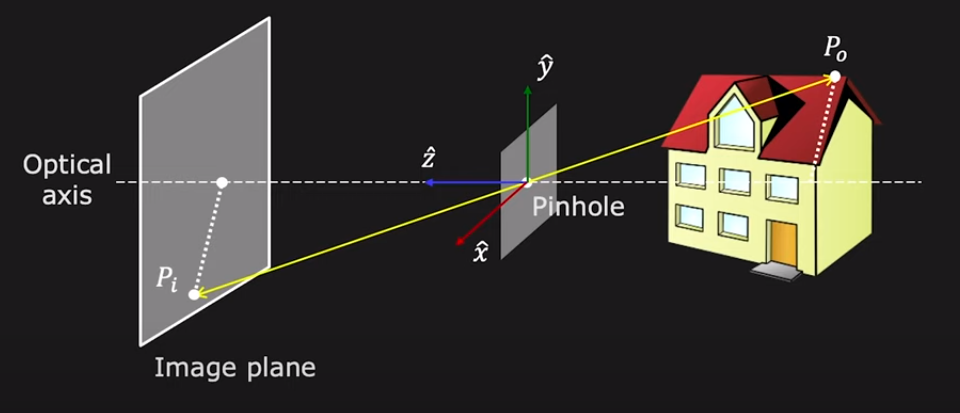
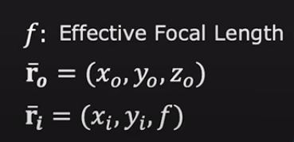
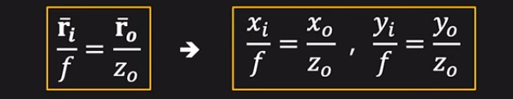

# First Principles of Computer Vison

## 1 Imaging: Image Formation, Sensing, Processing

### 1.1 Image Formation Overview

**Image: Projection of 3D scene onto 2D plane\*. We need to understand the geometric and photometric relation between the scene and its image.**

- By geometric, we mean given a point in the scene. We need to understand where it ends up in the image.
- By photometric, we mean the brightness and appearance of a point in this scene would be in the image.

**
Topics:
**

- **(1) Pinhole and Perspective Projection**

  - This is the simplest type of camera you can imagine. It has a very long history.

  - The pinhole camera performs what's called **perspective projection**. This is one of the most important concepts in computer vision.

  - We'll derive perspective projection and talk about some of the visual manifestations of perspective projection.

  - And then we'll argue that while the pinhole camera is great in terms of the clarity of images it can produce, it simply does not gather enough ligjt. To resolve this issue, we use lenses.

- **(2) Image Formation using Lenses**

  - Various attributes, focal length, depth of field, defocus, F number.

- **(3) Lens Related Issues**

  - Even if a lens is perfectly manufactured, it turns out that it's going to end up having some geometric aberrations and produce some distortions.

  - We'll talk about what these effects are in images and how we might be able to correct them.

- **(4) Wide Angle Cameras**

  - We will deviating from perspective project, and look at the problem of capturing unusually large fields of view.

  - For example, hemispherical field of view. It turns out this cannot be done using perspective projection.

  - So we design lens, which will allow us to capture very large fields of view, as well as combinations of mirrors and lenses.

- **(5) Biological(Animal) Eyes**
  - Focus on human eye and some of its remarkable characteristics.

### 1.2 Pinhole and Perspective Projection

### 1.2.1 Is an image being formed on the screen?

Here you see a three-dimensional scene on the right, which is a house. And you see a screen, or let's call it an image plane, on the left.

---

**Question: Is an image being formed on the screen?**

If you consider any point on the screen, it does receive light from a lot of points on the house. But you don't see a clear image.

So one could arugue that there is an image being formed. But it's a muddled image, and not a clear one.

**Answer: Yes! But not a "clear" one.**

---

**Question: How does one create a clear, crisp image of the house on the screen?**

The simplest way to do this is by using a pinhole.

A pinhole is an opaque sheet with a tiny hole in it. And it's placed between the scene and the image plane as show here.

Now if you take a look at a single on the house, you see that there is a ingle ray that travels from that point, in this case, P0, to the image plane, and projects ontothe point Pi.

So every point of the scene now projects on to a single point in the image.

So we want to understand the relationship between P0 and Pi.

For that, first, we are going to erect a coordinate frame, xyz, three-dimensional coordinate frame placed at the pinhole, with the z-axis pointing along the optical axis.

The optical axis, by the way, is the axis that is perpendicular to the image plane, shown here as a dotted line.

So the z-axis point towrds the image plane and lines on the optical axis. And the distance between the pinhole and the image plane is called the **effective focal length**, that is _`f`_.

So now we can write the point P0 using the vector _`r0`_. And that has coordinates _`x0`_, _`y0`_, _`z0`_.

And its image can be denoted as _`ri`_, which has coordinates _`xi`_ and _`yi`_ on the image plane. And the z-coordicate is going to be _`f`_.

Inrespective of where the point lies in 3D scene, irrespective of its _`z`_ component on the image plane is going to be _`f`_, the **effective focal length**.

From these two similar triangles shown as above, we can write:

By the way, _`z0`_ is the z-component of the point in 3D. In other words, it's the depth of point in 3D.

And since ri and r0 are vectors, we can break it down into its components into the equations as below.

Very simple equation, but create some fairly non-intuitive effects in images. So this idea of pinhole, projection and a pinhole camera, actually dates back to 500 BC.

There were Chinese philosophers who were riting about this concept way back then. And then somewhere around 1000 AD, the Arab physicist, Alhazen, he wrote a book called <<Kitab al-Manazir>>, it's actually one of the first optics books. He describes, in great deal, this concept of pinhole camera.

And it's only in the 16th century, that this concept actually came to the West. It became very popular among artists, particuarly, as a tool for rendering accurate depictions.

So here is a sketch by Gemma Frisius, the Dutch mathematician, where you can see that there is a wall with a little pinhole, the 3D scene gets projected by this pinhole onto a 2D image.

And now you can imagine that an artist can walk up to this wall and sketch out a very accurate geometrical representation of the perspective projection of the scene, a picture.

---

## 2 Features: Edges, Boundaries, SIFT, Applications

## 3 Reconstruction 1: Shading, Focus, Active Illumination

## 4 Reconstruction 2: Stereo, Optical Flow, SFM

## 5 Perception: Segmentation, Tracking, Recognition
