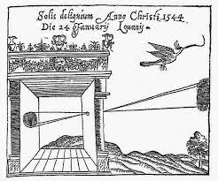

# First Principles of Computer Vison

## 1 Imaging: Image Formation, Sensing, Processing

### 1.1 Image Formation Overview

**Image: Projection of 3D scene onto 2D plane\*. We need to understand the geometric and photometric relation between the scene and its image.**

- By geometric, we mean given a point in the scene. We need to understand where it ends up in the image.
- By photometric, we mean the brightness and appearance of a point in this scene would be in the image.

**
Topics:
**

- **(1) Pinhole and Perspective Projection**

  - This is the simplest type of camera you can imagine. It has a very long history.

  - The pinhole camera performs what's called **perspective projection**. This is one of the most important concepts in computer vision.

  - We'll derive perspective projection and talk about some of the visual manifestations of perspective projection.

  - And then we'll argue that while the pinhole camera is great in terms of the clarity of images it can produce, it simply does not gather enough ligjt. To resolve this issue, we use lenses.

- **(2) Image Formation using Lenses**

  - Various attributes, focal length, depth of field, defocus, F number.

- **(3) Lens Related Issues**

  - Even if a lens is perfectly manufactured, it turns out that it's going to end up having some geometric aberrations and produce some distortions.

  - We'll talk about what these effects are in images and how we might be able to correct them.

- **(4) Wide Angle Cameras**

  - We will deviating from perspective project, and look at the problem of capturing unusually large fields of view.

  - For example, hemispherical field of view. It turns out this cannot be done using perspective projection.

  - So we design lens, which will allow us to capture very large fields of view, as well as combinations of mirrors and lenses.

- **(5) Biological(Animal) Eyes**
  - Focus on human eye and some of its remarkable characteristics.

### 1.2 Pinhole and Perspective Projection

#### 1.2.1 Is an image being formed on the screen?

Here you see a three-dimensional scene on the right, which is a house. And you see a screen, or let's call it an image plane, on the left.

**Question: Is an image being formed on the screen?**

If you consider any point on the screen, it does receive light from a lot of points on the house. But you don't see a clear image.

So one could arugue that there is an image being formed. But it's a muddled image, and not a clear one.

**Answer: Yes! But not a "clear" one.**

#### 1.2.2 How does one create an image on the screen?

**Question: How does one create a clear, crisp image of the house on the screen?**

The simplest way to do this is by using a pinhole.

A pinhole is an opaque sheet with a tiny hole in it. And it's placed between the scene and the image plane as show here.

Now if you take a look at a single on the house, you see that there is a ingle ray that travels from that point, in this case, $P_{0}$, to the image plane, and projects ontothe point Pi.

So every point of the scene now projects on to a single point in the image.

So we want to understand the relationship between $P_{0}$ and $P_{i}$.

For that, first, we are going to erect a coordinate frame, xyz, three-dimensional coordinate frame placed at the pinhole, with the z-axis pointing along the optical axis.

The optical axis, by the way, is the axis that is perpendicular to the image plane, shown here as a dotted line.

#### 1.2.3 Effective Focal Length

So the z-axis point towrds the image plane and lines on the optical axis. And the distance between the pinhole and the image plane is called the **effective focal length**, that is $f$.

So now we can write the point $P_{0}$ using the vector $\overline{r_{0}}$. And that has coordinates $x_{0}$, $y_{0}$, $z_{0}$.

And its image can be denoted as $r_{i}$, which has coordinates $x_{i}$ and $y_{i}$ on the image plane. And the z-coordicate is going to be $f$.

Inrespective of where the point lies in 3D scene, irrespective of its $z$ component on the image plane is going to be $f$, the **effective focal length**.

From these two similar triangles shown as above, we can write:

By the way, $z_{0}$ is the z-component of the point in 3D. In other words, it's the depth of point in 3D.

And since $\overline{r_{i}}$ and $\overline{r_{0}}$ are vectors, we can break it down into its components into the equations as below.

#### 1.2.4 Pinhole Camera History - Camera Obscura

Very simple equation, but create some fairly non-intuitive effects in images. So this idea of pinhole, projection and a pinhole camera, actually dates back to 500 BC.

There were Chinese philosophers who were riting about this concept way back then. And then somewhere around 1000 AD, the Arab physicist, Alhazen, he wrote a book called <<Kitab al-Manazir>>, it's actually one of the first optics books. He describes, in great deal, this concept of pinhole camera.

And it's only in the 16th century, that this concept actually came to the West. It became very popular among artists, particuarly, as a tool for rendering accurate depictions.

So here is a sketch by Gemma Frisius, the Dutch mathematician, where you can see that there is a wall with a little pinhole, the 3D scene gets projected by this pinhole onto a 2D image.

And now you can imagine that an artist can walk up to this wall and sketch out a very accurate geometrical representation of the perspective projection of the scene, a picture.

By the way, this concept was called **_camera obscura_**, which in Latin, means a dark chamber.

#### 1.2.5 Pinhole Eye of Nautilus pompilius

Well, when it comes to the pinhole camera, as with many other things in life, nature got there first. So here is an eye, which is a pinhole eye, in the case of thi creature. This is a shelled sea creature called Nautilus pompilius(鹦鹉螺).

You can see that it has an eye with a farily large pinhole, which creates an image, and there is no lens in this eye.

#### 1.2.6 Perspective Projection of a Line

All right now let's take a look at some of the properties of perspective projection.

And we know that the line and the pinhole, that is a line and a point, define a plane in 3D. And all the rays of light that pass through the pinhole lie on this plane.

And for that matter, all the rays of light that pass through the pinhole towards the image plane almost should lie on this plane. And so the image of this 3D line on your 2D image must be the intersection, must line at the intersection of this plane and the image plane.

So in other words, the image of a line in 3D, has to be a line in 2D. This is why you find that in photographs, **straght lines in the scene will map to straght lines in the photograph**.

#### 1.2.7 Image Magnification Equation

You have an object of a certain size, at a certain distance, what is going to be its size in the image. So for thi, we're going to use a little segment here: $A_{0}$ -> $B_{0}$ of length $d_{0}$.

So this segment lies on a plane in the scene that is parallel to the image plane. Then it produces an image, which is another segment which is $A_{i}$ -> $B_{i}$.

We want to understand what the length of the segment $A_{i}$ -> $B_{i}$ is going to be due to a segment of length $d_{0}$ in the scene.

So the ratio of the length of the segment in the image to the length of the segment in the scene, is called the magnification. And this, of course, can be written in terms of the displacements:

So now we want to substitute for the displacements in the image. So we can simply this. And to do that, what we're going to do is apply perspective projection to the Point $A_{0}$ and $B_{0}$. In doing so, we are going to get four equations:

**From Perspective Project:**

${x_i \over f} = {x_0 \over z_0}$ and ${y_i \over f} = {y_0 \over z_0}$ --- (A)

${x_i + \delta x_i \over f} = {x_0 + \delta x_0 \over z_0}$ and ${y_i + \delta y_i \over f} = {y_0 + \delta y_0 \over z_0}$ --- (B)

Using these four equation you end up with a very simple expression for the relationship between displacements in the image to the displacements in the scene.

**From (A) and (B) we get:**

${\delta x_i \over f} = {\delta x_0 \over z_0}$ and ${\delta x_i \over f} = {\delta y_0 \over z_0}$

And pluging these back into the equation for magnification, it turns out you get a very simple expression:

**Magnification:**

The magnitude of $m$, the absolute value of $m$, is going to be the absolute value of $f$, that's the effective focal length divided by $z_{0}$, which is the depth of the object in the scene.

So note that there's $z_{0}$ in the denominator. This is a really interesting thing. The size of the magnification of an object in an image is going to be inversely proportional to its distance from the camera.

By the way, the sign of $m$ is going to correspond to whether the image is upright or inverted. In the case of a pinhole camera of the type that we've just talked about, it's going to be inverted, and therefore, negatvie.

#### 1.2.8 Image Magnification Manifestations

So here you see train tracks, two parallel tracks. The tracks must be parallel, otherwise the train is going to have a problem. We know that these two lines are parallel in 3D. And yet, in the image, they appear to be intersecting or meeting at infinity. As you go further and further away, in terms of depth, the two lines get closer and closer. And this is because magnification is inversely proportional to the distance, $z_{0}$, depth.

So you can actually have some fun with this effect, magnification effect as a photographer. Herey you know that these two people are probably roughly the same height. And yet, the man seems to be standing small enough to be standing on the palm of the woman.

#### 1.2.9 Remarks about Magnification

- $m$ can be assumed to be **constant** if the range of scene depth $\Delta$$z$ is much smaller than the average scene depth $\tilde{z}$.
- 

#### 1.2.10 Vanishing Point

We can assume that all of these lines area parallel in 3D, because it's a tunnel. And yett all of them seem to be emerging from a single point in the image. And that point is called the **vanishing point**.

So if you have a set of parallel lines in 3D, they end up producing, it doesn't matter how many parallel lines, they end up sharing a single **vanishing point**. They seem to be converging at the single point in the image.

And the location of this vanishing point in the image, depends on the **orientation** of parallel straight lines in 3D.

#### 1.2.11 Finding the Vanishing Point

How do we figure out, given a set of parallel lines in 3D, where the **vanishing point** is going to end up for that set of lines?

So here is a very simple way one can figure this out, a very intuitive way to do it.

So assume that you have these two parallel lines. And we want to find the vanishing point corresponding to these two lines. Well, remember, all parallel lines in 3D share the same **vanishing point**.

We need to do is to construct a line that is parallel to these two lines that passes through the pinpole. Wherever that line pierces the image is the **vanishing point** corresponding to this set of parallel lines in 3D.

But how do we find this?

- We first define the direction of the set of parallel lines in 3D.
  - Givin by the vector $l_{x}$, $l_{y}$, $l_{z}$.
- And then we create a point, which is in that direction, a point $P$ in that direction from the pinhole of the camera.
- Then you simply perspectively project that point into the image using perspective projection equations that we already know. And you get the location of the vanishing point.

**Calculation the coordinates:**

**Vanishing point of the line is the projection of point $P$.**

${(x_{vp}, y_{vp})} = {(f{l_{x} \over l_{z}}* {f{l_{y} \over l_{z}}})}$

The vanishing point is a concept that artists have used extensively. Here is an example, Johnnes Vermeer painted **_The Music Lesson_**, very famous painting by this Dutch artist.

In this scene here, you have sets of parallel lines. But let's take a look at this set right here.

You see that this set of parallel lines ends up converging at this point. This is the vanishing point right here. And what Vermeer has done is place what he considers to be the most important object or activity exactly at that place.

In this particular case, it sits at the elbow, or close to the elbow, of the student who is playing the piano. He wants to draw your attention to that activity.

So a lot of artists figured out early on that humans, in any 3D scene, in any photograph, tend to be drawn to vanishing point, especially dominant vanishing points that are created by large numbers of parallel lines.

And so they tended, they played this trick of placing the most important subject or activity at those points.

#### 1.2.12 False Perspective

Here's another interesting concept, which is called **False Perspective**. This is Galleria Spada by Francesco Borronmini. It's a beautifule little gallery in Rome.

What you see here is a archway, or a little bit of a halfway. And at the end of the hallway, you have the sculpture. When you stand in front of the hallway, you get the impression that the sculpture is roughly 150 feet away from you. It turns out that this sculpture is only 30 feet away from you.

The reason you have this very compelling effect, or illusion, is because the pillars of the archway are actually geting smaller with distance away from the observer. So is's a tapered archway, this creates this effect of **False Perspective**, which forces you to believe, leads you to believe, that the object at the end of the hallway is much further away than it actually is.

#### 1.2.13 What is the Ideal Pinhole Size?

OK, so we talked about the pinhole and how it can be used to create images. But one thing we sort of set aside is the size of the pinhole. What should the size of the pinhole be?

If you look here, you have the size of the pinhole used to take a set of images. At the beginning of 2mm, when you are getting the pinhole smaller and smaller, you see that it gets sharper till to 0.35mm.

But here's the interesting thing, you go smaller, you make the pinhole even samller, actually the image starts getting burrier again.

Why does this happen? This is because of an effect in **wave optics called diffraction**. It turns out that if you have any opening, and you have a light wave that's passing through this opening, there is going to be a bending of these light waves at the edge of the periphery of the opening.

The samller the opening gets, there's going to be more the effect of the bending that the light actually passing through. So you get severe bending as you get too small.

So then the question is, what is the ideal size of the pinhole?

#### 1.2.14 What about Exposure Time?

One of the interesting things you notice is that the iamge is pretty much focused everywhere. So pinhole cameras, well-designed pinhole cameras tend to create these sort of all-focused, focused everywhere images.

Since a plinhole captures very little ligt, it lets very little light through. As a result of that, the exposure times tend to be much longer. So the detector that you're using to capture the image has enough photons that arrive on it. So Pinhole pass less light and hence require **long exposures** to capture bright images.

And so you can image that almost for any real application of computer vision, waiting for 12 seconds to capture a single frame is just not going to work. And that's why we use lenses.

### 1.3 Using Lenses

#### 1.3.1 Lenses

Now let's take a look at how you form an image using a lens. The lens performs the same projection as pinhole, which is perspective excpet that it gathers a lot more light.

You see a lens here. And let's consider this point in the scene $P_{0}$. All the rays of light received by the lens from the point $P_{0}$, are refracted or bent by the lens to converge at the point $P_{i}$.

So $P_{i}$ is where the point $P_{0}$ is going be focused behind the lens. And the bending power of the lens is defined by its focal length.

Now if you compare these with a pinhole camera, in the case of a pinhole camera the only ray of light that would have made it through is this orange ray which passes through the center of the lens.

#### 1.3.2 Gaussian Lens (Thin Lens) Law

#### 1.3.3 How ti Find the Focal Length?

How dees one find the focal length of a lens if that's not given to you. It's actually pretty easy.

Once again you have the Gaussion Lens Law. In this equation if you set $o = \infty$, which means if you use a source that is or a point in the scene that is really far away and you image it, then $o$ is infiity, then you see that $f = i$.

By simply showing the lens an object that is really far away such as the sun, a very distant point light source, and looking at where the image of that point source is formed on say a sheet of paper, the distance between the focused image and the lens is the focal length.

Now the bending power or the focal length of the lens is determined by a few factors.

- One is the material that lenses made of.
  - It could be made of glass or it could be made of plastic.
  - It has to be a transparent material.
- So the refractive index of the material determines $f$ to a great extent, but it's also determined by the shape of the lens.
  - The shape of the lens has two surfaces, curved surfaces - typically spherical surfaces.
  - The radius of curvature of these two surfaces also determines the focal length of the lens.

#### 1.3.4 Image Magnification

Once again you have the object distance $o$, the image at distance $i$. And the height of the object in this case is $h_{0}$, and we want to know what is going to be the height of the image $h_{i}$.

So the magnification is defined as $h_{i}$ divided by $h_{0}$. If you look at these two similar triangles - the red triangles, you see that $h_{i}$ divided by $h_{0}$ is equal to $i$ divide by $o$.

#### 1.3.5 Two Lens System

So one can actually change the magnification of a lens system by using multiple lenses. Let's take a look at this two lens system.

In this case, you have lens $L_{1}$ and $L_{2}$, an object with distance $o_{1}$ from the lens $L_{2}$. So this object is imaged onto the _`Intermediate image`_ that is focused, that acts like a new object, if you will. And it is image by the lens $L_{1}$ to get the _`final image`_.

So the magnification of the complete system is a magnification due to lens $L_{2}$ times the magnification due to a lens $L_{1}$. Without changing the distance between the object and the image plane, you can actually move the lenses $L_{1}$ and $L_{2}$ around to change the effect of magnification of the complete system.

That really is the process of **zomming**, it's moving the lenses to change the magnification of a lens system.

#### 1.3.6 Aperture of Lens

The aperture of the lens is the clear area of the lens that gathers light from points in the scene and it has a diameter $D$.

In a typical lens such as this screenshots as below, you see that the aperture is implemented using what's called the diaphgram.

You can change the ring in the back, what that does is this set of blades that come together to change the diameter of the aperture. So from left to right, we're going from an open aperture to a closed aperture.

#### 1.3.7 f-number (f-stop, f-ratio) of Lens

It's convenient to express the aperture diameter of lens in terms of its as a fraction of the focal length of the lens. That's called the **f-number**.

If you are looking at the **f-number** as the aperture as a way to represent the aperture, as you go from a fully open aperture to a closed aperture, the **f-number** is going to go up while the diameter goes down.

#### 1.3.8 Lens Defocus

Now let's talk about the price we pay when we use a lens. Gathers a lot more light, but there's only one plane in the scene that is perfectly focused onto the **image plane** by lens.

So let's take a look at our point $o$ once again, this distance $o$ is going to be focused at the distance $i$ behind the lens.

For this particular position of the **image plane**, that is exactly one plane which is going to be completely in focus. In fact any point on the **plane of focus** on the right is going to be perfectly focused on this **image plane**, and this is called the plane of focus corresponding to your lens system.

Now we have to ask what happens if you happen to lie outside of this **plane of focus**. So let's consider at this point right here, which happens to be at a distance $o'$ from the lens.

Since it's closer to the lens, its image is going to be formed behind the **image plane**. In other words, the light that the lens receives from the central point is not going to end up being a single point on the image plane, but rather distributed over a circular disk on the image plan. It's going to be **blurred**. This is call **blur circle**.

The **blur circle** has a diameter let's say equalt to $b$. We want to figure out what thi **blur circle** diameter is for any given position of the object in the scene.

For that we use these similar triangles, the small orange left of the **blur circle**, and the large one on the right. We have:

${b \over D} = {|i' - i| \over i'}$

**Blur circle diameter:**

$b = {D \over i'}|i' - i|$

$b \propto D \propto {1 \over N}$

The **blur circle diameter** is proportional to the diameter of the aperture. You use a lens which deviates from a pinhole camera more and more, which larger and larger aperture, you're going to end up with a greater degree of blur for point that lie outside the plane of focus.

So the blur circle diameter is proportional to the diameter of the aperture, and therefore inversely proportional to the **f-number** of the lens.

Let's review this expression again, we have the image distances $i'$ and $i$. We'd like to express this in terms of the object distances $o'$ and $o$ because that's what we have at our disposal. We want to know what happens when we move things away from the plane of focus in the scene.

#### 1.3.9 Blur Circle (Defocus)

So we use the Gaussian lens law again. We can write the Gaussian lens law for lens equation for the focused point and the defoused point.

Eventually we can get the expression here.

#### 1.3.10 Focusing

How do we focus an imaging system? Here you see an out of focus defocused imaging system. The object you want to in the image, but it's being imaged behind the image plane, therefore creating a blur circle.

The obvious thing to do to focus this imaging system would be:

- move the image plane.
- move the lens itself thereby changing the Guassian lens equation and getting the point into focus.
- move both the len and the iamge plane.

For that matter you could also move the entire camera system towards or further away form the object. So as to bring it into focus.

### 1.4 Depth of Field

#### 1.4.1 Depth of Field (DoF)

For any given image sensor or image plane location, there is one plane in the scene that is perfectly focused. All things, all objects that lie outside of that plane are going to be out of focus.

And the degree of defocus is going to increase with its distance from the plane of focus. This is in continous domain when you're talking about your optical image.

But we also know that images have finite resolution, they are made of pixels of finite size. So it turns out that the best focus region in the scene or the range of depths in the scene that are best focus are those points in the scen, for which the blur circel lies within a single pixel.

So as long as the blur circle happens to be smaller in diameter that the size of a pixel, all points are going to be equally out of focus, or equally focus, and that's why you see here.

The range of object distances for which the image is "sufficiently well" focused, that is the range over which the blue $b$ is lees that the pixel size is called the** depth of field **of the imaging system.

So let's find the depth of field of lens system. For that we have to:

- First define the pixel size, let's call that $c$.
- See what is the range of distances of the object $o$ for which the blur is going to smaller than $c$.
- Let's consider the point $o_{1}$.
  - This is the point for which the diameter of the blur circle exactly equals the size of the pixel $c$.
  - In this case because the point is in front or closer to the image, the lens itself, it is closer to the lens than $o$, so the image is going to be formed behind the image plane with a blur circle of diameter $c$.
- Then there is another point $o_{2}$ which is further away from the lens, where the images are going to be formed in front of the image plane, but then it again diverges to create a blur circle of diameter $c$.

**DoF = $o_{2}$ - $o_{1}$**

We can find out this **DoF** pretty easily, because we have an expression for the blur circle diameter. So in that blur circle diameter expression instead of $b$, we are going to just plug-in $c$ which is the size of your pixel.

- For the scenario where the object is in front you are going to have the first expression with $o_{1}$.
- For the case where the object is further away than the plane of focus, you're going to get the second expression on the right.

Note that we have got:

- $c$ - size of the pixel.
- $f$ - focal length
- **f-number**
- The distance of the plane of focus $o_{1}$ and $o_{2}$.

**So now we can get a simple expression for the depth of the field.**

Interesting thing to note here that the distance between $o_{2}$ and $o$ is greater than the distance between $o1$ and $o$. That is closer and closer you get to the lens, the defocus is going to increase more rapidly.

So this brins us to an interesting concept, which is called the **hyperfocal distance**.

#### 1.4.2 Hyperfocl Distance

The **hyperfocal distance** is the closed distance that you would focus a lens at for which all points beyond that distance are going to be in focus. From that depth $o$ onwards all points beyond that all the way to infinity are going to be produce a blur circel that is smaller than the sice of a fixel.

So what that also means is that when we consider a point at infinity and the parallel rays of light that come from that point, so you're going to set $o_{2}$ to infinity and you have parallel rays comming to the lens from that point, these rays are going to converge at a point and then they're going to diverge again. And when they do the blur circle it creates on the image plane is going to exactly equal to the size of a pixel. That's what we want to find.

**Summary:**

The closet distance $o$ = $h$ the lens muust be focused to keep objects at infinity ($o_{2}$ = $\infty$) acceptably sharp (blue cicle \leqslant $c$).

So if the focus distance $o$ for which that is true, it is the **hyperfocal distance**. It turns out that we can easily compute this distance by the following equation as below.

The **hyperfocal distance** is an important concept. If you create an imaging system which is focused on the **hyperfocal distance**, then you know that all points beyond that are going to be in focus, its only points that are closer as you get closer and closer to the lens, that things are going to go out of focus.

It's a very useful concept because in the case of a smartphone camera, you want to set the focus at the hyperfocal distance. So that when you take pictures, you know that there is a certain distance beyond which your images are always going to be well focused.

#### 1.4.3 Aperture Size: DOF vs. Brightness

Now let's take a look at this trade off between depth of field and the brightness of the image.

Remember we're using a lens rather than a pinhole camera because it creates brighter images. So let's take a look at what price we pay in terms of depth of field by doing so.

- Focal length: 50mm
- Focus: 1m
- Aperture D: 25mm
- f-Number N: 2 - wide open

Here we have three paintings, one at 1 meter, the second one is at 1.5 meters, and the third one is 2 meters. When we have a camera with the parameters as above, we see that the paintig at 1 meter is perfectly focused, it's a bright enough image but the one at 1.5 is out of focus, and the one at 2 is even more out of focus.

So let's now stop down the aperture, let's increase the f-number or reduce the diameter of the aperture.

- Focal length: 50mm
- Focus: 1m
- Aperture D: 12.5mm
- f-Number N: 4

When you do that, you find that the paintings that are out of focus are getting more in focus but obviously the image is getting darker because less light is being collected by the lens.

- Focal length: 50mm
- Focus: 1m
- Aperture D: 6.25mm
- f-Number N: 8

If you go further down to an f-number of eight, you get a much darker image but a sharper image.

- Focal length: 50mm
- Focus: 1m
- Aperture D: 3.125mm
- f-Number N: 16

If you go further you're almost approaching a pinhole now and with an f-number of 16 you get an image that's pretty nuch focused everywhere except that it's really dark.

So we can summarize the trade-off:

- **Large** Aperture (**Small** f-Number)

  - **Bright** Image or **Short** Exposure Time
  - **Shallow** Depth of Field

- **Small** Aperture (**Large** f-Number)
  - **Dark** Image or **Long** Exposure Time
  - **Large** Depth of Field

#### 1.4.4 Tissue Box Camera and Blocking the Lens

The same camera with a part of the lens blocked out. Whatever attached to the lens here is some insulation tape in the shape of a cross, try to guess what the image might look like?

It turns out that the image look pretty much the same. It is indeed in focus but it's a bit darker and that makes sense. It's darker because there's lees light being passed through by the lens but it's a non-intuitive thing that the images continues to be in focus.

So for the focus plane - the plane of focus, it doesn't matter what the shape of the aperture is, you're going to still get whatever part of the lens is epposed to the light, it's going to focus those rays to create a sharper image.

This is a really important feature of a lens, beacuse in a real world setting if you have a little bit of dust on the lens or if you have little droplets on the lens, id doesn't really matter, the light as long as light is able to go through there's enough of the lens that's open to the scene, you tend to get images that look pretty good and that makes lenses really useful.

#### 1.4.5 Tilting the Lens

You have a tilted lens in this case.

Let's first consider the optical access that runs through the center of this lens and pierces the image plane (iamge sensor). If you consider this point, and you want to see which point in the scene is going to be focused, you can use the **Gaussian lens law** to figure that out.

There is indeed a point $P$ that's going to be perfectly focused at the image plane. But because the image plane is tilted, we can guess that the plane of focus is not going to be parallel to the image plane in this particular case. So what is it going to be?

To construct this is a very simple consctruction here. You extend the image plane and you extend a line that goes through the lens. These two lines shown here is dotted lines interset at the point $Q$.

And now you're going to connect this point $Q$ with the point $P$. That is the plane of focus of this tilt lens camera.

**Queston: What is the utility of this system?**

There are applications where you want to have a camera looking out at something but what you're interested in maintaining in focus is not a plane that is parallel to the image plane but it's a different plane, for instance a ground plane.

So imagine that you're out in the street and you want to take a picture of something in front of you, but you want to see the entire ground plane, the road and all the people on the road in focus, but you're not interested in what happens to the sky and things that are further up. In this case, you can tilt the lens and you can ensure that the entire ground plane is in focus in the image.

This construction is called the **Scheimpflug Condition**. There are indeed still cameras that can go out and buy, photographers often use the tilt camera to capture some really interesting iamges with depth of field that are very different from what a normal camera would give you.

### 1.5 Lens Related Issues

Even if a lens is perfectly manufactured, it turns out that it's going to still produce some aberrations, some undesirable effects. Here we are going to use a single lens to describe most of concepts.

#### 1.5.1 Compound Lenses

In reality lenses seldom have a single lens inside them. We are showing you here a couple sophisticated imaging lenses, which have lots of lenses inside them and therefore these are called compound lenses, lenses of different shapes.

Why do we need all of these lenses when we seem to be able to do a lot with a single lens?

Well, it's a real challenge to create an image even off a plane of focus, create an image which is focused everywhere, which has the same quality all over the image plane, it's an extremely difficult thing to do. Often the lens will produce higher image quality in the center of the image as compared to the periphery of the image.

So in order to actually do this, you use a series of lenses. By the way, lens design is where I hink art meets science, that these experts will know which recipes work in this particular case.

And so you use a series of lenss of different shapes that try to compensate for the undesirable effects of each other to come up with a really high quality image.

Let's take a look at some of the effects that lenses suffer from, some of the undesirable effects.

#### 1.5.2 Vignetting

One is vegnetting, in this case, you have lenses, L1, L2 and L3 they all have different sizes or openings, as a result of which when you place a point **A** on the optical axis, a lot of the light from this point manages to make its way through to the image sensor.

However, if you move this point **A** along the same plane of focus but away from the optical axis to the point **B**, then you see that there is a greater chance, that rays of light from this point, are going to be blocked by the lenses as they travel through.

Therefore more light passes through L3 from point **A** than point **B**. Result in a smooth fall off in brightness from **A** to **B**.

For this simple reason images often tend to be darker towards the periphery and this effect is called **vignetting**.

So you'll see here, the first image of a perfectly flat white surface but you see that the corners are darker. The second image where agaun there's some darkening of the corners.

The **vignetting** of a lens is one nice thing is that given a lens you can measure these effects, you can correct the images that you capture for these effects.

#### 1.5.3 Chromatic Aberration

Remember that a lens is made of a certain material such as glass or plastic which has certain refractive index and that's what gives it its bending power the refractive index is greater than the refractive index of air.

But it turns out that the refractive index is a function of the wavelength of light. We know that visible light goes from about 400 nanometers to 700 nanometers, 400 is blue light, 700 is red light, and green light is somewhere in between like 550 nanometers.

Since the refractive index depends on wavelength, that means that the focal length of the lens also depends on wavelength. The bending power in the lens depends on wavelength.

**Refractive index (and hence focal length) of lens is different for different wavelength.**

In the first image, you can see that you have white light comming through, white loght has many different wavelenghts - all wavelength of light, and you can see that even though it's coming in as from the same direction parallel rays of light, the red light gets bend the least, the green light and the blue light gets bend the most.

So therfore, the blue image so to speak is focus at a different distance from the red image with respect to the image plane. This causes some shift in color in the iamge.

This is an image of a printed sheet of paper, it's black and white, but even so you can see at the edges the colors are shifted, this is called **chromatic aberration**.

#### 1.5.4 Geometric Distortion

## 2 Features: Edges, Boundaries, SIFT, Applications

## 3 Reconstruction 1: Shading, Focus, Active Illumination

## 4 Reconstruction 2: Stereo, Optical Flow, SFM

## 5 Perception: Segmentation, Tracking, Recognition
