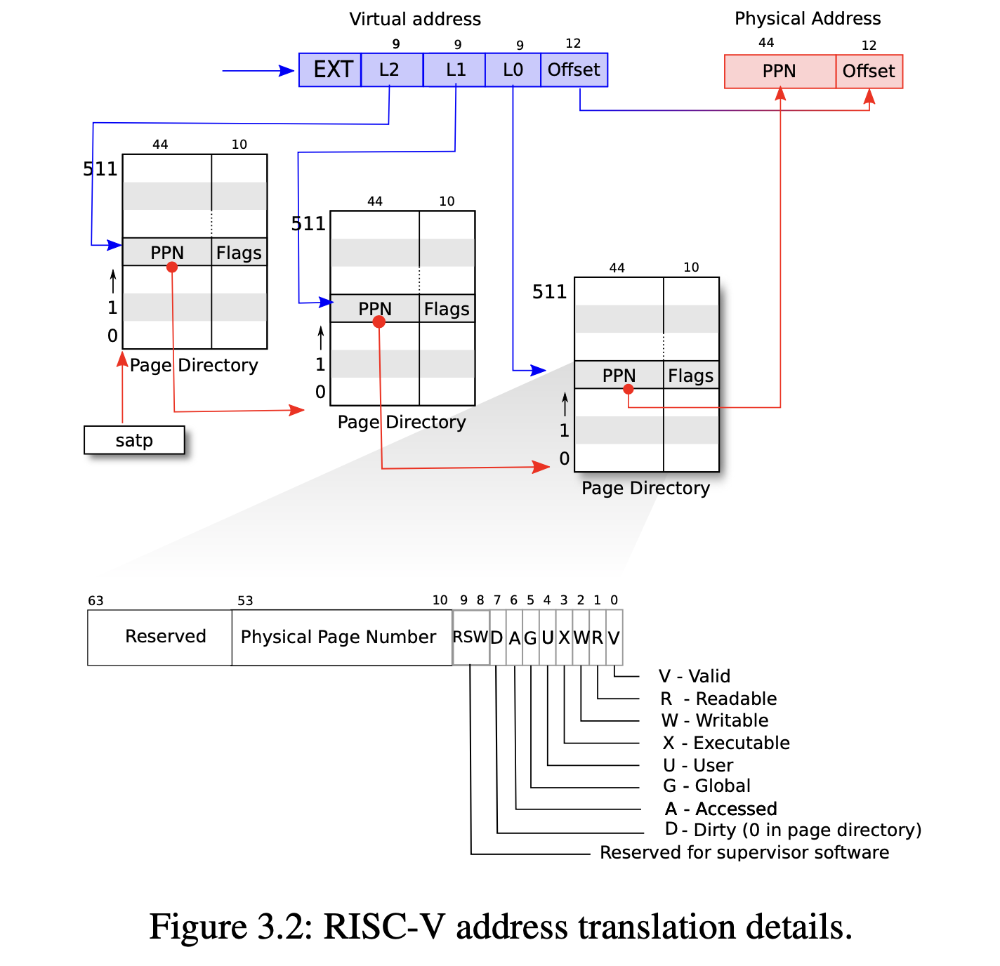
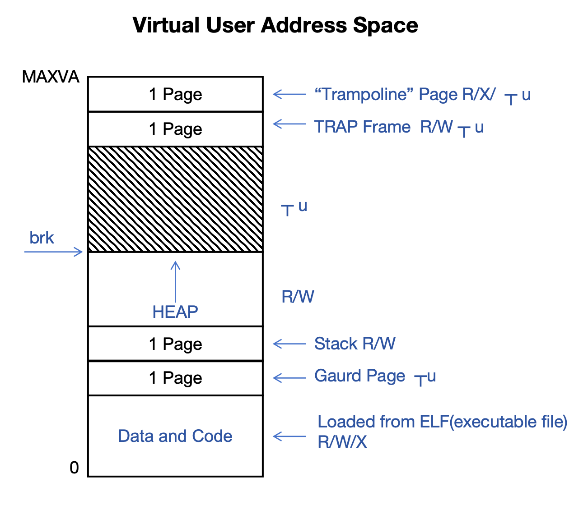

# The xv6 kernel

## 1 Overview

### 1.1 Features of xv6

- **PROCESS**
  - These processes run in their own virtual address space, so there are page tables for each address space to support virtual address spaces.
- **FILES, DIRECTORIES**
  - Unix-like files
  - Directory hierarchy
- **PIPES**
  - You can pipe data from one program to another program.
- **MULTITAKSING**
  - Timer interrupts for multitasking.
  - The various processes are running in parallel with time-slicing.
- **21 SYSTEM CALLs**
  - Implemented in xv6
  - The production Unix systems have more like 300 system calls, maybe 500 system calls.
  - This is to give you the core ideas of Unix.

### 1.2 User Programs

There are a number of user programs that are supplied with this kernel, and these can illustrate the capabilities of thi operating system.

```sh
sh
cat
echo
grep
kill
ln
ls
mkdir
rm
wc
```

This can be really be considered a true Unix system.

### 1.3 What is Missing?

**ALL THE COMPLEXITY OF A "REAL" OS.**

- User IDs
- Login
- File protection
- Mountable Filesystems
- Paging to disk
- Sockets, support for networks
- Interprocess Communication
- Device Drivers ... only 2
- (Limited) User Code / Apps

### 1.4 System Calls in _`user.h`_

These are familiar from any Unix or Linux system, the parameters are slightly different in some cases but the ideas is there.

```c
// system calls
int fork(void); // Create a new process
int exit(int) __attribute__((noreturn));  // Terminate a process
int wait(int*); // Wait for a child process to terminate
int pipe(int*);
int write(int, const void*, int);
int read(int, void*, int);
int close(int);
int kill(int);  // Terminate the process

// Pass a file name and will read in that file presumable it's an executable file and we'll load into memory creating a new virtual address space and execute it.
int exec(const char*, char**);

int open(const char*, int);
int mknod(const char*, short, short);
int unlink(const char*);
int fstat(int fd, struct stat*);
int link(const char*, const char*);
int mkdir(const char*);
int chdir(const char*);
int dup(int); // Copy file descriptors
int getpid(void);
char* sbrk(int);
int sleep(int);
int uptime(void);
```

## 2 General Features

### 2.1 SMP: Shared Memory Multiprocessor

It's meant to run on a system with multiple cores but which all share a single range of main memory.

- **CPU = CORE = <font color='red'>HART</font>**
  - They all mean a hardware processor capable of executing a single thread pf control.
  - **<font color='red'>HART</font>** stands for hardware thread which is something encounted in RISC-V documentation.
  - The idea is normally a core will execute a single hardware thread. but for some high performance cores you might have two **<font color='red'>HART</font>**s (hardware threads).
  - For example with the Intel hyper threading architectures you might have two threads running on a single core.
  - The idea is that these two threads are being interwoven, the instructions are being executed concurrently or possibly interwoven, in such a way as to share some of the processing hardware.
  - The idea is to increase the performance per transistor, so this term **<font color='red'>HART</font>** appears.
- **MAIN MEMORY (RAM) is SHARED** (All caching issues are ignored)
  - In a real operating system, the issues regarding the caching of main memory L1, L2 and so on, the kernel needs to sort of work around the caching schemes, and caching system in order to improve performance.
- In this code, the main memory is 128MB
  - This is just hardwired intothe kernel's code.
  - It's fixed with the _`#define`_.
  - A typical real world operating system kernel is going to look at the amount of memory that's available on the machine when it starts up, and it's going to configure itself to use all physical memory.

### 2.2 Deivices

- **UART**
  - The device that handles serial communication.
  - It stands for Universal Asynchronous Receive Transmit Unit.
  - In the old days it was a separate chip but now it's integrated on the process chip along with the cores on so on.
  - This is the device that provides a communication channel for printing and reading input from a keyboard typically.
  - It can send a byte stream in one direction and receive a byte string comming back in the other direction.
- **DISK**
  - The xv6 system has one disk drive and that will be emulated with the file on the host.
- **TIMER INTERRUPTS**
  - The **UART** and **DISK** are shared between all the cores, but each core has its own timer interrupt.
- **PLIC**: Platform Level Interrupt Controller
  - The processors in the real world contained something called a **PLIC** or Platform Level Interrupt Controller.
  - What this does is a separate chip or separate circuit that deals with interrupts comming in from all the different devices that might be on a system.
  - It's figuring out which core should be interrupted, which core should be told about the interrupt, and allowed to handle the interrupt and deal with it.
  - The emulator will emulate the **PLIC** or Platform Level Interrupt Controller.
- **CLINT**: Core Local Interrupt Controller
  - There is one of these core local interrupt controllers for each core, so the operating system has to deal with **PLIC** as well.

### 2.3 Memory Management

- Page Size = 4096 bytes
  - Physical memory is divided into pages and the page is fixed at 4KB.
  - _`#define PGSIZE`_
- Single Free List
  - Memory is allocated at least for the kernel from a free list.
  - There is a free list of unused pages and it's a simple linked list.
  - Whenever the kernel needs more memory it allocates the page from the free list.
  - When that page is no longer needed, it is returned by adding it to the front of the free list.
  - A very basic memory allocation scheme.
- No variable-sized allocation = No _`malloc()`_
  - There are no objects in the operating system.
  - In a real-world kenel there are other techniques for allocating memory to acommodate variable size chunks of memory, but that doesn't happen in xv6.
- Page Tables
  - The virtual address spaces are handled with page tables.
  - The page tables are three levels.
  - 
  - There's one table per process and in addition there is one page table for the kernel itself which maps all the physical memory.
  - That table for the kernel is shared by all the cores.
  - The page table hardware can accommodate making the data pages as either **R/W/X/U/V**(readble, writable, executable, user access and valid).
  - Some pages may be restricted so that they can only be accessed when the core is running in kernel mode and other pages can be accessed by the user mode.

### 2.4 Scheduler

- Basically a **Round-Robin** scheduler
- Size of timeslice is fixed (1,000,000 cycles)
  - Each process is given a timeslice and then it goes back it becomes dormant sitting on the ready queue.
  - The size of all timeslices are fiexed, it happens to be fiexed at 1M cycles.
- All the cores share a single **READY QUEUE**
  - Sometimes a **READY QUEUE** is called a ready list, or a run list, or a run queue.
  - When a core is ready to run a process, it will select a process the next runnable process from the **READY QUEUE**, and it will give a timeslice on that core. Then it will return the **READY QUEUE** after the timeslice ends.
- Next timeslice may be on a different core
  - So the **READY QUEUE** is actually an array and what's happening is each core for scheduling is going through that array linearly when it gets to the bottom of the array, it goes back up to the top.
  - What it is doing is searching for a process that is runnable that is ready for next timeslice.
  - When it finds one it gives it a timeslice and then after the timeslice ends, it returns to the **READY QUEUE** as a runnable process and moves on to the next process.
  - It just keeps going through each core, keeps going through that array repeatedly.

Actually it's not quite **Round-Robin**, because what can heppen is a particular process might be given a time slice say on core number one, and then the timeslice completes the core will put it back on the **READY QUEUE**, and then move on to find another runnable process, but immediately or very soon after some other core (perhaps core number foure) might be searching through the array, it might happen to come to that same process **P** and give it a timeslice, and put it back on the **READY QUEUE** when the timeslice ends.

So what happen is this single process **P** might be given a timeslice on core number one and then immediately after given another timeslice on core number four. Normally with **Round-Robin** after process **P** is given a timeslice, it needs to wait until all other runnable processes have a chance to run.

But with xv6 and the multiple cores it's sort of **Round-Robin** within each core. So it's not quite a proper **Round-Robin** scheduling. But it's simple and it's probably just about as effective equally efficient.

### 2.5 Boot Sequence

- qemu: Loads kerne code at fixed address and

  - The emulator which will be emulating the RISC-V processor and running on our kernel. Basically skips all the boot sequences altogether.
  - What is is going to do is to load the kernel from some executable file on your host, and put it into the memory that is the emulated physical memory of the RISC processor it is emulating.
  - Then put that code at a fixed location, in fact it uses 0x8000_0x0000.

- No bootloader/boot block/BIOS

### 2.6 Locking

- **Spin Locks**
  - Two functions they're called _`acquire()`_ and _`release()`_.
  - There's a single word i memory, that word is 0 if the lock is free or unheld, it is 1 if the lock is busy or locked or held.
  - What _`acquire()`_ will do is just basically in a tight loop wait for that word to become 0 unlocked. And then when it finds that it's unlocked it will set it to 1.
  - The _`release()`_ just simply sets the word back to 0.
- _`sleep()`_ and _`wakeup()`_

  - When a particular thread executes the sleep function, it will end its timeslice and it will be placed back on the **READY QUEUE** with a status of non-runnable.
  - It will then sleep until it is woken up.
  - So when a process executes the _`sleep()`_ function, that process will no longer runnable, it will go into a blocked or sleep state and it will not be scheduled.
  - Later some other process will execute the _`wakeup()`_ function and wake up one or more processes or zero or more processes.
  - If our processes happens to get woken up, then it will be changed back from a status of sleeping or blocked to runnable, and it will get timeslice after that.

- **Selected disabling of interrupts**

  - There is also a third technique that is sometimes used and that is the selective disabling of interrupts.
  - Each core has a status of control word, there is a bit that control word that can be either set or cleared, which either enables and allows interrupts or disables and prevents interrupts, by disabling interrupts a thread running on one core can prevent being interrupted.
  - When a timer interrupt goes of or when an I/O device calls for an interrupt. We can use this technique on one core to prevent being interrupt by another thread on that same core.
  - We can use this technique on one core to prevent being interrupted by another thread on that same core.
  - However, xv6 is a multi-core system and disabling interrupts on one core has no impacts on other cores. So a thread on another core can be modifying memory simultaneously.

- **Fixed Limits**

  - Defined in _`param.h`_, for example the number of processes is just a fixed number.
    - _`#define processes`_
    - Review as above, the **READY QUEUE** is stored in an array, and that array is allocated with a fixed size.
    - _`#define openfiles`_

- **Several Arrays**
  - The Kernel tends to use array and not linked-lists so much.
  - In several situations we are running through these arrays with a linear search.
  - For example _`kill(pid)`_ function is passed the process id, and what it does is a linear search of the array of processes.
  - Actually the **READY QUEUE** here is not a separate data structure, there is a single array of processes, and some of them are marked as runnable, and some of them are not runnable. So when we want to find a process that is runnable we basically just go through the process array and looking for one that has a status of runnable.

## 2.7 Virtual User Address Space



This is the virtual address space that a user mode program sees. Here is showing the address starting at location (buttom) zero going up to the maximum virtual address.

The kernel will allocate this address space in units of pages, each one of these is a 4K page.

When the exact SystemCall is used, the kernel will go out to the file system, and find the executable file which is in **ELF** format, and it will allocate several pages (an integral number of pages) in **[Data and Code]** region.

It will read in the data and code into the **[Data and Code]** region of memory. those pages will then be marked read, write and executable by the kernel.

We also have a page allocated for the **stack**, notice that the **stack** only gets one page - 4kB of memory. And so xv6 is somewhat limited in this aspect. A process that wants to grow in its **stack** beyond this volume will not be able to, the kernel will simply abort it happen and terminate the process.

The way the kernel does that is kind of clever, it allocates what is called a **gaurd page** under the stack page. This **gaurd page** is not readable and not writable in fact. It's not accessible in user mode.

So if the user mode code tries to access this page for virtual address space, it will immediately cause an exception and the process will be thrown out and termiated.

The **heap** starts after the stack and grows in units of pages. As the user code allocates things on its heap, the **brk** (break) will be moved up. The kernel will be invoked to allocate more pages and the **brk** point will be moved up and will consume some of the unused spacce. And the allocated page will be marked read and write.

In a typical Linux or Unix system, the stack is usually put out in high memory and it grous down.

There are two pages up at the very top of the virtual memory space. These are used during trap and exception processing. The **trampoline page** contans code, so it's executable. When an exception or interrupt occurs, we're going to be executing code in the **trampoline page**.

The **trap frame** is readable and writeable, ii's where the regier will be srave, when a trap that is when an exception or an interrupt occurs, the register the entire state of this user process will be saved in the **trap frame**.

Each virtual address space has its own **trap frame** page, they're all mapped to the same location, but they are different physical memory pages, so each process has its own **trap frame**.

The **trampoline page** is shared by all of the processes, the exact same page of physical memory is mapped into this same spot in all of the virtual address pages.

Again the kernel doesn't have a very sophisticated memory allocation system, it just has pages and they are kept in a free list and so all allocations are in units of one page of 4kB.

However, we accommodate **HEAP**s for the user mode programs, so a user mode program is free to implement _`malloc()`_ with and allocate things on the **HEAP**. In fact it's free to implement whatever complex garbarge collection algorithm it wants to, but it just has thie **HEAP** memory that can be grown.

### 2.8 Stack

Main function which takes a counple of arguments _`argc`_ and _`argv`_, and these point to the arguments that are passed into the program when it begins executing. How does that happen?

When an exact system call its _`main()`_, the kernel in the kernel will set up the virtual address space here, and among other things it will allocate a page for the **stack** and it push onto the stack the arguments.

Then the kernel will allocate these arguments on the **stack** essentially pushing them onto the stack, and moving them into the registers. So the first instruction of the user program is executed, it will already find several things on the stack, it will find its the arguments on the stack.

### RISC-V Virtual Address

RISC-V is a pretty complex architecture and there is several different options for pages tables:

- Sv32 -> 2 level pages table scheme
- Sv39 (xv6) -> 3 level pages table scheme
- Sv48 -> 4 level pages table scheme

xv6 with the particular 3 level scheme, virtual address are 39 bits.

=> 2^39 = 512GB = 0x80.0000.0000
=> We could access 512GB.

Actually xv6 uses only 38 bits for virtual address.
=>2^38 = 256GB = 0x40.0000.0000 = MAXVA > (Max Address: 0x3F.FFFF.FFFF)
